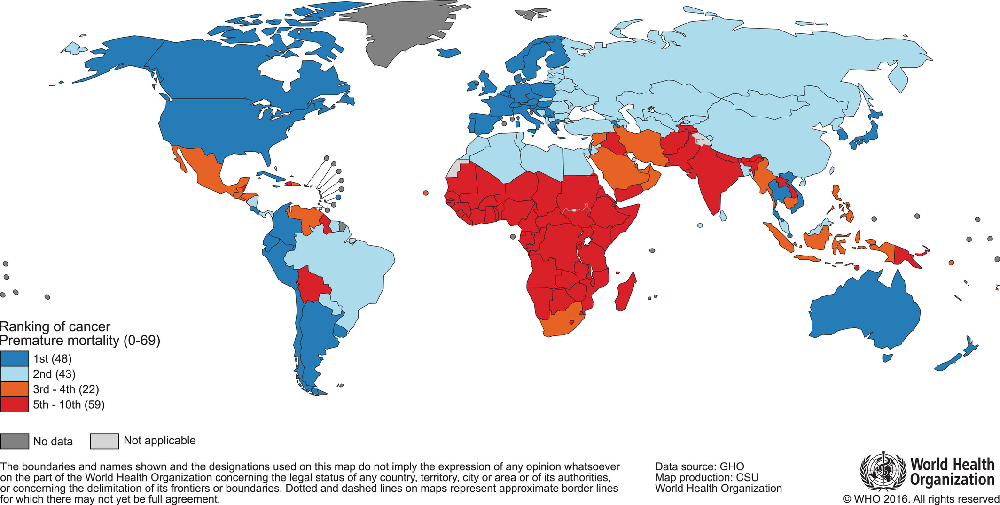

# Cancer as deregulation of complex machinery

```{r, include=knitr::is_latex_output(), echo=FALSE}
knitr::asis_output('\\epigraph{"All happy families are alike; each unhappy family is unhappy in its own way."}{Leo Tolstoy (Anna Karenina, 1877)}')
```

```{r, include=knitr::is_html_output(), echo=FALSE}
knitr::asis_output(
  '>*All happy families are alike; each unhappy family is unhappy in its own way.*<br/>
  >Leo Tolstoy (Anna Karenina, 1877)')
```

```{r, include=knitr::is_latex_output(), echo=FALSE}
knitr::asis_output('\\initial{A}rmed with all these models, whether statistical or mechanistic, we are going to look at a particularly complex system that fully justifies their use: cancer. Since the first chapter recalled how important prior knowledge of the phenomenon under study is for designing models, whatever their nature, this chapter will briefly summarize some of the most important characteristics of this disease before returning to the models themselves in the next chapter. Without aiming for exhaustiveness, and after an epidemiological and statistical description, we will focus on the most useful information for the modeller, i.e. the underlying biological mechanisms and available data.')
```

```{r, include=knitr::is_html_output(), echo=FALSE}
knitr::asis_output('Armed with all these models, whether statistical or mechanistic, we are going to look at a particularly complex system that fully justifies their use: cancer. Since the first chapter recalled how important prior knowledge of the phenomenon under study is for designing models, whatever their nature, this chapter will briefly summarize some of the most important characteristics of this disease before returning to the models themselves in the next chapter. Without aiming for exhaustiveness, and after an epidemiological and statistical description, we will focus on the most useful information for the modeller, i.e. the underlying biological mechanisms and available data.')
```


```{r 2_packages, echo=FALSE, warning=FALSE, message=FALSE}
invisible(lapply(X =  c("knitr", "tidyverse", "magrittr",  "ggplot2", "ggpubr", "patchwork", "cowplot", "kableExtra"),
       FUN = require,
       character.only = TRUE))

knitr::opts_chunk$set(
  cache = TRUE, echo = FALSE, warning = FALSE, message = FALSE,
  out.width = "90%",
  #fig.pos = "ht",
  fig.align = "center"
  )
```

```{r bath, echo=FALSE, out.width = "90%", fig.cap='(ref:bath-caption)', fig.scap='Cancer is an old disease', fig.align='center'}

```
(ref:bath-caption) **Cancer is an old disease**  Rembrandt, *Bathsheba at Her Bath*, c. 1654, oil on canvas, Louvre Museum, Paris

## What is cancer?

Cancer can be described as a group of diseases characterized by uncontrolled cell divisions and growth which can spread to surrounding tissues. Descriptions of this disease, and essentially associated solid tumours, have been found as far back as ancient Egyptian documents, at least 1600 BC and we know from the first century A.D. with Aulus Celsus that it is better to remove the tumors and this as soon as possible [@hajdu2011note]. Progress will accelerate during the Renaissance with the renewed interest in medicine, and anatomy in particular, which will advance the knowledge of tumour pathology and surgery [@hajdu2011note2]. The progress of anatomical knowledge has also left brilliant testimonies in the field of painting, which make the renown of the Renaissance today. The precision of these artists' traits has also allowed some retrospective medical analyses, some of them going so far as to identify the signs of a tumour in certain subjects [@bianucci2018earliest]. Such is the bluish stain on the left breast of the Bathsheba painted by Rembrandt (Figure \@ref(fig:bath)) which has been subject to controversial interpretations, sometimes described as an example of "skin discolouration, distortion of symmetry with axillary fullness and peau d'orange" [@braithwaite1983rembrandt] and sometimes spared by photonic and computationnal analyses [@heijblom2014monte]. The mechanisms of the disease only began to be elucidated with the appearance of the microscope in the 19th century, which revealed its cellular origin [@hajdu2012note]. The classification and description of cancers is then gradually refined and the first non-surgical treatments appear with the discovery of ionising radiation by the Curies [@hajdu2012note2]. The 20th century is then the century of understanding the causes of cancer [@hajdu2013note; @hajdu2013note2]. Some environmental exposures are characterized as asbestos or tobacco. Finally, the biological mechanisms become clearer with the identification of tmour-causing viruses and especially with the discovery of DNA [@watson1953molecular]. The foundations of our current understanding of cancer date back to this period, which marks the beginning of the molecular biology of cancer. It is this branch of biology that contains the bulk of the knowledge that will be used to build our mechanistic models, and it will be later detailed in Section \@ref(molecular-biology).  
  
One of the ways to read this brief history of cancer is to see that theoretical and clinical progress has not followed the same timeframes.The medical and clinical management of cancers initially progressed slowly but surely, and this in the absence of an understanding of the mechanisms of cancer. Conversely, the theoretical progress of the last century has not always led to parallel medical progress, except on certain specific points. The interaction between the two is therefore not always obvious. The transformation of fundamental knowledge into medical and clinical impact is therefore of particular importance. This is what is called *translational medicine*, the aim of which is to go from laboratory bench to bedside [@cohrs2015translational]. It is, modestly, in this perspective that the mechanistic models of cancer that will receive particular attention in this thesis are placed. Their objective is to integrate biological knowledge, or at least a synthesis this knowledge, in order to transform it into  with a relevant clinical information.

## Cancer from a distance: epidemiology and main figures

Before going down to the molecular level, it is important to detail some figures and trends in the epidemiology of cancer today. Following the description in the previous section, cancer is first and foremost defined as a disease. Considered to be a unique disease, it caused 18.1 million new cancer cases and 9.6 million cancer deaths in 2018 according to the Global Cancer Observatory affiliated to World Health Organization [@bray2018global]. However, these aggregated data conceal disparities of various kinds. The first one is geographical. Indeed, mortality figures make cancer one of the leading causes of premature death in most countries of the world but its importance relative to other causes of death is even greater in the more developed countries (Figure \@ref(fig:globocan-map)). All in all, cancer is the first or second cause of premature death in almost 100 countries worldwide [@bray2018global]. These differences call for careful consideration of the impact of population age structures and health-related covariates.

```{r globocan-map, echo=FALSE, out.width = "90%", fig.cap ='(ref:globocan-map-caption)', fig.scap="Network visualization of *model* thesaurus entries", fig.align='center'}

```
(ref:globocan-map-caption) **World map and national rankings of cancer as a cause of premature death.** Classification of cancer as a cause of death before the age of 70, based on data for the year 2015. Original Figure, data and methods from @bray2018global.

A second disparity lies in the different types of cancer. If we classify tumours solely according to their location, i.e. the organ affected first, we already obtain very wide differences. First of all, the incidence varies considerably (Figure \@ref(fig:cancer-tissues)A)). Cancers do not occur randomly anywhere in the body and certain environments or cell types appear to be more favourable [@tomasetti2015variation]. Mortality is also highly variable but is not directly inferred from incidence. Not all types of cancer have the same prognosis (Figure \@ref(fig:cancer-tissues)A and B) and survival rates [@liu2018integrated]. Although breast cancer is much more common than lung cancer, it causes fewer deaths because its prognosis is, on average, much better. The mechanisms at work in the emergence of cancer are therefore not necessarily the same as those that will govern its evolution or its response to treatment. And still on the response to treatment, Figure \@ref(fig:cancer-tissues)B highlights another disparity: not only are the survival prognosis associated with each cancer very different, but the evolution (and generally the improvement) of these prognoses has been very uneven over the last few decades. This means that theoretical and therapeutic advances have not been applied to all types of cancer with the same success. It is one more indication of the diversity of biological mechanisms at work, which make it impossible to find a panacea, and which, on the contrary, encourage us to carefully consider the particularities of each tumour, both to understand them and to treat them. Under a generic name and in spite of common characteristics, the cancers thus appear as extremely heterogeneous. And to understand the sources of this heterogeneity, it will be necessary to place ourselves on a much smaller scale.  
  

```{r cancer-tissues, echo=FALSE, out.width = "90%", fig.cap ='(ref:cancer-tissues-caption)', fig.scap="Some analyses around Lotka-Volterra model of a prey-predator system", fig.align='center', fig.show='hold', eval=TRUE, fig.height=6, fig.width=8}
data_incidence <- readr::read_csv("data/cancer/data-incidence.csv") %>%
  rename(Incidence=`ASR (World)*`) %>%
  select(Cancer, Incidence) %>%
  filter(Cancer!="Allcancers") %>%
  arrange(desc(Incidence)) %>%
  mutate(Cancer=case_when(
    Cancer=="Cervixuteri" ~ "Cervix Uteri",
    Cancer=="Corpusuteri" ~ "Corpus Uteri",
    Cancer=="Non-Hodgkinlymphoma" ~ "Non-Hodgkin Lymphoma",
    Cancer=="Lip,oralcavity" ~ "Oral Cavity",
    Cancer=="Brain,centralnervoussystem" ~ "Brain & CNS",
    Cancer=="Melanomaofskin" ~ "Skin Melanoma",
    TRUE ~ Cancer))

data_mortality <- readr::read_csv("data/cancer/data-mortality.csv") %>%
  rename(Mortality=`ASR (World)*`) %>%
  select(Cancer, Mortality) %>%
  filter(Cancer!="Allcancers") %>%
  arrange(desc(Mortality)) %>%
  mutate(Cancer=case_when(
    Cancer=="Cervixuteri" ~ "Cervix Uteri",
    Cancer=="Corpusuteri" ~ "Corpus Uteri",
    Cancer=="Non-Hodgkinlymphoma" ~ "Non-Hodgkin Lymphoma",
    Cancer=="Lip,oralcavity" ~ "Oral Cavity",
    Cancer=="Brain,centralnervoussystem" ~ "Brain & CNS",
    Cancer=="Melanomaofskin" ~ "Skin Melanoma",
    TRUE ~ Cancer))

cancer_list <- head(data_incidence$Cancer, 19)

data_cancers <- full_join(mutate(data_incidence, Incidence=-Incidence), data_mortality, by="Cancer") %>%
  filter(Cancer %in% cancer_list) %>%
  pivot_longer(cols=c("Incidence", "Mortality")) %>%
  mutate(Cancer=factor(Cancer, levels=rev(cancer_list)))

p_stat <- ggplot(data_cancers, aes(y=Cancer, x=value, fill=name)) +
  geom_bar(stat="identity", width = 0.6) +
  theme_pubclean() +
  labs(y="Cancer types",
       x="Age-standardized rates (ASR)",
       fill="Type:") +
  scale_x_continuous(breaks = seq(-40,20,10),
                     labels = abs(seq(-40,20,10))) +
  scale_fill_manual(values = c("Incidence"="#C8964BFF", "Mortality"="#7D3232FF")) +
  theme(#panel.grid.major.x = element_line(color="grey", linetype="dotted"),
        #panel.grid.major.y= element_line(color="grey", linetype="dotted", size=0.2),
        legend.position = "top",
        legend.title = element_text(face="bold", size=10))

## Aalysis on survival rates
data_survival <- readxl::read_xlsx("data/cancer/seer-data-jemal.xlsx", sheet = 2)
data_survival <- data_survival[seq(1,nrow(data_survival),2),] %>%
  mutate(Cancer=case_when(
    Cancer=="Breast (Female)" ~ "Breast",
    Cancer=="Lung and Bronchus" ~ "Lung",
    Cancer=="Colon and Rectum" ~ "Colorectum",
    Cancer=="Liver and Intrahepatic Bile Duct" ~ "Liver",
    Cancer=="Corpus and Uterus, NOS" ~ "Corpus Uteri",
    Cancer=="Esophagus" ~ "Oesophagus",
    Cancer=="Urinary Bladder" ~ "Bladder",
    Cancer=="Leukemia" ~ "Leukaemia",
    Cancer=="Kidney and Renal Pelvis" ~ "Kidney",
    Cancer=="Oral Cavity and Pharynx" ~ "Oral Cavity",
    Cancer=="Brain and Other Nervous System" ~ "Brain & CNS",
    Cancer=="Melanoma of the Skin" ~ "Skin Melanoma",
    TRUE ~ Cancer)) %>%
  filter(Cancer %in% cancer_list) %>%
  mutate(Cancer=factor(Cancer, levels=rev(cancer_list)),
         `1975-1977`=as.numeric(`1975-1977`),
         `2006-2012`=as.numeric(`2006-2012`),
         Old="1975-1977",
         New="2006-2012")

p_surv <- ggplot(data_survival) +
  geom_segment(aes(x=`1975-1977`, xend=`2006-2012`-1,
                   y=Cancer, yend=Cancer), 
               color="grey", size=1,
               arrow = arrow(length = unit(0.2,"cm"), type = "closed")) +
  geom_point(aes(x=`1975-1977`, y=Cancer, color=Old),
             size=1.5) + 
  geom_point(aes(x=`2006-2012`, y=Cancer, color=New),
             size=2.5) +
  theme_pubclean() +
  scale_color_manual(values=c("1975-1977"="#90A8C0FF", "2006-2012"="#304890FF")) +
  #scale_y_discrete(position = "right") +
  labs(x="5-year relative survival (%)",
       y="",
       colour="Time period:") +
  theme(legend.position = "top",
        legend.key = element_rect(fill = NA, colour = NA, size = 0.25),
        axis.text.y = element_blank(),
        legend.title = element_text(face="bold", size=10))

p_stat + p_surv +
  plot_annotation(tag_levels = 'A')
```
(ref:cancer-tissues-caption) **Incidence, mortility and survival per cancer types**. (A) World incidence and mortality for the 19 most frequent cancer types in 2018, expressed age-standardized rates (adjusted age structure based on world population); data retrieved from [Global Cancer Observatory](https://gco.iarc.fr/today/home). (B) Evolution of 5-years relative survival for the same cancer types based on US data from SEER registries in 1975-1977 and 2006-2012; data retrieved from @jemal2017annual.

## Basic molecular biology of cancer {#molecular-biology}

[@weinberg2013biology]

[@tomasetti2015only]

## High-throughput data and multi-omics

## From genetic to network disease

[@sanchez2018oncogenic]
