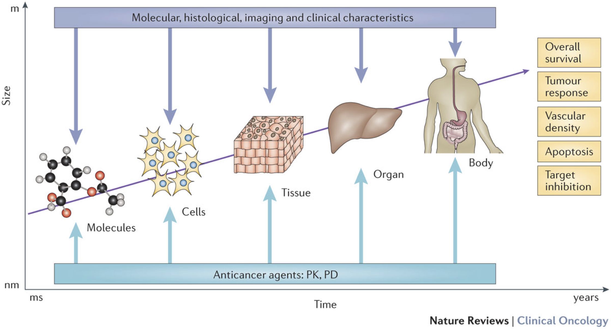

# Mechanistic and computational modeling of cancer: from complex disease to systems biology

```{r, include=knitr::is_latex_output(), echo=FALSE}
knitr::asis_output('\\epigraph{"How remarkable is life? The answer is: very. Those of us who deal in networks of chemical reactions know of nothing like it... How could a chemical sludge become a rose, even with billions of years to try."}{George Whitesides}')
```

```{r, include=knitr::is_html_output(), echo=FALSE}
knitr::asis_output(
  '>*"How remarkable is life? The answer is: very. Those of us who deal in networks of chemical reactions know of nothing like it... How could a chemical sludge become a rose, even with billions of years to try."*<br/>
  >George Whitesides')
```

```{r, include=knitr::is_latex_output(), echo=FALSE}
knitr::asis_output('\\initial{T}he previous chapter identified the need to organize cancer knowledge and data. The integration of biological knowledge, particularly in the form of networks, is a first step in this direction. The deepening of knowledge, however, requires the ability to manipulate objects even more, to experiment, to dissect their behaviour in an infinite number of situations, such as the astronomer with his orrery or physicians with their old anatomical models (Figure \\@ref(fig:anatomy)). Is it then possible to create mechanistic models of cancer in the same way?')
```

```{r, include=knitr::is_html_output(), echo=FALSE}
knitr::asis_output('The previous chapter identified the need to organize cancer knowledge and data. The integration of biological knowledge, particularly in the form of networks, is a first step in this direction. The deepening of knowledge, however, requires the ability to manipulate objects even more, to experiment, to dissect their behaviour in an infinite number of situations, such as the astronomer with his orrery or physicians with their old anatomical models (Figure \\@ref(fig:anatomy)). Is it then possible to create mechanistic models of cancer in the same way?')
```


```{r 3_packages, echo=FALSE, warning=FALSE, message=FALSE}
invisible(lapply(X =  c("knitr", "tidyverse", "magrittr",  "ggplot2", "ggpubr", "patchwork", "cowplot", "kableExtra"),
       FUN = require,
       character.only = TRUE))

knitr::opts_chunk$set(
  cache = TRUE, echo = FALSE, warning = FALSE, message = FALSE,
  out.width = "90%",
  #fig.pos = "ht",
  fig.align = "center"
  )
```

```{r anatomy, echo=FALSE, out.width = "90%", fig.cap='(ref:anatomy-caption)', fig.scap='Dissecting a biological phenomenon using a non-computational model', fig.align='center'}
knitr::include_graphics("fig/anatomy.jpg")
```
(ref:anatomy-caption) **Dissecting a biological phenomenon using a non-computational model.**  Rembrandt, *The Anatomy Lesson of Dr Nicolaes Tulp*, 1634, oil on canvas, Mauritshuis museum, The Hague

## Introducing the diversity of mechanistic models of cancer

Modeling cancer is not a new idea. And the diversity of biological phenomena at work in cancer has given rise to an equally important diversity of models and formalisms, which we seek here to give a brief overview in order to better identify the specific models that we will focus on later. One way to order this diversity is to consider the scales of these models (Figure \@ref(fig:multiscale)). Indeed, cancer can be read at different levels, from the molecular level of DNA and proteins, to the cellular level, to the level of tissues and the organism [@anderson2008integrative]. Models have been proposed at all these scales, using different formalisms [@bellomo2008foundations] and answering different questions.  
  

Consistent with the evolution of knowledge and data, the early models were at the macroscopic level. While methods and terminologies may have changed, there are nevertheless traces of these models as early as the 1950s. We then speak rather of mathematical modeling with a meaning that is nevertheless intermediate between what we have defined as mechanistic models and statistical models [@byrne2010dissecting]. First, the initiation of tumorigenesis was theorized with biologically-supported mathematical expressions in order to make sense of cancer incidence statistics [@armitage1954age, @knudson1971mutation]. These models, however, remained relatively descriptive in that they did not shed any particular light on the biological mechanisms involved and focused on gross characteristics
of tumours. The integration of more advanced knowledge as well as the progressive refinement of mathematical formalisms has nevertheless allowed these models to proliferate while gaining in interpretability, with for instance mechanistic models of metastatic relapse [@nicolo2020machine]. Always on a macroscopic scale, the study of tumor growth has also been the playground of many mathematicians [@araujo2004history; byrne2010dissecting], even predicting invasion or response to surgical treatments using spatial modeling [@swanson2003virtual]. This line of research is still quite active today and provides a mathematical basis for comparison with tumour experimental growth [@benzekry2014classical].  
  

```{r multiscale, echo=FALSE, out.width = "90%", fig.cap='(ref:multiscale-caption)', fig.scap='The different scales of cancer modeling', fig.align='center'}

```
(ref:multiscale-caption) **The different scales of cancer modeling.** Cancer can be approached at different scales, from molecules to organs, using different data (dark blue), but often with the direct or indirect objective of contributing to the study of clinically interpretable phenomena (yellow boxes), in particular by studying the influence of anticancer agents (pale blue). Reprinted from @barbolosi2016computational.


Taking it down a step further, it is also possible to model cancer at the cellular level, for example by looking at the clonal evolution of the cancer [@altrock2015mathematics]. The aim is then to understand the impact of the processes of mutation, selection, expansion and cohabitation of different populatons of cells, at specifc rates. The accumulation of a mutation in a population of cells can thus be studied [@bozic2010accumulation]. Modeling at the cellular level is well suited to the study of interactions between cells, between cancer cells and their environment or with the immune system. Similar to other kinds of studies of population dynamics, formalisms based on differential equations are quite common, some conceptually analogous to the Lotka Volerra system presented in section \@ref(lotkasection) [@bellomo2008foundations]; but there are many other methods such partial differential equations or agent-based modeling [@letort2019physiboss].  
  

Finally, at an even smaller scale, it is possible to model the molecular networks at work in cells [@le2015quantitative]. The aim is then to simulate mathematically how the different genes and molecules regulate each other, transmit information and, in the case of cancer, end up being deregulated [@calzone2010mathematical; @flobak2015discovery]. These models will be the subject of the thesis and will therefore be defined more precisely and used to detail the concepts and tools of systems biology in the following sections. It can already be noted that while these models can integrate the most fundamental biological mechanisms of living organisms, one of the most burning questions is whether it is possible to link them to the larger scales that are clinically more interesting (tissues, organs etc.). Can these models tell us about the molecular nature of cancer? About patient survival? Their response to treatment? These questions apply to all of the above models, whatever their scales (Figure \@ref(fig:multiscale)), but are more difficult to answer for models defines at molecular scale that are further from the clinical data of interest. The aim of this thesis is to provide potential answers to these questions. One of the ways of approaching these issues has been to propose multi-scale models, which are nevertheless very complex [@anderson2008integrative; @powathil2015systems]. We will focus here on the use of models defined almost exclusively at the molecular scale, which is assumed to be prominent, to study what can be inferred on the larger scales.

## Cell circuitry and the need for cancer systems biology

Once the context has been defined, both biologically and methodologically, it is possible to begin the exploration of the models that will constitute the core of this thesis: the **mechanistic models of molecular networks**.
[@hornberg2006cancer]
[@kreeger2010cancer]

Cancer systems biology can be understood as the study of how perturbations of
the normal and healthy genome leads to tumorigenesis. This interdisciplinary fields
combine mathematics, statistics, physics, and molecular biology in order to decipher
or to begin to understand the effect of these alterations [16].
The cell can be seen as a system composed of genes, proteins, small molecules,
enzymes, etc. which interact and are involved in many different intertwined signalling
pathways. Cancer is characterised by an accumulation of genetic and epigenetic
alterations and regulatory networks, which deregulate the molecular machinery
of normal cells. Cancer is often referred to as a network disease [1], because the
genes that are mutated or altered affect or even rewire the original network leading
to different outcomes [17]. An alteration of one of these genes may have an impact
or not on the cellular fate; the outcome is often unpredictable and unexpected.

With data [@de2002modeling]

Data impact and plot 

```{r pubmed, echo=FALSE, warning=FALSE, out.width = "90%", fig.cap ='(ref:pubmed-caption)', fig.scap="PubMed trends in cancer studies.", fig.align='center'}

pm_cancer <- read_csv("data/computational/PubMed_Cancer.csv", skip = 1) %>%
  filter(Year<2020) %>% rename(Cancer=Count)
pm_model <- read_csv("data/computational/PubMed_Model.csv", skip = 1) %>%
  filter(Year<2020) %>% rename(Model=Count)
pm_networks <- read_csv("data/computational/PubMed_CancerNetwork.csv", skip = 1) %>%
  filter(Year<2020) %>% rename(Network=Count)
pm_compmath <- read_csv("data/computational/PubMed_CancerCompMath.csv", skip = 1) %>%
  filter(Year<2020) %>% rename(CompMath=Count)

data_all <- full_join(pm_cancer, pm_networks, by = "Year") %>%
  full_join(pm_compmath, by = "Year") %>%
  full_join(pm_model, by = "Year") %>%
  mutate(Network=Network/Cancer, CompMath=CompMath/Cancer, Model=Model/Cancer) %>%
  pivot_longer(cols=c("Network", "CompMath", "Model"),
               names_to = "Query", values_to="Percentage")


p_1 <- ggplot(pm_cancer) +
  geom_bar(aes(x=Year, y=Cancer), stat = "identity") +
  theme_pubclean() +
  theme(axis.title.x = element_blank()) +
  labs(y="# of 'Cancer'\narticles")

p_2 <- mutate(data_all, Percentage=100*Percentage) %>%
  mutate(Query=case_when(
    Query=="CompMath" ~ "Cancer AND (Computational OR Mathematical)",
    Query=="Model" ~ "Cancer AND Model",
    Query=="Network" ~ "Cancer AND Network"
  ) %>% factor(levels=c('Cancer AND Model', 'Cancer AND Network',
                        'Cancer AND (Computational OR Mathematical)'))) %>%
  ggplot() +
  geom_line(aes(x=Year, y=Percentage, color=Query)) +
  theme_pubclean() +
  theme(legend.position = "bottom",
        legend.key = element_rect(fill = NA, colour = NA, size = 0.25),
        legend.title = element_text(face="bold", size=10)) +
  labs(y="% of 'Cancer' articles\nmatching query",
       color="Query:") +
  guides(color=guide_legend(nrow=2,byrow=TRUE))

(p_1 / p_2) + plot_layout(heights = c(1,3)) + plot_annotation(tag_levels = 'A')
```
(ref:pubmed-caption) **PubMed trends in cancer studies.** 


Figure \@ref(fig:pathways)

## Mechanistic models of molecular signaling

### Common elements to capture the complexity

### Different formalisms for different applications

With two main formalisms: ODE and logical
[@le2015quantitative]
[@de2002modeling]

## Cancer systems biology: exemples of complex features


Theory --> Features of complex systems: emergence, non-linearity, feedback

critical transitions in multiple fields [@trefois2015critical]
bistable and switches [@markevich2004signaling]
emergence [@helikar2008emergent]
tyson ode examples breast [@tyson2011dynamic] and general [@tyson2003sniffers]

network and complex elements. Examples of loops [@kitano2002computational] [@kitano2002systems]


## Applications --> impact of data // Clincal impact

Boris Kholodenko
With data also [@bouhaddou2018mechanistic]
Details Fey


