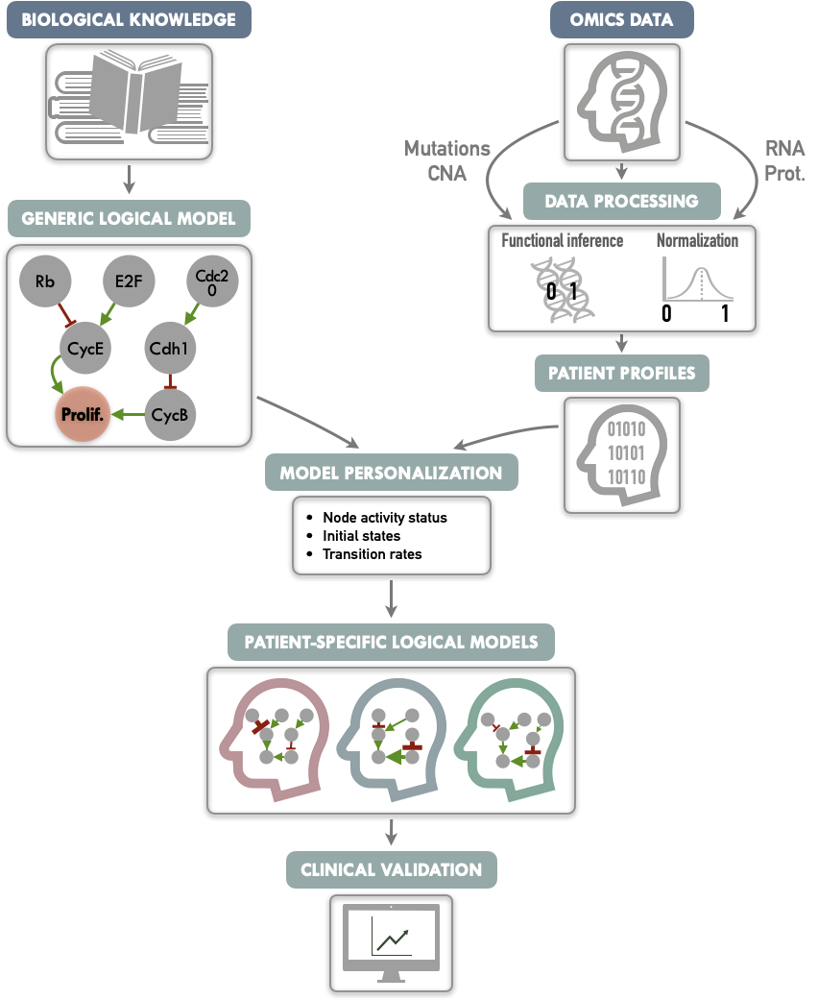
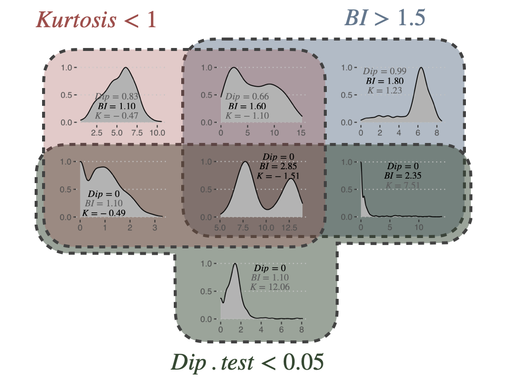
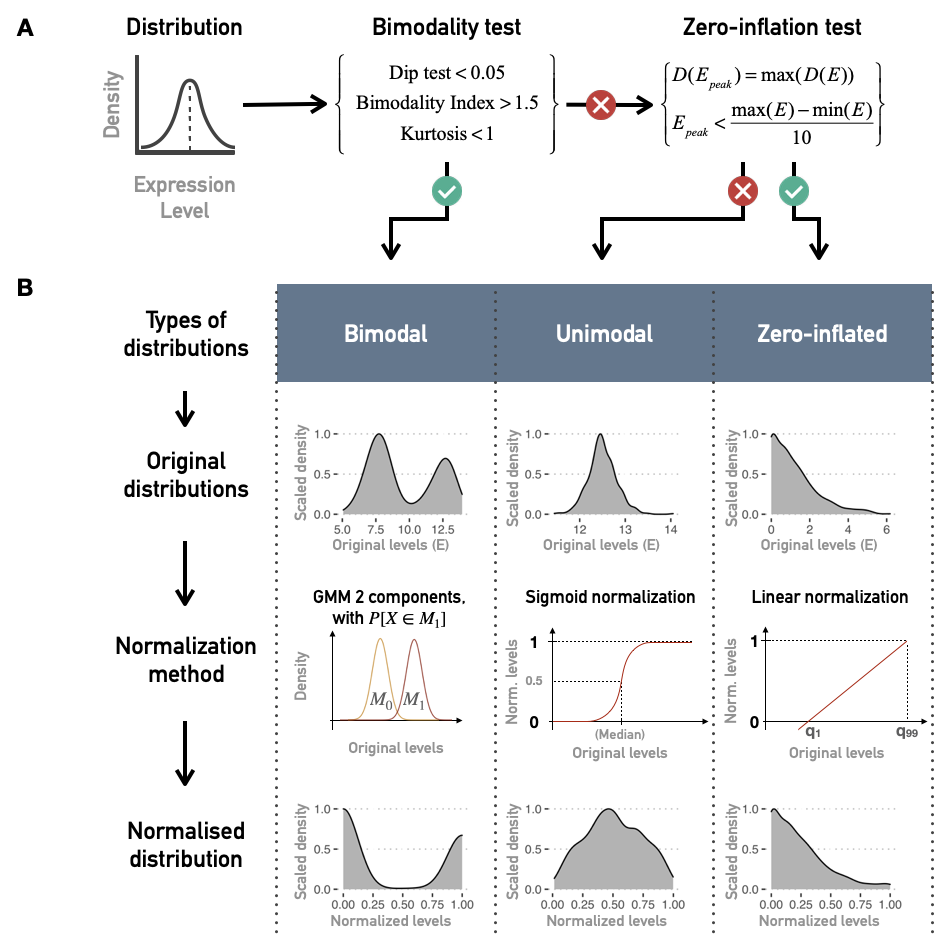
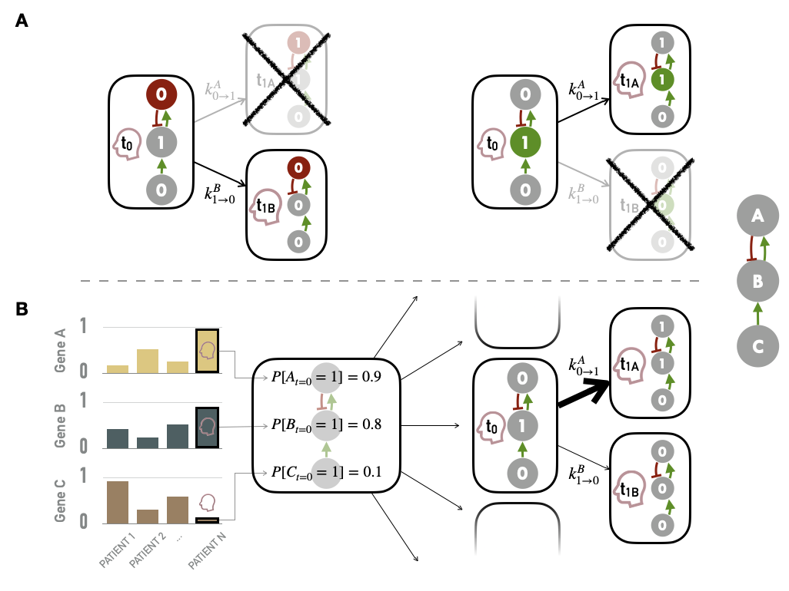

# Personalization of logical models: method and prognostic validation

```{r, include=knitr::is_latex_output(), echo=FALSE}
knitr::asis_output('\\epigraph{"All happy families are alike; each unhappy family is unhappy in its own way."}{Leo Tolstoy (Anna Karenina, 1877)}')
```

```{r, include=knitr::is_html_output(), echo=FALSE}
knitr::asis_output(
  '>*All happy families are alike; each unhappy family is unhappy in its own way.*<br/>
   >Leo Tolstoy (Anna Karenina, 1877)')
```

  

```{r, include=knitr::is_latex_output(), echo=FALSE}
knitr::asis_output('\\initial{N}ow that logical modeling has been introduced, it is possible to come back to the question that structures this part and to refine it. **Is it possible to use routine omics data to obtain logical models that provide qualitative clinical interpretation?** We thus propose a sequential approach, separating the model construction process from the integration of biological data. A generic logical model is first built, based on the literature knowledge, and the data are then used to specify the model. Indeed, the model as defined from the literature is often generic in the sense that it summarizes the state of knowledge on a probably heterogeneous pathology or population. Assuming that this general regulatory scheme provides a relevant framework for the system, it may then be relevant to use more precise omics data to impose biologically sourced constraints on the model: inactivation of a gene in a patient, activation of a protein or a signalling pathway by overexpression or phosphorylation, etc. This approach, called **PROFILE** (PeRsonalization OF logIcaL ModEls), allows the integration of both discrete (mutations) and continuous data (RNA expression levels, proteins) based on the MaBoSS software, and leads to specific models of a cell line or a patient.')
```

```{r, include=knitr::is_html_output(), echo=FALSE}
knitr::asis_output('Now that logical modeling has been introduced, it is possible to come back to the question that structures this part and to refine it. **Is it possible to use routine omics data to obtain logical models that provide qualitative clinical interpretation?** We thus propose a sequential approach, separating the model construction process from the integration of biological data. A generic logical model is first built, based on the literature knowledge, and the data are then used to specify the model. Indeed, the model as defined from the literature is often generic in the sense that it summarizes the state of knowledge on a probably heterogeneous pathology or population. Assuming that this general regulatory scheme provides a relevant framework for the system, it may then be relevant to use more precise omics data to impose biologically sourced constraints on the model: inactivation of a gene in a patient, activation of a protein or a signalling pathway by overexpression or phosphorylation, etc. This approach, called **PROFILE** (PeRsonalization OF logIcaL ModEls), allows the integration of both discrete (mutations) and continuous data (RNA expression levels, proteins) based on the MaBoSS software, and leads to specific models of a cell line or a patient.')
```

```{r 5_packages, echo=FALSE, warning=FALSE, message=FALSE}
invisible(lapply(X =  c("knitr", "tidyverse", "magrittr",  "ggplot2", "ggpubr", "patchwork", "cowplot", "kableExtra", "survival", "survminer"),
       FUN = require,
       character.only = TRUE))

knitr::opts_chunk$set(
  cache = TRUE, echo = FALSE, warning = FALSE, message = FALSE,
  out.width = "90%",
  #fig.pos = "ht",
  fig.align = "center"
  )
```

```{block2, type='summarybox', echo = TRUE}

#### Scientific content {-}

This chapter presents the method developed during the thesis to personalize logical models, i.e., generate patient-specific models from a single generic one. The principles of the method and some analyses on patient data have been comprehensively described in @beal2019personalization and briefly summarized in @beal2020personalized. Analyses on cell lines are unpublished.
```

## From one generic model to data-specific models with PROFILE method

The PROFILE method is summarized in Figure \@ref(fig:PROFILE-abstract) and the different steps are successively described in the following subsections.

```{r PROFILE-abstract, echo=FALSE, out.width = "80%", fig.cap='(ref:PROFILE-abstract-caption)', fig.scap='Graphical abstract of PROFILE method to personalize logical models with omics data', fig.align='center'}

```
(ref:PROFILE-abstract-caption) **Graphical abstract of PROFILE method to personalize logical models with omics data.** On the one hand (upper left), a generic logical model, in a MaBoSS format is derived from literature knowledge to serve as the starting-point. On the other hand (upper right), omics data are gathered (e.g., genome and transcriptome) as data frames, and processed through functional inference methods (for already discrete genome data) or binarization/normalization (for continuous expression data). The resulting patient profiles are used to perform model personalization, i.e., adapt the generic model with patient data. The merging of the generic model with the patient profiles creates a personalized MaBoSS model per patient. Then, biological or clinical relevance of these patient-specific models can be assessed.

### Gathering knowledge and data

The first steps are therefore to build a logical model adapted to the biological question (Figure \@ref(fig:PROFILE-abstract), upper left) and to collect omics data that will be used to personalize the model (Figure \@ref(fig:PROFILE-abstract), upper right). The construction of the model can be based on literature or data (see previous chapter). In the latter case, the data used to build the model will preferably be distinct from those used to personalize the model.

#### A generic logical model of cancer pathways

In this chapter, which is essentially methodological in nature, we will use a **published logical model of cancer pathways** to illustrate our PROFILE methodology. It is based on a regulatory network summarizing several key players and pathways involved in cancer mechanisms: RTKs, PI3K/AKT, WNT/$\beta$-catenin, TGF-$\beta$/Smads, Rb, HIF-1, p53 and ATM/ATR [@fumia2013boolean]. The later analyses will be mainly focused on two read-out nodes, *Proliferation* and *Apoptosis*. Based on the model’s logical rules *Proliferation* node is activated by any of the cyclins (CyclinA, CyclinB, CyclinD, and CyclinE) and is, thus, an indicator of cyclin activity as an abstraction and simplification of the cell cycle behavior. *Apoptosis* node is regulated by Caspase8 and Caspase9. This generic model contains 98 nodes and 254 edges. Further details and visual representation are provided in section \@ref(appendix-fumia) and Figure \@ref(fig:Fumia). Model files are available in MaBoSS format in a dedicated [GitHub repository](https://github.com/sysbio-curie/PROFILE/tree/master/Models/Fumia2013).

#### Cancer data to feed the models

In order to showcase the method, **breast-cancer patient data** are gathered from METABRIC studies [@curtis2012genomic; @pereira2016somatic]. 1904 patients have data for both mutations, copy number alterations, RNA expression and clinical status (e.g. survival). This number rises to 2504 patients if we only look at the mutations. Additional analyses were also performed based on the smaller and clinically less complete TCGA breast cancer data [@cancer2012comprehensive]. These are detailed in @beal2019personalization but not included in this thesis. A more comprehensive description of these two databases can be found in section \@ref(appendix-datasets-patients).  
  

In addition to these examples proposed in the original article, an application to **cell line data** is proposed in section \@ref(PROFILE-CL) to link to the next chapters. A cohort of 663 cell lines from different types of cancer will be used. The data are from Cell Models Passports [@van2019cell] and are described in more detail in the appendix \@ref(appendix-cl). In all cases, samples and cell lines will sometimes be referred to as patients for the sake of simplicity.

### Adapting patient profiles to a logical model

Before describing precisely the methodologies for using the data to generate patient-specific models, it is important to understand that these data will need to be transformed. This is the transformation of raw omics data into processed profiles that can be used directly in logical modeling.

#### Functional inference of discrete data

Since the logical formalism is itself discrete, the integration of discrete data is more straightforward, at least at the first glance. The most natural idea, used in many previous works, is to **interpret the functional effect of these alterations** and to encode it directly in the model. For instance, a deleterious mutation is integrated into the model by setting the corresponding node to $0$ and ignoring the logical rule associated to it. For activating mutation, the node is set to $1$. The main obstacle is therefore to estimate the functional impact of the alterations in order to translate them as well as possible in the model.  
  

For mutations, based on the variant classification provided by the data, inactivating mutations (nonsense, frame-shift insertions or deletions and mutation in splice or translation start sites) are assumed to correspond to loss of function mutations and therefore the corresponding nodes of the model are forced to $0$. Then, missense mutations are matched with OncoKB database [@chakravarty2017oncokb]: for each mutation present in the database, an effect is assessed (gain or loss of function assigned to $1$ and $0$, respectively) with a corresponding confidence based on expert and literature knowledge. Then, mutations targeting oncogenes (resp. tumor-suppressor genes), as defined in the 2020+ driver gene prediction method [@tokheim2016evaluating], are assumed to be gain of function mutations (resp. loss of function) and therefore assigned to $1$ (resp. $0$). To rule potential passenger mutations out, each automatic assignment of a oncogene/tumor-suppressor gene muations requires that the effect of the mutation has been identified as significant by predictive software based on protein structure such as SIFT [@kumar2009predicting] or PolyPhen [@adzhubei2010method].  
  

For integration of copy number alterations, we use the discrete estimation of gain and loss of copies from GISTIC algorithm processing [@mermel2011gistic]. The loss of both alleles of a gene (labelled -2) can thus be interpreted as a 0. Conversely, a significant gain of copies (labelled +2) denotes a gene that tends to be more highly expressed although the interpretation is more uncertain.

#### Normalization of continuous data

The integration of continuous data, such as RNA expression levels, in logical modeling is more difficult. The stochastic framework of MaBoSS provides however some possibilities. The main continuous mechanistic parameters of MaBoSS are the initial conditions of each node (its initial probability of being activated among the set of simulated stochastic trajectories) and the transition rates associated with the nodes (its probability to have its transition performed in an asynchronous update). In order to facilitate the use of continuous data through one of these two possibilities, we propose to transform them so that the **values are continuous between 0 and 1**, what we will refer to hereafter as normalized data. **It is assumed that these continuous data can be good proxies of biological activity**, 0 corresponding to a very low level of activity of the biological entity and 1 to a very high level. This assumption will have to be explained and justified each time: high level of expression of an RNA or significant phosphorylation of a protein interpreted as continuous markers of an important biological activity for example.  
  
```{r ERG, echo=FALSE, fig.align='center', fig.cap='(ref:ERG-caption)', fig.height=3, fig.scap='Bimodal distribution of ERG gene in TCGA prostate cancer cohort', fig.width=5, out.width="60%"}
plot_data_ERG <- readRDS("data/personalized/plot_data_ERG.rds")

ggplot(plot_data_ERG, aes(x=ERG, group=Status, fill=Status)) +
  geom_density(alpha=0.7, color = NA) +
  theme_pubclean() +
  scale_fill_manual(values = c("Fusion"="#E19600FF", "No fusion"="#193264FF")) +
  labs(fill="ERG-TMPRSS2 status:",
       y="Density",
       x="RNA levels of ERG genes in TCGA prostate cancer cohort") +
  theme(legend.title = element_text(face="bold", size=10))
```
(ref:ERG-caption) **Bimodal distribution of ERG gene in TCGA prostate cancer cohort.** This bimodality is largely explained by the fusion status of ERG gene. Patients for whom the gene has fused with TMPRSS2 have a much higher level of RNA expression for ERG.

One of the assumptions of our analysis is that the interpretation of continuous data can only be relative and not absolute. It is indeed difficult to define an absolute threshold of RNA level at which a gene will be considered as activated. This may depend on contexts, technologies or even the way in which the data have been processed. On the other hand, it is possible to estimate that a gene is over-expressed for a patient compared to a cohort of interest. In contrast, the effect of a mutation can be estimated more independently. Thus, the **continuous data will be normalized for the whole cohort studied**, for each gene individually. In order to retain biological information as much as possible, distribution patterns are identified and normalized in different ways (Figure \@ref(fig:logical-processing)). We will illustrate the process by taking the example of the expression data expressed with continuous RNA levels. Beforehand, genes with no variation in expression level or too many missing values are discarded from the analysis. Then, we seek to identify first the genes that have a **bimodal** distribution. Indeed, these naturally fit into a binary formalism and this bimodality often has an underlying biological explanation. As an example, in the TCGA prostate cancer cohort (used in section \@ref(prostate-model)), a gene called ERG has a bimodal distribution when looking at RNA levels in all patients. This distribution is almost entirely explained by an underlying genetic alteration that is the fusion of the ERG gene with the TMPRSS2 gene promoter (Figure \@ref(fig:ERG)), which is very common in this cancer [@tomlins2005recurrent]. In the data we identify bimodal patterns based on three distinct criteria: **Hartigan’s dip test of unimodality, Bimodality Index (BI) and kurtosis**. The dip test measures multi-modality in a sample using the maximum difference between empirical distribution and the best unimodal distribution, i.e., the one that minimizes this maximum difference [@hartigan1985dip]. Values below $0.05$ indicate a significant multi-modality. In PROFILE, this dip statistic is computed using the R package *diptest*. The Bimodality Index (BI) evaluates the ability to fit two distinct Gaussian components with equal variance [@wang2009bimodality]. Once the best 2-Gaussian fit is determined, along with the respective means $\mu_1$ and $\mu_2$ and common variance $\sigma$, the standardized distance $\delta$ between the two populations is given by

$$\delta = \dfrac{|\mu_1-\mu_2|}{\sigma}$$

and the BI is defined by

$$BI=[p(1-p)]^{1/2}\delta$$

where $p$ is the proportion of observations in the first component. In PROFILE, BI is computed using the R package *mclust*. Finally, the kurtosis method corresponds to a descriptor of the shape of the distribution, of its tailedness, or non-Gaussianity. A negative kurtosis distribution, especially, defines platykurtic (flattened) distributions, and potentially bimodal distributions. It has been proposed as a tool to identify small outliers subgroups or major subdivisions [@teschendorff2006pack]. In our case, we focus on negative kurtosis distributions to rule out non-relevant bimodal distributions composed of a major mode and a very small outliers’ group or a single outlier. Although Dip test, BI and negative kurtosis criteria emerge as similar tools in the sense that they select genes whose values can be clustered in two distinct groups of comparable size, we choose to combine them in order to correct their respective limits and increase the robustness of our method. For that, we consider that **all three conditions (Dip test, Bimodality Index and kurtosis) must be fulfilled in order for a gene to be considered as bimodal**. The thresholds of each test are inspired by those advocated in the papers presenting the tools individually. Dip test is a statistical test to which the classical $0.05$ threshold has been chosen. In the article describing BI, authors explored a cut-off range between 1.1 and 1.5 and we chose $1.5$ for the present work. Regarding kurtosis, the usual cut-off is $0$, but since this criterion does not directly target bimodality, this criterion has been relaxed to $K < 1$. Several examples of the relative differences and complementarities between these criteria can be seen in Figure \@ref(fig:bimodality).

```{r bimodality, echo=FALSE, out.width = "80%", fig.cap='(ref:bimodality-caption)', fig.scap='Bimodality criteria and their combinations', fig.align='center'}

```
(ref:bimodality-caption) **Bimodality criteria and their combinations.** Examples of gene expression distributions for the different combinations of bimodality criteria: Dip test, Bimodality Index (BI) and kurtosis (K). Plots are organized in a Venn diagram.  
  
Non-bimodal genes are further classified as unimodal or zero-inflated distributions, looking at the position of the distribution density peak (Figure \@ref(fig:logical-processing)A). Then, based on this three category classification of genes, a **pattern-preserving normalization** can be performed, as summarized in Figure \@ref(fig:logical-processing)B. For a bimodal gene $i$, a 2-component Gaussian mixture model is fitted using *mclust* R package resulting in a lower mode $M_{i,0}$ and an upper mode $M_{i,1}$. Denoting $X_{i,j}$ the expression value for gene $i$ and sample $j$, $X_{i,j}$ has a probability to belong to $M_{i,0}$ or $M_{i,1}$ such as $P[X_{i,j} \in M_{i,0}]+P[X_{i,j} \in M_{i,1}]=1$. For these bimodal genes, the normalization processing is defined as:

$$X_{i,j}^{norm}=P[X_{i,j}] \in M_{i,1}$$

For unimodal distributions, we transform data through a sigmoid function in order to maintain the most common pattern which is unimodal and nearly-symmetric:

$$X_{i, j}^{norm}=\dfrac{1}{1+e^{-\lambda(X_{i, j}-median(X_{i}))}}$$

Since the slope of the function depends on $\lambda$, we adapt it to the dispersion of initial data in order to maintain a significant dispersion in $[0, 1]$ interval: more dispersed unimodal distributions are mapped with a gentle slope, peaked distributions with a steep one. We map the median absolute deviation $MAD(X_{i})=median(|X_{i}-median(X_i)|)$ on both sides of the median respectively to $0.25$ and $0.75$ to ensure a minimal dispersion of the mapping. Thus, the proposed mapping results in:

$$\lambda=\dfrac{log(3)}{MAD(X_i)}$$

Last, zero-inflated distributions are transformed by linear normalization of the initial distribution:

$$X_{i, j}^{norm}=\dfrac{X_{i, j}-min(X_{i})}{max(X_{i}-min(X_{i}))}$$

The transformation is applied to data between 1st and 99th quantiles to be more robust to outliers. Values outside this range are respectively assigned to $0$ and $1$. All the categoriation of distributions and the subsequent normalizations are summarized in Figure \@ref(fig:logical-processing). With the help of the categories described here, it is also possible to binarize the continuous data quite simply. This binarization is required for some methods of network inference or logical modeling but will not be used in the examples presented below. Readers may refer to @beal2019personalization for more details.

```{r logical-processing, echo=FALSE, out.width = "80%", fig.cap='(ref:logical-processing-caption)', fig.scap='Normalization of continuous data for logical modeling', fig.align='center'}

```
(ref:logical-processing-caption) **Normalization of continuous data for logical modeling.** (A) Combinations of tests and criteria to classify distributions of continuous data (such as gene expression for one gene and all patients) as bimodal, unimodal or zero-inflated. (B) Normalization methods for each kind of distribution.


### Personalizing logical models with patient data

It is now possible to redefine more precisely the ways of integrating data into a logical model defined with MaBoSS, as sketched at the beginning of the previous section. **Personalization is defined here as the specification of a logical model with data from a given patient**: each patient has a personalized model tailored to his/her data, so that all personalized models are different specifications of the same logical model, using data from different patients (Figure \@ref(fig:PROFILE-abstract)). Based on MaBoSS formalism and the processed patient data, there are several possibilities to personalize a generic logical model with patient data. One possibility to have patient-specific models is to force the value of the variables corresponding to the altered genes in a given patient, i.e., constraining some model nodes to an inactive ($0$) or active ($1$) state (Figure \@ref(fig:logical-personalization)A). In order to constrain a node to $0$ (resp. $1$), the initial value of the node is set to $0$ (resp. $1$) and $k_{0\rightarrow 1}$ (resp. $k_{1\rightarrow 0}$) to $0$ to force the node to maintain its initially defined state. For instance, the effect of a TP53 inactivating mutation can be modeled by setting the node *p53* in the model and its initial condition to $0$ and ignoring the logical rule of p53 variable. Because of the type of data used, this personalization method is referred to as **discrete personalization**. It has also been called *strict node variants* in @beal2019personalization because this data integration overwrites the logical rules.

```{r logical-personalization, echo=FALSE, out.width = "90%", fig.cap='(ref:logical-personalization-caption)', fig.scap='Methods for personalization of logical models', fig.align='center'}

```
(ref:logical-personalization-caption) **Methods for personalization of logical models.** (A) Personalization with discrete data, such as mutations, with some nodes forced to $0$ based on loss of function alteration (left) or $1$ based on gain of function/constitutive activation (right). (B) Personalization with continuous data used to define the initial conditions of nodes and to influence the transitions rates and the subsequent probabilities of transition in asynchronous updates.  
  

Another possible strategy is to modify the initial conditions of the variables of the altered genes according to the results of the normalization (i.e., the probability of initial activation for one node among the thousands of stochastic trajectories). These initial conditions can capture different environmental and genetic conditions. Nevertheless, in the course of the simulation, these variables will be prone to be updated depending on their logical rules. Finally, as MaBoSS uses Gillespie algorithm to explore the STG, data can be mapped to the transition rates of this algorithm. In the simplest case, all transition rates of the model are set to $1$, meaning that all possible transitions are equally probable. Alternatively, it is possible to separate the speed of processes by setting the transition rates to different values to account for what is known about the reactions: more probable reactions will have a larger transition rate than less probable reactions [@stoll2012continuous]. For this, different orders of magnitude for these values can be used. They are set according to the activation status of the node (derived from normalized values) and an amplification factor $F$, designed to generate a higher relative difference in the transition rates, and are therefore defined for each node $i$ and sample $j$:

$$k^{0\rightarrow1}_{i,j}=F^{2(X^{norm}_{i,j}-0.5)}$$
$$k^{1\rightarrow0}_{i,j}=\dfrac{1}{k^{0\rightarrow1}_{i,j}}$$
Thus, if a gene has a value of $1$ based on its RNA profile, $k_{0\rightarrow1}$ (resp. $k_{1\rightarrow0}$) will be $10^2$ (resp. $10^{-2}$) with an amplification factor of $100$. This amplification factor is therefore a hyper-parameter of the method. Very low values of $F$ will have no impact while higher values will make some transitions almost impossible and the method will then approach the discrete personalization described above. Some quantitative illustrations of the influence of $F$ are provided in @beal2019personalization. The integration of continuous data through the initial conditions of the nodes and the transition rates are combined to form a second personalization method called **continuous personalization** and described in Figure \@ref(fig:logical-personalization)B. This method has also been called *soft node variants* to emphasize its difference with discrete/strict personalization: it may influence the trajectories in the solution state space leading to a change in probabilities of the resulting stable state but it does not overwrite the logical rules. To illustrate a little more explicitly the impact of continuous personalization, if a given node has a normalized value of $0.8$ after data processing (based on proteins levels for instance), it will be initialized as $1$ in 80% of the stochastic trajectories, its transition rate $k_{0\rightarrow1}$ will be increased (favoring its activation) and its transition rate $k_{1\rightarrow0}$ will be decreased (hampering its inactivation). These changes increase the probability that this node will remain in an activated state close to the one inferred from the patient’s data, while maintaining the validity of its logical rule. Thus, continuous personalization appears as a smoother way to shape logical models’ simulations based on patient data.  
  

In summary, different types of data can be used, with different integration methods. Note that it is quite natural to use genetic alterations (mutations, CNA) to specify definitive changes in models (such as those of discrete personalization) since this corresponds to biological reality: a mutation cannot be undone or reversed. Conversely, continuous alterations in expression or phosphorylation are subject to modification and regulation, thus justifying their interpretation in a less strong and definitive way (such as continuous personalization). Finally, it follows from these definitions that there are different strategies for personalizing a logical model since discrete and continuous personalizations can each use different types of data; and moreover, these two strategies can be combined. **Except otherwise stated, mutations (resp. RNA or protein) will always be integrated using discrete (resp. continuous)  personalization and the joint integration of both types of data will therefore combine both methods.** The relative merits of the different personalization strategies will be discussed below.


## An integration tool for high-dimensional data?

Once the method has been defined, it is imperative to study its validity and possible limitations. This comes down to answering the question: **do personalized models capture a biological reality**, and in our case do they discriminate between different types of cancer?

### Biological relevance in cell lines {#PROFILE-CL}

These questions can be addressed using cell line data. Using the logical model of cancer pathways from @fumia2013boolean, it is possible to study the 663 cell lines from different types of tumors by integrating their processed omics profiles to the generic logical model to obtain as many personalized models. If we focus on the read-out of *Proliferation*, one of the easiest to interpret, there are several ways to study its relevance. For each cell line and each personalization strategy (and corresponding data type) we can define a personalized model and derive the asymptotic value the *Proliferation* node, called *Proliferation* score. This score is therefore *a priori* different for all cell lines that present a different molecular profile. For the whole population of cell lines, this score can be confronted with other markers of proliferation such as the levels of Ki67 [@miller2018ki67], here replaced as an example by the RNA levels of the corresponding MKI67 gene. It can then be observed that the simulated *Proliferation* indicator, derived from the personalized models, correlates positively with the biomarker, but only when RNA has been used in the personalization (Figure \@ref(fig:PROFILE-CL)A). The **correlation makes qualitative sense, but the heterogeneity appears to be very large and most of the variability is not captured by the models**. This heterogeneity is also visible by focusing on some types of cancer (Figure \@ref(fig:PROFILE-CL)B). Thus this kind of comparison only validates the models' ability to retrieve a RNA biomarker (not used in personalization) when they themselves integrate other RNA data. It is also consistent that scores from models personalized with mutations only have less uniform distributions due to the discrete nature of the data and the many identical profiles: many cell lines are not distinguishable by mutations only.

```{r PROFILE-CL, echo=FALSE, out.width = "90%", fig.cap='(ref:PROFILE-CL-caption)', fig.scap='Validation of personalized \\emph{Proliferation} scores in cell lines', fig.align='center', fig.height=8, fig.width=7}
plot_data_GDSC_noDrug <- readRDS("data/personalized/plot_data_GDSC_noDrug.rds") %>%
  mutate(SimCase = case_when(
    SimCase=="mut" ~ "Mutations",
    SimCase=="mut_RNArb" ~ "Mutations & RNA",
    SimCase=="RNArb" ~ "RNA"
  ) %>% factor(levels=c("Mutations", "RNA", "Mutations & RNA")))

plot_A <- ggplot(plot_data_GDSC_noDrug, aes(x=Proliferation, y=MKI67)) +
  geom_point(alpha=0.2) +
  facet_grid(.~SimCase) +
  geom_smooth(method='lm', formula= y~x) +
  stat_cor() +
  theme_pubclean() +
  theme(axis.title.x = element_blank(),
        title = element_text(size=10)) +
  scale_x_continuous(breaks = c(0.2, 0.5, 1)) +
  labs(y="MKI67\n(Prolif. biomarker)",
       title = "663 cancer cell lines from Cell Model Passports")

plot_B <- filter(plot_data_GDSC_noDrug, TCGA_label %in% c('BRCA', 'LUAD')) %>%
  ggplot(aes(x=Proliferation, y=MKI67)) +
  geom_point(alpha=0.5) +
  facet_grid(TCGA_label~SimCase) +
  geom_smooth(method='lm', formula= y~x) +
  stat_cor() +
  theme_pubclean() +
  theme(axis.title.x = element_blank(),
        title = element_text(size=10)) +
  scale_x_continuous(breaks = c(0, 0.5, 1)) +
  labs(y="MKI67\n(Prolif. biomarker)",
       title = "114 breast and lung cancer cell lines (BRCA and LUAD)")

plot_C <- ggplot(plot_data_GDSC_noDrug, aes(x=Proliferation, y=Doubling_NCI60)) +
  geom_point(alpha=0.5) +
  facet_grid(.~SimCase) +
  geom_smooth(method='lm', formula= y~x) +
  stat_cor() +
  theme_pubclean() +
  theme(title = element_text(size=10)) +
   scale_x_continuous(breaks = c(0, 0.5, 1)) +
  labs(x="Proliferation scores from personalized models",
       y="Doubling times",
       title = "60 cell lines from NCI60")

(plot_A / plot_B / plot_C) +
  plot_layout(nrow = 3, heights = c(1,2,1)) +
  plot_annotation(tag_levels = 'A')
```
(ref:PROFILE-CL-caption) **Validation of personalized *Proliferation* scores in cell lines.** (A) Comparison with MKI67 proliferation biomarker for all cancer cell lines. (B) Same with breast (BRCA) and lung (LUAD) cancer only. (C) Comparison with doubling times in a subset of 60 cell lines.  
  

It is possible to go one step further by comparing these personalized *Proliferation* scores with the doubling time of the cell lines, i.e., the time it takes for the cell line population to double. A cell line described as proliferative (high *Proliferation* score) should thus have a low doubling time. This can be observed qualitatively by using a subgroup of cell lines for which this information is available (Figure \@ref(fig:PROFILE-CL)C). These correlations are not significant and once again summarize a large heterogeneity. Predicting doubling times is, however, a rather difficult task with poor accuracies, even with the help of more flexible machine learning low [@kurilov2020assessment].

### Validation with patient data {#validation-METABRIC}

```{r PROFILE-METABRIC-Grade, echo=FALSE, out.width = "90%", fig.cap='(ref:PROFILE-METABRIC-Grade-caption)', fig.scap='Comparaison of personalized scores with tumor grades for breast cancer patients in METABRIC cohort', fig.align='center', fig.height=5, fig.width=7}

data_survival_mut<- readRDS("data/personalized/data_survival_mut.rds") %>%
  mutate(SimCase="Mutations") 

data_survival_RNA <- readRDS("data/personalized/data_survival_RNA.rds") %>%
  mutate(SimCase="RNA")

data_survival_mutRNA <- readRDS("data/personalized/data_survival_mutRNA.rds") %>%
  mutate(SimCase="Mutations & RNA")

data_survival <- bind_rows(data_survival_mut, data_survival_RNA, data_survival_mutRNA) %>%
  mutate(GRADE=as.numeric(GRADE) %>% factor(levels=c("1", "2", "3")),
         SimCase=factor(SimCase, levels=c("Mutations", "RNA", "Mutations & RNA"))) %>%
  pivot_longer(cols=c("Proliferation", "Apoptosis"),
               names_to = "Node", values_to="Score")


filter(data_survival, !is.na(GRADE)) %>%
  left_join(group_by(., GRADE, SimCase, Node) %>% summarise(N=n())) %>%
  mutate(GRADE=paste0(GRADE, "\n(n=", N, ")")) %>%
  ggplot(aes(x=GRADE, y=Score)) +
  geom_boxplot(aes(fill=GRADE), show.legend = FALSE) +
  facet_grid(Node~SimCase, scales = "free", space = "free") +
  theme_pubclean() +
  scale_fill_manual(values = c("1\n(n=165)"="#EBCB8BFF", "1\n(n=169)"="#EBCB8BFF", "2\n(n=740)"="#D08770FF", "2\n(n=771)"="#D08770FF", "3\n(n=927)"="#BF616AFF", "3\n(n=952)"="#BF616AFF")) +
  labs(x="Tumor grade",
       y="Node score")

 # t <- group_by(data_survival, Node, SimCase) %>%
 #   summarise(JTinc=jonckheere.test(Score, as.numeric(GRADE),
 #                                alternative = "increasing")$p.value,
 #             JTdec=jonckheere.test(Score, as.numeric(GRADE),
 #                                alternative = "decreasing")$p.value) %>%
 #   mutate(JT=if_else(Node=="Proliferation", JTinc, JTdec))

```
(ref:PROFILE-METABRIC-Grade-caption) **Comparaison of personalized scores with tumor grades for breast cancer patients in METABRIC cohort.** Comparisons are provided for different personalization strategies (with mutations and/or RNA) and two different model nodes (*Proliferation* and *Apoptosis*). 


Patient data can as well be used to reproduce analyses of the same type as those previously performed with the MKI67 biomarker, as was done in @beal2019personalization, but we focus here on the more clinical applications of the personalized mechanistic models. By analogy with the validations proposed for other mechanistic models [@fey2015signaling], it is also possible to evaluate the **prognostic value of personalized logical models on patient data**. For example, when studying breast cancer patients in the METABRIC cohort, *Proliferation* and *Apoptosis* scores differ according to tumor grade. The more advanced tumors (grade 3) are associated with higher *Proliferation* scores and lower *Apoptosis* scores (Figure \@ref(fig:PROFILE-METABRIC-Grade)). This is in line with the natural interpretation that could be given since proliferation is by definition a sign of cancer progression while apoptosis, a programmed death of defective cells, is on the contrary a protective mechanism. While these trends are monotonous and clearly significant for the third strategy using both mutations and RNA ($p<10^{-12}$ with Jonckheere–Terpstra test for ordered differences among classes, for both nodes), this is not the case when the two types of data are used separately: mutations (resp. RNA) are not sufficient to personalize *Proliferation* (resp. *Apoptosis*) scores in a meaningful way. The personalisation method therefore seems to be able to combine discrete and continuous data in such a way that some of the biological information is preserved.  
  

```{r PROFILE-METABRIC-Cox, echo=FALSE, fig.align='center', fig.cap='(ref:PROFILE-METABRIC-Cox-caption)', fig.scap='Hazard ratios for \\emph{Proliferation} and \\emph{Apoptosis} in a survival Cox model in METABRIC cohort', out.width="90%", fig.height=2, fig.width=7}

time_limit <- 120
fit <- coxph(Surv(OS_MONTHS, Status) ~ Proliferation + Apoptosis,
            data =  mutate(data_survival_mutRNA,
                           Status=if_else(OS_MONTHS<time_limit & Status==1,1,0),
         OS_MONTHS=if_else(OS_MONTHS>time_limit,time_limit,OS_MONTHS)))
ggforest(fit)
```
(ref:PROFILE-METABRIC-Cox-caption) **Hazard ratios for *Proliferation* and *Apoptosis* in a survival Cox model in METABRIC cohort.** Higher *Proliferation* (resp. *Apoptosis*) scores correspond to higher (resp. lower) probabilities of death.

This comparison to clinical data can be extended to **patient survival data** in the same cohort. If we focus on the strategy integrating both mutations and RNA, we observe that in a Cox model of survival, *Proliferation* is significantly associated with a higher risk of event while *Apoptosis* is associated with a lower risk, which is again consistent (Figure \@ref(fig:PROFILE-METABRIC-Cox)). In a more schematic and visual way, it is possible to transform these continuous *Proliferation* and *Apoptosis* scores into binary indicators (using medians) and observe their impact on survival, as it has been done in previously mentioned studies [@fey2015signaling; @salvucci2019system]. The shortcomings of such approaches will be discussed from a statistical point of view in Part III. We then observe the same behaviour for the two personalized scores (Figure \@ref(fig:PROFILE-METABRIC-Survival)A and B). Interestingly, if we combine the indicators to create groups that are expected to be of very bad prognosis (high *Proliferation*, low *Apoptosis*) or of very good prognosis (low *Proliferation*, high *Apoptosis*), we further discriminate patients and confirm the qualitatively meaningful interpretation of the personalized scores. It should be noted that the clinical validations presented here remain voluntarily simple and quite close to those proposed in similar articles. Discussions and statistical developments will be proposed in Part III.

```{r PROFILE-METABRIC-Survival, echo=FALSE, out.width = "90%", fig.cap='(ref:PROFILE-METABRIC-Survival-caption)', fig.scap='Prognostic value of \\emph{Proliferation} scores for breast cancer patients in METABRIC cohort', fig.align='center', fig.height=6, fig.width=10}


time_limit <- 120
fit <- coxph(Surv(OS_MONTHS, Status) ~ Proliferation + Apoptosis,
            data =  mutate(data_survival_mutRNA,
                           Status=if_else(OS_MONTHS<time_limit & Status==1,1,0),
         OS_MONTHS=if_else(OS_MONTHS>time_limit,time_limit,OS_MONTHS)))
plot_forest <- ggforest(fit)


data_plot <- mutate(data_survival_mutRNA,
                    Apoptosis=if_else(Apoptosis>median(Apoptosis), 1, 0),
                    Proliferation=if_else(Proliferation>median(Proliferation), 1, 0),
                    Models=case_when(
                      Proliferation==1 & Apoptosis==0 ~
                        "High risk\n(high Prolif. & low Apop.)",
                      Proliferation==0 & Apoptosis==1 ~
                        "Low risk\n(low Prolif. & high Apop.)",
                      TRUE ~ "Medium risk\n(mixed scores)"
                    ) %>%
                      factor(levels=c("Low risk\n(low Prolif. & high Apop.)","Medium risk\n(mixed scores)","High risk\n(high Prolif. & low Apop.)"))) %>%
  mutate(Status=if_else(OS_MONTHS<time_limit & Status==1,1,0),
         OS_MONTHS=if_else(OS_MONTHS>time_limit,time_limit,OS_MONTHS))


fit_bin_all <- survfit(Surv(OS_MONTHS, Status) ~ Models,
             data = data_plot)
Surv_All <- ggsurvplot(fit_bin_all,
           palette = c("#A3BE8CFF", "#AF967DFF", "#BF616AFF"),
           conf.int = T, pval = T, pval.method = T,
           pval.method.coord=c(0.4,0.75), pval.coord=c(0.4,0.65),
           risk.table = T, risk.table.y.text = FALSE,
           ggtheme = theme_pubclean(),
           ylim=c(0.5,1),
           xlab="Time (in months)",
           ylab="Survival probability",
           break.time.by=30,
           fontsize=4)

fit_bin_p <- survfit(Surv(OS_MONTHS, Status) ~ `Prolif.`,
                       data = mutate(data_plot,
                                     Proliferation = if_else(Proliferation==0, "Low", "High") %>%
                                       factor(levels=c("Low", "High"))) %>%
                       rename(`Prolif.`=Proliferation))
Surv_P <- ggsurvplot(fit_bin_p,
           palette = c("#C8AF96FF", "#967D7DFF"),
           conf.int = T, pval = T, pval.method = T,
           pval.method.coord=c(0.4,0.75), pval.coord=c(0.4,0.65),
           #risk.table = T, risk.table.y.text = FALSE,
           ggtheme = theme_pubclean(),
           ylim=c(0.5,1),
           xlab="Time (in months)",
           ylab="Survival probability",
           break.time.by=30,
           fontsize=4)

fit_bin_a <- survfit(Surv(OS_MONTHS, Status) ~ `Apop.`,
                       data = mutate(data_plot,
                                     Apoptosis = if_else(Apoptosis==0, "Low", "High") %>%
                                       factor(levels=c("Low", "High"))) %>%
                       rename(`Apop.`=Apoptosis))
Surv_A <- ggsurvplot(fit_bin_a,
           palette = c("#C8AF96FF", "#967D7DFF"),
           conf.int = T, pval = T, pval.method = T,
           pval.method.coord=c(0.4,0.75), pval.coord=c(0.4,0.65),
           #risk.table = T, risk.table.y.text = FALSE,
           ggtheme = theme_pubclean(),
           ylim=c(0.5,1),
           xlab="Time (in months)",
           ylab="Survival probability",
           break.time.by=30,
           fontsize=4)

((Surv_P$plot / Surv_A$plot) |
  ((Surv_All$plot + theme(axis.title.x = element_blank()) + guides(color=guide_legend(nrow=2,byrow=TRUE))) / Surv_All$table) +
    plot_layout(heights = c(6,1))) +
  plot_layout(widths = c(2,3)) +
  plot_annotation(tag_levels = 'A')


```
(ref:PROFILE-METABRIC-Survival-caption) **Prognostic value of *Proliferation* scores for breast cancer patients in METABRIC cohort.** (A) Survival curve for overall survival stratified with *Proliferation* scores from personalized models integrating mutations and RNA; scores have been binarized based on median and survival censored at 120 months. (B) Same with *Apoptosis* scores. (C) Survival curve stratified with combinations of *Proliferation* and *Apoptosis* scores, based on the same thresholds, and the corresponding number of patients at risk (D).

### Perspectives

In summary, this kind of application of personalized models allows the **integration of quite heterogeneous and moderately dimensional biological data in a constrained framework** that orders the relationships between variables and guides interpretations. Comparison with external biological or clinical data then makes it possible to verify the absence of major contradictions in the definition of the model. However, the interest of these mechanistic approaches in this type of task appears as quite moderate compared to statistical models. The qualitative aspect is not necessarily compensated here by the integration of knowledge into the structure of the model, especially in examples that use an extremely broad logical model, which has not been specifically designed for the problems to which it is applied. It is then necessary to study the application of these personalized models to more suitable problems, in which the explicitly mechanistic nature of the models can be exploited.
