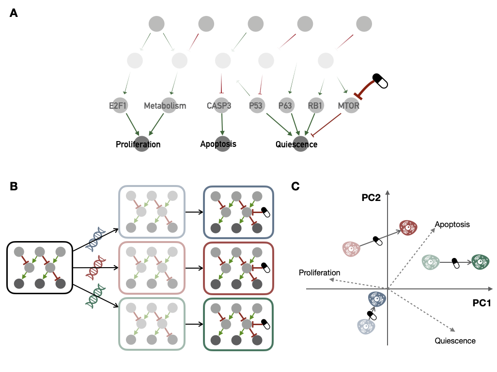
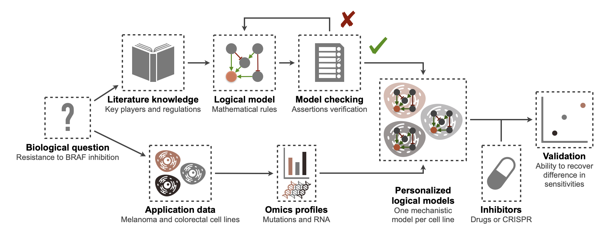
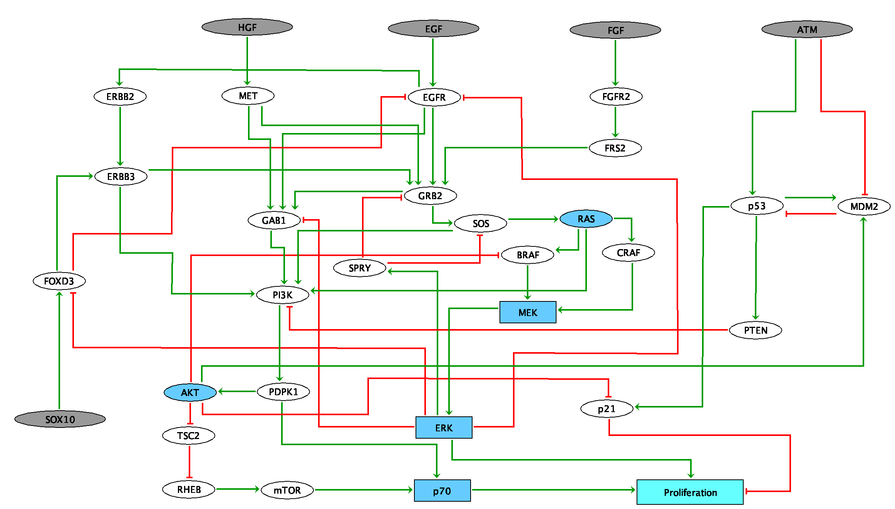

# Personalized logical models to study an interpret drug response {#chap6}

```{r, include=knitr::is_latex_output(), echo=FALSE}
knitr::asis_output('\\epigraph{"Il serait excellent que tout médecin ait la possibilité d\'expérimenter un grand nombre de médicaments sur lui-même. Sa compréhension de leurs effets en serait tout autre."}{Mikhail Bulgakov (Morphine, 1927)}')
```

```{r, include=knitr::is_html_output(), echo=FALSE}
knitr::asis_output(
  '>*Il serait excellent que tout médecin ait la possibilité d\'expérimenter un grand nombre de médicaments sur lui-même. Sa compréhension de leurs effets en serait tout autre.*<br/>
  >Mikhail Bulgakov (Morphine, 1927)')
```

```{r, include=knitr::is_latex_output(), echo=FALSE}
knitr::asis_output('\\initial{H}istorically, all mechanistic models of molecular networks, and logical models in particular, have been widely used to study response to treatments [@flobak2015discovery; @jastrzebski2018integrative]. Indeed, biological entities, many of which are prospective therapeutic targets, are explicitly represented in the model, making it possible to simulate their inhibition. This is what will be presented in this chapter using the personalized logical models described above. Can they be used to study the response of biological systems to perturbations, in this case the response of cell lines to gene or protein inhibitions? Compared to the numerous statistical models designed to predict the sensitivity of cell lines to treatements, what information do these personalized mechanistic models provide?')
```

```{r, include=knitr::is_html_output(), echo=FALSE}
knitr::asis_output('Historically, all mechanistic models of molecular networks, and logical models in particular, have been widely used to study response to treatments [@flobak2015discovery; @jastrzebski2018integrative]. Indeed, biological entities, many of which are prospective therapeutic targets, are explicitly represented in the model, making it possible to simulate their inhibition. This is what will be presented in this chapter using the personalized logical models described above. Can they be used to study the response of biological systems to perturbations, in this case the response of cell lines to gene or protein inhibitions? Compared to the numerous statistical models designed to predict the sensitivity of cell lines to treatements, what information do these personalized mechanistic models provide?')
```

```{r 6_packages, echo=FALSE, warning=FALSE, message=FALSE}
invisible(lapply(X =  c("knitr", "tidyverse", "magrittr",  "ggplot2", "ggpubr", "patchwork", "cowplot", "kableExtra", "ggrepel", "UpSetR", "gghalves", "ggh4x", "latex2exp", "plotly", "ggstance"),
       FUN = require,
       character.only = TRUE))

knitr::opts_chunk$set(
  cache = TRUE, echo = FALSE, warning = FALSE, message = FALSE,
  out.width = "90%",
  #fig.pos = "ht",
  fig.align = "center"
  )
```
  


```{block2, type='summarybox', echo = TRUE}

#### Scientific content {-}

This chapter extends the method presented in the previous chapter to investigate drug response with personalized logical models. The first application to cell lines of all cancer types was presented orally at (ISMB2020)[https://www.youtube.com/watch?v=6EMBycoR0Ow] in Basel but is not published.
  
The example about BRAF in melanomas and colorectal cancers is under review and the corresponding pre-print is available as @beal2020personalized. In this joint work, only the construction of the generic logical model and the model-checking procedure were mostly carried out by collaborators and especially by an intern under my joint supervision. These two steps will therefore be described more succinctly.  
  
Finally, the work on prostate cancer presented in a third section will be submitted soon. It is also a joint work, in which my participation focused on the application of the PROFILE method.

```

## One step further with drugs

One of the main clinical consequences of the underlying molecular complexity of cancers is the divergent response to treatment, even for *a priori* similar tumors. In the light of high-throughput sequencing data, the mechanisms governing these responses are somewhat better understood, for patients and especially for model organisms such as cell lines [@heiser2012subtype; @garnett2012systematic]. But beyond a few simple cases, the diversity of response biomarkers once again calls for **holistic approaches** to unravel the underlying mechanisms.


### Modeling response to cancer treatments 

To study these observed differences in drugs response in various cancers, some approaches based on mathematical modeling were developed to explore the complexity of differential drug sensitivities^[Sensitivity is understood throughout this chapter in the biological sense, *i.e.*, the response of a biological system (here cell lines) to an external disturbance (*e.g.*, a drug). This definition is extended to personalized logical models whose response to the same perturbations is studied.]. A number of **machine learning-based methods for predicting sensitivities** have been proposed [@costello2014community], either without particular constraints or with varying degrees of prior knowledge; but they do not necessarily provide a mechanistic understanding of the response. Some other approaches focused on the description of the processes that might influence the response by integrating knowledge of the signaling pathways and their mechanisms and translated it into a mathematical model [@eduati2017drug; @jastrzebski2018integrative; @frohlich2018efficient]. The first step of this approach implies the construction of a network recapitulating knowledge of the interactions between selected biological entities (driver genes but also key genes of signaling pathways), extracted from the literature or from public pathway databases, or directly inferred from data [@verny2017learning]. This static representation of the mechanisms is then translated into a dynamical mathematical model with the goal to not only understand the observed differences [@jastrzebski2018integrative] but also to predict means to revert unexpected behaviours.  
  

One way to address issues related to patient response to treatments is to **fit these mechanistic models to the available data**, and to train them on high-throughput cell-line specific perturbation data^[In this thesis, this term refers to data from biological systems (e.g. cell lines) that have been disrupted according to different technologies or molecules: drugs, CRISPR/Cas9 etc. The dynamic response of the studied system to these perturbations is thus accessed instead of being restricted to a static knowledge of the system.] [@eduati2017drug; @jastrzebski2018integrative; @klinger2013network]. These mechanistic models are then easier to interpret with regard to the main drivers of drug response. They also enable the *in silico* simulations of new designs such as combinations of drugs not present in the initial training data [@frohlich2018efficient]. However, these mechanistic models contain many parameters that need to be fitted or extracted from the literature. Some parsimonious mathematical formalisms have been developed to make up for the absence of either rich perturbation data to train the models or fully quantified kinetic or molecular data to derive the parameters directly from literature. One of these approaches is the logical modeling, which uses discrete variables governed by logical rules. Its explicit syntax facilitates the interpretation of mechanisms and drug response [@zanudo2017network; @iorio2016landscape] and despite its simplicity, semi-quantitative analyses have already been performed on complex systems including drug response studies [@knijnenburg2016logic; @eduati2020patient].  
  

### An application of personalized logical models

But logical formalism has also shown its relevance regarding drug response in cases where the model is not automatically trained on data but simply constructed from literature or pathway databases and where biological experiments focus on a particular cell line [@flobak2015discovery]. The study is then restricted to one cell line only from which some data and parameters have been experimentally inferred. Using the PROFILE method, it is possible to generate personalized logical models associated with different cell lines and then use them to study the response to treatment. **Since the models are not trained with perturbation data but simply specified/constrained by interpreting the molecular profiles, it is possible to personalize the logical models with a rather limited amount of data**.  
  

```{r PROFILE-drug, echo=FALSE, out.width = "90%", fig.cap='(ref:PROFILE-drug-caption)', fig.scap='Schematic extension of PROFILE-personalized logical models to drug investigation', fig.align='center'}

```
(ref:PROFILE-drug-caption) **Schematic extension of PROFILE-personalized logical models to drug investigation.** (A) Schematic representation of a logical model of cancer molecular networks, in particular the one described in appendix \@ref(appendix-verlingue) and used in the next subsection. (B) Sequential pipeline for drug response investigation with PROFILE, starting from a generic logical model, then transformed into several personalized models with different molecular profiles (correspondong to several cell lines); these models are finally simulated with a defined drug inhibition. (C) A possible analysis of the predictions of personalized models obtained from the generic model described in (A); a PCA is computed based on the final phenotype scores from personalized model, it allows to interpret biologically how the models represent cell lines (*e.g.*, more or less proliferative) and especially what impact of treatment they predict (*e.g.*, decrease *Proliferation* or increase *Apoptosis*). 
  

The principles are summarized in Figure \@ref(fig:PROFILE-drug). A generic model (Figure \@ref(fig:PROFILE-drug)A) is first transformed into as many personalized models as there are cell lines with an omics profile. These persnalized models are then simulated by adding the effect of a given treatment (Figure \@ref(fig:PROFILE-drug)B). The treatments that can be studied are generally targeted inhibitors. Generally speaking, one must be able to **translate the mechanism of action of the treatment into the logical model**. The impact of more systemic treatments such as chemotherapy or radiotherapy is more difficult to study with these methods, in any case with most of the logical models published to date, even if in theory, precise modeling of the pathways associated with these treatments (such as DNA repair) could contribute to this.  
  

It is then possible to analyze the personalized scores for each cell line (asymptotic values of the phenotypic read-outs of the model) with or without the effect of treatment. If the model includes more than two phenotypes of interest, such as the one in Figure \@ref(fig:PROFILE-drug)A, one can visualize these behaviors in the PCA space of the personalized scores, as shown schematically in Figure \@ref(fig:PROFILE-drug)C. In this case the directions of the original phenotype features (*Proliferation*, *Apoptosis*, *Quiescence*) have been added in the PCA-transformed space in order to facilitate the interpretation of positions and drug-induced displacements. In this mock example, based on personalized models, treatment would promote a shift from proliferative to more apoptotic or quiescent behaviors, in particular in the red and green cell lines, which are *a priori* more sensitive to the treatment.

### A pan-cancer attempt

This versatile analysis framework was first applied during this thesis to a **large pan-drug and pan-cancer analysis**. On the basis of generic logical models such as those previously presented (see appendix \@ref(appendix-fumia) and \@ref(appendix-verlingue)), and in view of the abundance of available data (across cancer tissues and drugs such as in GDSC cell line dataset, see appendix \@ref(appendix-fumia)), there were no theoretical obstacle to such an analysis. Although the simulations were carried out without any problems, the analysis nevertheless proved extremely difficult to interpret. We will highlight the various problems encountered, propose an illustration and some perspectives that led to the work presented in the following section.  
  

Based on the PROFILE methodology and GDSC data, hundreds of personalized models can be obtained, each corresponding to a cell line. For each of these personalized models, several dozen of potential drugs have a mechanism of action that can be mechanistically translated into the logical model. We thus obtain **tens of thousands of "personalized model/drug" pairs that correspond to experimentally evaluated drug sensitivies** (cf appendix \@ref(appendix-GDSC) for details). Firstly, the comparison of simulated and experimental data is not straightforward. As the models are qualitative, it is necessary to carry out the validation in this spirit. The idea is not to predict sensitivity quantitatively, rather to verify their relative relevance. In the first place, do we recover the cell lines that are most sensitive to a given drug? With several hundred cell lines, it is difficult to make this reflection graphically as in Figure \@ref(fig:PROFILE-drug)C. More quantitative approaches, such as correlation, would require the **definition of a precise sensitivity proxy in personalized models**. Should we choose the personalised *Proliferation* score obtained with drug? Or the drug-induced displacement in the mechanistic model (the drug arrows in Figure \@ref(fig:PROFILE-drug)C)? Or is a combination of phenotypes used, if so which one? As for experimental metrics, which ones to choose, and what interpretations do they allow? Whatever the choice, dose-response AUC or IC50 (see details in the appendix \@ref(appendix-GDSC)), a problem arises: can the sensitivities of a cell line to different drugs be compared? Such a comparison would allow the most clinically interesting questions of precision medicine to be asked: for a given molecular profile, can the model predict the best treatment to administer? However, AUCs are comparable for different drugs only if the concentration ranges tested are similar; and IC50s are extrapolated, sometimes well beyond the concentrations tested. Qualitative comparisons for a given drug therefore seem the most meaningful, as long as a relevant proxy in personalized models can be justified.


Aware of these difficulties, if one decides to do a correlation analysis, for each drug, of the personalized correlation scores with experimental sensitivities, one realizes that **some experimental responses correlate well with the behaviours of personalized models while others do not.** But it is difficult to decide between two different interpretations: does this mean that correctly predicted drugs are well modeled and others are not? Or does it mean that some correlations appear to be better by chance because so many drugs have been modeled? A case study can be illustrated more precisely with the example shown in Figure \@ref(fig:PROFILE-PCA). In order to simplify the analysis presented schematically in Figure \@ref(fig:PROFILE-drug)C, the 663 cell lines were averaged by cancer type (according to [TCGA denominations](https://gdc.cancer.gov/resources-tcga-users/tcga-code-tables/tcga-study-abbreviations)) and the drug-induced shifts are all represented from the origin in the PCA space. There is evidence that the effect of the drug on personalized models (using only mutations) tends to make them less proliferative and more apoptotic/quiescent (Figure \@ref(fig:PROFILE-PCA)A). This shift is strongest for those types of cancer that are actually most sensitive to this inhibitor experimentally (*i.e.*, low AUC), such as skin cutaneous melanomas (SKCM) in particular, and colorectal (COAD/READ) or pancreatic (PAAD) cancers to a lesser extent. The ability of personalized models to explain this difference can be understood by a known underlying biological reality: the prevalence of BRAF or RAS mutations in these cancers. The three aforementioned cancers are thus very frequently mutated for one of the two genes (Figure \@ref(fig:PROFILE-PCA)B). Then, the model translates the fact that these two genes are located just upstream of MAP2K1. It is therefore natural that an inhibition just downstream of these important mutations is particularly effective (Figure \@ref(fig:PROFILE-PCA)C). In a case such as this, the relevance of the model can be explained and justified *a posteriori*. This analysis is much more difficult in the vast majority of cases, whether the correlations are apparently good or not.

```{r PROFILE-PCA, echo=FALSE, fig.align='center', fig.cap='(ref:PROFILE-PCA-caption)', fig.scap='PROFILE-generated models and sensitivites to MAP2K1  inhibitors averaged per cancer type', out.width="90%", fig.height=8, fig.width=8}

data_arrow <- readRDS("data/drugs/data_arrow.rds")
data_plot_CT <- readRDS("data/drugs/data_plot_CT.rds")

p_ct <- ggplot() +
  geom_label_repel(data=data_plot_CT,
                aes(x=n_Dim.1, y=n_Dim.2,
                    label=TCGA_label,
                    fill=AUC),
                box.padding = unit(0.0, "lines"),
                label.padding = unit(0.1, "lines"),
                size=3, force = 2,
                segment.color = NA) +
  scale_fill_viridis_c(direction = -1) +
  geom_segment(data=data_arrow, 
            aes(x=0, y=0, xend=x, yend=y),
            arrow = arrow(angle = 30, length = unit(2, "mm"),
                          ends = "last", type = "open")) +
  geom_text_repel(data=data_arrow, 
               aes(label=name, x=x, y=y),
               box.padding = 0.25, point.padding = 0.05, direction = "y",
               segment.size = 10, min.segment.length = 1) +
  labs(title = paste0("Effects of MAP2K1 inhibitors on different cancer types"),
       subtitle = "(personalization with mutations only)",
       x = "Drug-induced shift in PC1",
       y = "Drug-induced shift in PC2",
       fill="Dose-response AUC:") +
  theme_pubclean() +
  theme(legend.position = "bottom",
        legend.title = element_text(face="bold"))


data_plot_CT_details <- readRDS("data/drugs/data_plot_CT_details.rds") %>%
  mutate(Status=100*Status)
p_ct_details <- ggplot(data_plot_CT_details, aes(x=Gene, y=Status, fill=AUC)) +
  geom_jitter(data = filter(data_plot_CT_details, !TCGA_label %in% c("SKCM", "PAAD", "COAD/READ")),
              aes(color=AUC),
              width = 0.1,
              show.legend = FALSE) +
  geom_label_repel(data = filter(data_plot_CT_details, TCGA_label %in% c("SKCM", "PAAD", "COAD/READ")),
                   aes(label=TCGA_label),
                   box.padding = unit(0.0, "lines"),
                   label.padding = unit(0.1, "lines"),
                   size=3,
                   segment.color = NA,
                   show.legend = FALSE) +
  scale_fill_viridis_c(direction = -1) +
  scale_color_viridis_c(direction = -1) +
  ylim(c(0, 100)) +
  labs(#title="Cancer types and BRAF/RAS mutations",
       x = "Mutated Gene (Gain of function)",
       y = "% of mutated cell lines") +
  theme_pubclean()

p_zoom <- ggdraw() + draw_image("fig/Verlingue-zoom.png",
                                scale = 1)

(p_ct / (p_ct_details + p_zoom) / guide_area()) +
  plot_layout(heights = c(2,2,1), guides = 'collect') +
  plot_annotation(tag_levels = 'A')

```
(ref:PROFILE-PCA-caption) **PROFILE-generated models and sensitivites to MAP2K1  inhibitors averaged per cancer type.** (A) Effects of MAP2K1 inhibitors on personalized logical models averaged per cancer types and represented in a normalized PCA space with super-imposed original phenotypes. (B) Proportion of BRAF- and RAS-mutated cell lines in some cancer types. (C) Zoom on the MAPK pathway of the logical model used.  
  

This example highlights a problem of scope. **The fact that the method enables to study hundreds of cell lines and dozens of drugs does not mean that it is relevant in each case**. The description of pathways in the model is more or less accurate. For example, a node at the model boundaries probably has many regulators missing. Is it then relevant to investigate the response of personalized models to its inhibition? It is therefore necessary to restrict the drugs studied. Similarly, even if the logical model summarizes many important pathways, it is probably unsuitable for certain cell lines or certain types of cancer with different etiologies. However, it is difficult to restrict the scope of the analysis in an unbiased way without having designed a model *de novo* for a specific purpose.  
  

For all these reasons, it was decided to leave aside this naive, broad-spectrum approach in favour of starting from a more specific biological question and constructing the appropriate logical model.


## Case study on BRAF in melanoma and colorectal cancers

In order to address the limitations outlined in this exploratory analysis, we propose here a pipeline based on logical modeling and able to go from the formulation of a specific biological question to the validation of a mathematical model on pre-clinical data, in this case a set of cell lines, and the subsequent interpretation of potential resistance mechanisms^[For the sake of completeness, all the steps will be described below or in appendix; the *"Logical model"* and *"Model checking"* steps that I supervised jointly without implementing them directly will be described more succinctly.] (Figure \@ref(fig:BRAF-GA)). As before, **one of the main points of differentiation with existing mechanistic approaches, is that this framework does not rely on any training of parameters but only on the automatic integration and interpretation of molecular features**. 

```{r BRAF-GA, echo=FALSE, out.width = "90%", fig.cap='(ref:BRAF-GA-caption)', fig.scap='BRAF modeling flowchart: from a biological question to validated personalized logical models', fig.align='center'}

```
(ref:BRAF-GA-caption) **BRAF modeling flowchart: from a biological question to validated personalized logical models.** Logical models are written with MaBoSS, and the checking model procedure is therefore provided in the same formalism. Cell line data are taken from Cell Model Passports [@van2019cell].

### Biological and clinical context

The construction of a mathematical model must be based first and foremost on a precise and specific biological question, at the origin of the design of the model. Here, we choose to explore the different responses to treatments in tumors from diverse cancers that bear the same mutation. A well-studied example of these variations is the BRAF mutation and especially its V600E substitution. BRAF is mutated in 40 to 70% of melanoma tumors and in 10% of colorectal tumors, each time composed almost entirely of V600E mutations [@cantwell2011brafv600e]. In spite of these similarities, **BRAF inhibition treatments have experienced opposite results with improved survival in patients with melanoma [@chapman2011improved] and significant resistance in colorectal cancers [@kopetz2010plx4032]**, suggesting drastic mechanistic differences. Some subsequent studies have proposed context-based molecular explanations, often highlighting surrounding genes or signalling pathways, such as a feedback activation of EGFR [@prahallad2012unresponsiveness] or other mechanisms [@poulikakos2011raf; @sun2014reversible]. These various findings support the need for an integrative mechanistic model able to formalize and explain more systematically the differences in drug sensitivities depending on the molecular context. The purpose of the study we propose here is not to provide a comprehensive molecular description of the response but to verify that the existence and functionality of the suggested feedback loops around the signalling pathway in which BRAF is involved [@prahallad2012unresponsiveness] may be a first hint towards these differences. For a more thorough study of these cancers, we refer to other works [@eduati2017drug; @baur2020connecting; @cho2016attractor].

### A logical model centred on BRAF

A logical model summarizing the main molecular interactions at work in colorectal cancers and melanomas is thus built from the literature and completed with databases. As previously mentioned, the objective is to understand whether it is possible to model and explain differences in responses to BRAF inhibition in melanoma and colorectal cancer patients using the same regulatory network. **The fact that the two cancers share the same network but differ from the alterations and expression of their genes constitutes our prior hypothesis**. The focus of this model is put on two important signaling pathways involved in the mechanisms of resistance to BRAF inhibition which are the ERK1/2 MAPK and PI3K/AKT pathways [@ursem2018emerging; @rossi2019drug]. The generic network presented in Figure \@ref(fig:BRAF-model) recapitulates the known interactions between the biological entities of the network that was first built from the literature, and then verified and completed with potential missing connections using SIGNOR database [@perfetto2016signor]. More details and references about the model can be found in appendix \@ref(appendix-pantolini). All in all, the logical model formalizes the knowledge compiled from different sources and highlights the role of SOX10, FOXD3, CRAF, PI3K, PTEN and of EGFR in resistance to anti-BRAF treatments. In order to facilitate the biological interpretation of the model's behaviors, **a phenotypic read-out is defined: it is the *Proliferation* node** which summarizes the proliferative capacity of the model resulting from the activation of the different signaling pathways.

```{r BRAF-model, echo=FALSE, out.width = "90%", fig.cap='(ref:BRAF-model-caption)', fig.scap='Logical model of signaling pathways around BRAF in colorectal and melanoma cancers', fig.align='center'}

```
(ref:BRAF-model-caption) **Logical model of signaling pathways around BRAF in colorectal andmelanoma cancers.** Grey nodes represent input nodes, which may correspond to the environmental conditions. Square nodes represent multi-valued variable (*MEK*, *ERK*, *p70* and *Proliferation*). Dark blue nodes accounts for families (several genes/entities for one node). Light blue node represents the phenotypic read-out of the model, *i.e.*, *Proliferation*.


Once the structure of the model was defined, and before moving on to its personalization, its consistency with the literature was checked using a **model-checking procedure**. Indeed, due to the complexity of the system, properly taking into account the interactions between entities does not automatically guarantee that the model will reproduce certain dynamic behaviours. It is therefore a question of verifying whether the model reproduces certain biological assertions found in the scientific literature. An example of a biological assertion may be the reactivation of the MAPK (mitogen-activated protein kinase) pathway through EGFR signal after BRAF inhibition in colorectal cancer [@prahallad2012unresponsiveness]: it is possible to check whether a simulation of this situation with the model gives the same result or not. Because there are many such assertions and because it is useful to verify them as the model is built, automatic model-checking tools have been defined, based on the MaBoSS syntax and inspired by the Python *unittest* library. More details are provided in @beal2020personalized and in a corresponding [GitHub repository](https://github.com/sysbio-curie/MaBoSS_test). The list of biological assertions used to validate the model is detailed in the appendix \@ref(appendix-pantolini).


### Cell lines data

The omics profiles of colorectal and melanoma cell lines are downloaded from Cell Model Passports portal [@van2019cell]. 64 colorectal cancer (CRC) cell lines and 65 cutaneaous melanoma (CM) cell lines are listed in the database, with at least mutation or RNA-seq data (59 CM and 53 CRC with both mutations and RNA-seq data). These omics profiles are used to generate cell-line-specific logical models as described in PROFILE method (Figure \@ref(fig:PROFILE-abstract)). The prevalence of mutations and their combination for the two types of cancer can be seen in Figure \@ref(fig:BRAF-GDSC)A and is consistent with the clinical situation described above with melanomas more frequently BRAF-mutated and colorectal cancers more frequently RAS-mutated.   

```{r BRAF-GDSC, echo=FALSE, fig.align='center', fig.cap='(ref:BRAF-GDSC-caption)', fig.scap='Descriptive analysis of cell lines for melanomas and colorectal cancers', out.width="95%", fig.height=5, fig.width=12}
colors_types <- c(CM="#B47562FF", CRC="#332826FF")
plot_data_upset <- readRDS("data/drugs/plot_data_upset.rds")
plot_data_BRAF_GDSC <- readRDS("data/drugs/plot_data_BRAF_GDSC.rds")
plot_data_BRAF_GDSC_label <- readRDS("data/drugs/plot_data_BRAF_GDSC_label.rds")

plot_A <- upset(plot_data_upset,
      sets=c("p53:0", "PI3K:1","RAS:1","BRAF:1"), keep.order=TRUE,
      order.by="freq", group.by="degree",
      query.legend = "bottom",
      sets.x.label = "Total mutations",
      mainbar.y.label = "Combinations of mutations\nprevalence",
      #query.legend=NULL,
      queries = list(
  list(query = intersects, params = list("TCGA_label", "CM", "CRC"), color = colors_types["CRC"], active = T, query.name = "CRC"),
  list(query = intersects, params = list("TCGA_label", "CM"), color = colors_types["CM"], active = T, query.name = "CM")))

t <- gather(plot_data_upset, key="Gene", value = "Status", -TCGA_label) %>%
  filter(Status==1) %>% select(-Status) %>%
  mutate(Gene=factor(Gene, levels=c("p53:0", "PI3K:1", "RAS:1", "BRAF:1")))
  
plot_sets <- ggplot(t, aes(y=Gene, fill=TCGA_label)) +
  geom_barh(show.legend = FALSE) +
  scale_y_discrete(position = "right") +
  scale_x_reverse() +
  scale_fill_manual(values = colors_types) +
  labs(x="Total mut.") +
  theme_classic() +
  theme(axis.ticks.y = element_blank(),
        axis.line.y = element_blank(),
        axis.text.y = element_blank(),
        axis.title.y = element_blank())

empty_plot <- ggplot() + theme_void() + labs(tag="A")

plot_Abis <- cowplot::plot_grid(
  empty_plot,
  plot_A$Main_bar,
  plot_sets, plot_A$Matrix,
  nrow=2, align='hv', rel_heights = c(2,1),
  rel_widths = c(2,4))


#####

plot_data_BRAF_GDSC %<>%
  mutate(Variant=if_else(Metric=="AUC","Drug (PLX-4720)", "CRISPR (Broad)"))

plot_data_BRAF_GDSC_label %<>%
  mutate(Variant=if_else(Variant=="PLX-4720\n(AUC)","Drug (PLX-4720)", "CRISPR (Broad)"))

plot_Ba <- ggplot(filter(plot_data_BRAF_GDSC, Variant=="Drug (PLX-4720)")) +
  geom_boxplot(aes(x=TCGA_label, y=Value, fill=TCGA_label),
               position = position_nudge(x = -0.2), outlier.shape=NA,
               alpha=0.5, width=.15,
               show.legend = FALSE) +
  geom_dotplot(aes(x=TCGA_label, y=Value, fill=TCGA_label),
               position = position_nudge(x = +0.2), binwidth = 0.015,
               binaxis='y',dotsize = 1, stackdir = "center",
               show.legend = FALSE) +
  geom_text(data = filter(plot_data_BRAF_GDSC_label, Variant=="Drug (PLX-4720)"),
            aes(x=TCGA_label, label=paste0("n=", Number)),
            y=0.52) +
  scale_fill_manual(values = colors_types) +
  facet_grid(Variant~BRAF, scales = "free") +
  theme_pubclean() +
  theme(legend.position = "right",
        axis.title.x = element_blank(), axis.ticks.x = element_blank(),
        axis.text.x = element_blank()) +
  labs(y= "AUC", tag="B") +
  ylim(c(0.5,1.05)) +
  stat_compare_means(aes(x=TCGA_label, y=Value),
                     label.x.npc = 0.25, label.y.npc = 0.95)

plot_Bb <- ggplot(filter(plot_data_BRAF_GDSC, Variant=="CRISPR (Broad)")) +
  geom_boxplot(aes(x=TCGA_label, y=Value, fill=TCGA_label),
               position = position_nudge(x = -0.2),
               alpha=0.5, width=.15,outlier.shape=NA,
               show.legend = FALSE) +
  geom_dotplot(aes(x=TCGA_label, y=Value, fill=TCGA_label),
               position = position_nudge(x = +0.2),
               binaxis='y',dotsize = 1, stackdir = "center") +
  geom_text(data = filter(plot_data_BRAF_GDSC_label, Variant=="CRISPR (Broad)"),
            aes(x=TCGA_label, label=paste0("n=", Number)),
            y=-2.8) +
  scale_fill_manual(values = colors_types,
                    guide = guide_legend(direction = "horizontal")
                    ) +
  facet_grid(Variant~BRAF, scales = "free") +
  theme_pubclean() +
  theme(legend.position = "bottom",
        strip.background.x = element_blank(),
        strip.text.x = element_blank(),
        axis.title.x = element_blank()) +
  labs(x = "Cancer types", y= "Scaled Bayes. factor", fill= "Cancer types:") +
  ylim(c(-3,6.5)) +
  stat_compare_means(aes(x=TCGA_label, y=Value),
                     label.x.npc = 0.25, label.y.npc = 0.95)

plot_B <- ((plot_Ba / plot_Bb) | guide_area()) +
  plot_layout(widths = c(6,1), guides = 'collect')

plot_B <- ((plot_Ba / plot_Bb / guide_area())) +
  plot_layout(heights = c(6,6,1), guides = 'collect')

ggarrange(plot_Abis, patchworkGrob(plot_B))

```
(ref:BRAF-GDSC-caption) **Descriptive analysis of cell lines for melanomas and colorectal cancers.** (A) Number of cell lines for the four most frequently mutated genes and their combinations (plot from UpSetR package [@conway2017upsetr]). (B) Differential sensitivities to BRAF inhibition by the drug PLX-4720 (lower panel) or by CRISPR inhibition (upper panel), depending on BRAF mutational status and cancer type. Numbers of cell lines in each category are indicated. Note that high sensitivities correspond to low AUC and high scaled Bayesian factors.  
  

In order to validate the relevance of personalized models to explain differential sensitivities to drugs, some experimental screening datasets are used. **Drug screening data** are downloaded from the Genomics of Drug Sensitivity in Cancer (GDSC) dataset [@yang2012genomics] which includes two BRAF inhibitors: PLX-4720 and Dabrafenib. The cell lines are treated with increasing concentration of drugs and the viability of the cell line relative to untreated control is measured. The dose-response relative viability curve is fitted and then used to compute the **area under the dose-response curve (AUC)** [@vis2016multilevel]. AUC is a value between $0$ and $1$: values close to $1$ mean that the relative viability has not been decreased, and lower values correspond to increased experimental sensitivity to inhibitions (details in appendix \@ref(appendix-GDSC)). The results obtained with the two drugs are very strongly correlated (Pearson correlation of $0.91$) and the analyses presented here will therefore focus on only one of them, PLX-4720.  
  

In a complementary way, some results of **CRISPR/Cas9 screening** are also downloaded from Cell Model Passports. This technology, which is described in more detail in the appendix \@ref(appendix-CRISPR), allows targeted inhibitions of certain genes. Two different datasets from Sanger Institute [@behan2019prioritization] and Broad Institute [@meyers2017computational] are available. We use **scaled Bayesian factors** to assess the effect of CRISPR targeting of genes. These scores are computed based on the fold change distribution of single guide RNAs [@hart2016bagel]. The highest values indicate that the targeted gene is essential to the cell fitness. The agreement between the two databases is good [@dempster2019agreement] but we choose to focus on the Broad database, which is more balanced in terms of the relative proportions of melanomas and colorectal cancers.  
  

Figure \@ref(fig:BRAF-GDSC)B illustrates both the relative quantities of cell lines for which drug or CRISPR screening data are available (depending on their BRAF status) as well as differences in experimental sensitivity to BRAF inhibition. The greater sensitivity of BRAF-mutated melanomas compared to BRAF-mutated colorectal cancers is well observed for PLX-4720. However, the overlap in the distributions requires a deeper look into the data and a search for more precise explanations of the differences in sensitivity, including within each type of cancer. The finding appears to be similar for CRISPR despite a sample size that is too small; the higher average sensitivity of melanomas even extends to non-mutated BRAF.

### Validation of personalized models using CRISPR/Cas9 and drug screening

The validation of personalized logical models using these screening data is done with the following rationale. First, the models are personalized using omics data from the cell lines. Then, two separate simulations are performed for each personalized model: one without the inhibition, the other by creating and activating a BRAF inhibitor to mimic the drug or CRISPR inhibition. A ratio of the *Proliferation* phenotype obtained with inhibition and without inhibition is obtained and can be written as follows for each personalized logical model:

$$\dfrac{Proliferation(t_{final})~\text{with BRAF inhibited}}{Proliferation(t_{final})~\text{without any inhibition}}$$

Since the expected effect of the drug is to decrease proliferation, this ratio is expected to be less than or equal to 1, with the lower values indicating the personalized logical models most sensitive to this targeted inhibition. This ratio is considered as a proxy for drug sensitivity. In the experimental cell line data mentioned above, drug sensitivities are measured with different metrics, each of which is also standardized: AUC is calculated on relative viability for drugs and Bayes factor is computed from fold-changes and then scaled. It is therefore possible to qualitatively compare the drug sensitivity proxy built from the personalized models and the experimental values, all measuring for each cell line the relative variation in proliferation in response to drug inhibition. Since mechanistic models are essentially qualitative, it is difficult to give a precise interpretation of the magnitude of their proliferation variations. Subsequently, the ratio presented above and the experimental values will be compared simply by calculating the linear correlation between these variables, in order to verify whether the ratio is able to reproduce the same trends and to identify the most or least sensitive lines. Predictive approaches would require a better prior calibration of the mechanistic models.

#### Differential sensitivities to BRAF targeting explained by personalized logical models {#diff-BRAF}

Once the logical model consistency has been validated, personalized models are generated for each cell line by integrating their interpreted genomic features directly as model constraints or parameters. **Sensitivities to BRAF inhibition inferred from models are then compared to experimentally observed sensitivities** (Figure \@ref(fig:BRAF-results)). In all the following analyses, we focus on three different personalization strategies using: only mutations as discrete personalization (Figure \@ref(fig:BRAF-results)A, upper row), only RNA as continuous personalization (Figure \@ref(fig:BRAF-results)A, middle row) or mutations combined with RNA (Figure \@ref(fig:BRAF-results)A, lower row). These choices reflect first of all the following *a priori*: mutations are much more drastic and permanent changes than RNA, whose expression levels are more subject to fluctuation and regulation. The objective is also to answer the following questions: What type of data is most likely to explain the differences in responses? Is it relevant to combine them? Figure \@ref(fig:BRAF-results) shows an example of the type of analyses possible with personalized models, zooming in more and more on the details from panel A to panel C.

```{r BRAF-results, echo=FALSE, out.width = "90%", fig.cap='(ref:BRAF-results-caption)', fig.scap='Validation of personalized models of BRAF inhibition with cell lines data', fig.align='center'}
knitr::include_graphics("fig/BRAF-results.png")
```
(ref:BRAF-results-caption) **Validation of personalized models of BRAF inhibition with cell lines data.** (A) Pearson correlations between normalized *Proliferation* scores from models and experimental sensitivities to BRAF inhibition (drug or CRISPR); only significant correlations are displayed. (B) Scatter plots with non-overlapping points corresponding to correlations of panel A for one drug (PLX-4720) and one CRISPR dataset (Broad) only. (C) Enlargement of one scatter plot in B (left) with the table describing the omics profiles used for each cell line to explore the response mechanisms (right); interactive version in Figure \@ref(fig:BRAF-interactive) or [GitHub files](https://github.com/sysbio-curie/PROFILE_BRAF_Model/blob/master/Analysis.html).

The first approach consists in using only mutations as discrete personalization (Figure \@ref(fig:BRAF-results), A, upper row): the mutations identified in the dataset and that are present in the regulatory network are set to 1 for activating mutations and set to 0 for inactivating mutations. In this case, the *Proliferation* scores from personalized models significantly correlate with both BRAF drug inhibitors (PLX-4720 and Dabrafenib) and both CRISPR datasets (using Pearson correlations). Note that the opposite directions of the correlations for the drug and CRISPR datasets are due to the fact that cell lines sensitive to BRAF inhibition result in low AUCs, and high scaled Bayesian factors, respectively, and, if the models are relevant, to low standardized *Proliferation* scores. Looking more closely at the corresponding scatter plot for PLX-4720 (Figure \@ref(fig:BRAF-results)B, upper left), it can be seen that this correlation results from the **model's ability to use mutations' information to recover the highest experimental sensitivities of the BRAF-mutated cell lines** that form an undifferentiated cluster on the left side. These cell lines are indeed relatively more sensitive than non-mutated BRAF cell lines. However, the integration of mutations alone does not explain the significant differences within this subgroup (AUC between 0.55 and 0.9). A very similar behaviour can be observed when comparing model simulations with CRISPR data (Figure \@ref(fig:BRAF-results)B, upper right).  
  

Using only RNA data as continuous personalization (Figure \@ref(fig:BRAF-results)A and B, middle rows) is both less informative and more difficult to interpret. For continuous data such as RNA-sequencing data, we normalize the expression values and set both the initial conditions and the transition rates of the model variables to the corresponding values. Correlations with experimental BRAF inhibitions appear weaker and more uncertain. The key point, however, is that the **combination of mutations and RNA, as depicted in Figure \@ref(fig:BRAF-results) A and B lower rows, seems to be more relevant**. This is partially true in quantitative terms but it is even easier to interpret in the corresponding scatter plots (Figure \@ref(fig:BRAF-interactive)). Comparing first the Broad CRISPR scatter plots using mutations only (Figure \@ref(fig:BRAF-results)B, upper right) and using both mutations and RNA (Figure \@ref(fig:BRAF-results)B, lower right), we can observe that non-responsive cell lines (scaled Bayesian factor below 0), grouped in the lower right corner and correctly predicted using only mutations stayed in the same area: these strong mutational phenotypes have not been displaced by the addition of RNA data. Other cell lines previously considered to be of intermediate sensitivity by the model (*e.g.*, COLO-678 or SK-MEL-2) were shifted to the right, consistent with the lack of sensitivity observed experimentally. Finally, BRAF-mutated cell lines, previously clustered in one single column on the left using only mutations (with normalized *Proliferation* scores around 0.5), have been moved in different directions. Many of the most sensitive cell lines (scaled Bayesian factor above 2) have been pushed to the left in accordance with the high sensitivities observed experimentally (*e.g.*, HT-29 or SK-MEL-24). It is even observed that the model corrected the position of the two BRAF mutated cell lines, but whose sensitivity is experimentally low (melanoma cell line HT-144 and colorectal cell line HT-55). Only one cell line (SK-MEL-30) has seen its positioning evolve counter-intuitively as a result of the addition of RNA in the personalization strategy: relatively sensitive to the inhibition of BRAF, it has, however, seen its standardised *Proliferation* score approach 1. All in all, this contribution of RNA data results in significant correlations even when restricted to BRAF-mutated cell lines only ($R=0.69$, $p.value=0.006$).  

```{r BRAF-interactive, echo=FALSE, fig.align='center', fig.cap='(ref:BRAF-interactive-caption)', fig.scap='Multi-omics integration and enhanced value of RNA in addition to mutations', out.width="90%", fig.height=5, fig.width=8}
colors_types_add <- c("p53: Loss function"="#B18147FF",
                  "p53: No mutation"="#B2AAA2FF",
                  "PI3K: Gain function"="#803B31FF",
                  "PI3K: No mutation"="#B2AAA2FF")

plot_data_BRAF_interactive <- readRDS("data/drugs/plot_data_BRAF_interactive.rds")

if (is_html_output()){
p_crispr <- ggplot(plot_data_BRAF_interactive, aes(x=Score, y=Value)) +
  geom_point(aes(color=TCGA_label, text=Label, frame=SimCase),
             show.legend = FALSE) +
  #facet_grid(SimCase~.) +
  theme_pubclean() +
  scale_color_manual(values = colors_types)  +
  theme(legend.position = "none",
        plot.title = element_text(hjust = 0.5),
        strip.background.y = element_blank(),
        strip.text.y = element_blank(),
        panel.border = element_rect(color = "gray30",
                                    fill = NA, size = 0.7)) +
  labs(#title="CRISPR: (Prolif. norm.) VS (CRISPR Broad)",
       x="Proliferation scores from  personalized models",
       y="CRISPR screening metric\n(scaled Bayesian factor)")
ply_crispr <- ggplotly(p_crispr, tooltip = "text") %>%
  animation_slider(currentvalue = list(prefix = "Personalization with ", font = list(color="black")),
                   lenmode="fraction",
                   len=0.5,
                   x=0.3,
                   y=-0.2)

ply_crispr

} else {
  p_crispr <- ggplot(plot_data_BRAF_interactive, aes(x=Score, y=Value)) +
  geom_point(aes(color=TCGA_label),
             show.legend = TRUE) +
  facet_grid(~SimCase) +
  theme_pubclean() +
  scale_color_manual(values = colors_types)  +
  theme(legend.position = "none",
        plot.title = element_text(hjust = 0.5),
        strip.background.y = element_blank(),
        strip.text.y = element_blank(),
        panel.border = element_rect(color = "gray30",
                                    fill = NA, size = 0.7)) +
  labs(#title="CRISPR: (Prolif. norm.) VS (CRISPR Broad)",
       x="Proliferation scores from  personalized models",
       y="CRISPR screening metric\n(scaled Bayesian factor)")
  
  p_crispr <- select(plot_data_BRAF_interactive, -P_Rates) %>%
    pivot_wider(names_from = SimCase, values_from = Score) %>%
  ggplot() +
  geom_segment(aes(x=`Mutations`, xend=`Mutations & RNA`,
                   y=Value, yend=Value,
                   color=TCGA_label),
               arrow = arrow(angle = 30, length = unit(4, "mm"),
                                ends = "last", type = "open"),
               show.legend = TRUE, alpha=0.5) +
  geom_point(aes(x=`Mutations`, y=Value, color=TCGA_label),
             alpha=0.5) +
    geom_point(aes(x=`Mutations & RNA`, y=Value, color=TCGA_label)) +
  theme_pubclean() +
  scale_color_manual(values = colors_types)  +
  theme(legend.position = "none",
        plot.title = element_text(hjust = 0.5),
        strip.background.y = element_blank(),
        strip.text.y = element_blank(),
        panel.border = element_rect(color = "gray30",
                                    fill = NA, size = 0.7)) +
  labs(#title="CRISPR: (Prolif. norm.) VS (CRISPR Broad)",
       x="Proliferation scores from  personalized models",
       y="CRISPR screening metric\n(scaled Bayesian factor)")
  
  p_crispr

}

```

```{r, include=knitr::is_latex_output(), echo=FALSE}
knitr::asis_output('(ref:BRAF-interactive-caption) **Multi-omics integration and enhanced value of RNA in addition to mutations.** For each cell line, an arrow shows the impact of adding RNA in the customization strategy. This graph is present in an [interactive format](https://jonasbeal.github.io/files/PhdThesis/personalized-logical-models-to-study-an-interpret-drug-response.html#fig:BRAF-interactive) in the online version of the thesis in order to give easy access to the omic profile corresponding to each point.')
```

```{r, include=knitr::is_html_output(), echo=FALSE}
knitr::asis_output('(ref:BRAF-interactive-caption) **Multi-omics integration and enhanced value of RNA in addition to mutations.** The successive observation of the two personalization strategies allows to visualize the impact of the RNA addition and to look at the corresponding omics sprofiles for the different points.')
```  

A similar analysis can be made of the impact of adding RNA data to personalization when comparing with the experimental response to PLX-4720 (Figure \@ref(fig:BRAF-results)B, upper and lower left). Most of the non-sensitive cell lines (upper right corner) have not seen the behaviour of the personalized models change with RNA addition. However, the numerous BRAF-mutated cell lines previously grouped around standardized *Proliferation* scores of 0.5, are now better differentiated and their sensitivity predicted by personalized models has generally been revised towards lower scores (*i.e.*, higher sensitivity). Similar to the CRISPR data analysis, three sensitive cell lines have been shifted to the right and are misinterpreted by the model. As a result, the correlation restricted to BRAF-mutated cell lines is no longer significant (R=0.26, p.value=0.1).

#### An investigative tool

These **personalized models are not primarily intended to be predictive tools but rather used to reason and explore the possible mechanisms and specificities of each cell line, for example by studying the molecular alterations at the origin of the observed behaviour** (Figure \@ref(fig:BRAF-interactive)). To continue on the previous examples, the two melanoma cell lines, HT-144 and SK-MEL-24, share the same mutational profiles but have very different sensitivities to BRAF targeting (Figure \@ref(fig:BRAF-results)C). This inconsistency is partially corrected by the addition of the RNA data, which allows the model to take into account the difference in CRAF expression between the two cell lines. In fact, CRAF is a crucial node for the network since it is necessary for the reactivation of the MAPK pathway after BRAF inhibition. Therefore, the high sensitivity of SK-MEL-24 may be explained by its low CRAF expression level, which makes the reactivation of the MAPK pathway more difficult for this cell line. Conversely, in HT-144, the high level of CRAF expression allows the signal to flow properly through this pathway even after BRAF inhibition, thus making this cell line more resistant. The importance of CRAF expression is also evident in HT-29, a CRC BRAF mutated cell line with other important mutations (PI3K activation and p53 deletion). However, it remains sensitive to treatment, due to its very low level of CRAF expression.  
  

Another interesting contribution of RNA appears in the melanoma cell line UACC-62, which is particularly sensitive to treatment. The model is able to correctly predict its response once RNA levels are integrated. In this case, the reason for sensitivity seems to be due to the low level of PDPK1, which makes it difficult to activate p70 and thus to trigger the resistance linked to PI3K/AKT pathway activation. Similarly, the CRC resistant cell line, HT55, which carries only the BRAF mutation, expresses high levels of PDPK1, in addition to high levels of CRAF, supporting the idea that the presence of both MAPK and PI3K/AKT pathways may confer resistance to BRAF inhibition treatments. We can also mention a cluster of RAS mutated cell lines, usually NRAS mutated for melanomas (*e.g.*, SK-MEL-2) and KRAS for colorectal cancers (*e.g.*, COLO-678), which are classified by the model as resistant. Interestingly, in these cell lines, a low level of CRAF is not enough to block the signal of the MAPK pathway, which is stronger in the model because of the simulation of the RAS mutation (RAS is set to $1$). Only SK-MEL-30 appears to be incorrectly classified and is observed to be more sensitive than the other cell lines with a similar mutation profile. This could be due to the fact that our network is incomplete and not able to account for some alterations responsible for this cell line sensitivity. The problem may also come from the fact that this cell line contains a frameshift mutation of RPS6KB2 (p70 node) not referenced in OncoKB and therefore not included in the simulation.  
  
```{r BRAF-results-add, echo=FALSE, fig.align='center', fig.cap='(ref:BRAF-results-add-caption)', fig.scap='Application of personalized models to other CRISPR targets', out.width="90%", fig.height=5, fig.width=8}
colors_types_add <- c("p53: Loss function"="#B18147FF",
                  "p53: No mutation"="#B2AAA2FF",
                  "PI3K: Gain function"="#803B31FF",
                  "PI3K: No mutation"="#B2AAA2FF")

plot_data_BRAF_add <- readRDS("data/drugs/plot_data_BRAF_add.rds")

p_table_red <- select(plot_data_BRAF_add, SimCase, P_Mutants, P_Rates) %>%
   pivot_longer(starts_with("P_"), names_to="P_Method", values_to="P_Type") %>%
   distinct %>%
   mutate(Alpha_Status=if_else(P_Type==" ", 0, 1),
         P_Method=if_else(P_Method=="P_Mutants", "Disc.", "Cont.") %>% factor(levels=c("Disc.", "Cont.")),
         Label="Personalization") %>%
   ggplot(aes(x=P_Method, y=1)) +
      geom_tile(aes(alpha=as.factor(Alpha_Status)),
                color="black", size=0.5,fill="grey85",
                show.legend = FALSE) +
      geom_text(aes(label=P_Type), color="black", angle=90) +
      theme_pubclean() +
      theme(panel.grid.minor.y = element_blank(),
            strip.text = element_text(size=12),
            axis.ticks.y = element_blank(),
            axis.title.y = element_blank(),
            axis.text.y = element_blank(),
            strip.background.y = element_blank(),
            strip.text.y = element_blank(),
            axis.text.x = element_blank(),
            axis.ticks.x = element_blank(),
            axis.title.x = element_blank()) +
      #scale_fill_manual(values=colors_perso) +
      scale_alpha_manual(values = c(0.4,1)) +
  scale_y_continuous(breaks = seq(1, 1, 1)) +
  labs(x="Personalization methods",
       y="Combinations of personalization methods") +
  facet_nested(SimCase~Label+P_Method, scales = "free", space = "free")
  
  p_crispr_p53 <- filter(plot_data_BRAF_add, Target=="p53") %>%
    mutate(Variant="CRISPR inhibition: TP53", Label_Void=" ") %>%
    ggplot(aes(x=Score, y=Value)) +
    geom_label_repel(aes(label=Label_Void, fill=p53),
                     #color='',
                     show.legend = TRUE,
                     box.padding = 0, label.padding = 0.03,
                     segment.color = NA) +
    stat_cor(method="pearson",
             label.y.npc=0.2, label.sep = "\n") +
    facet_grid(SimCase~Variant) +
    theme_pubclean() +
    scale_fill_manual(values = colors_types_add) +
    theme(legend.position = "bottom",
          plot.title = element_text(hjust = 0.5),
          strip.background.y = element_blank(),
          strip.text = element_text(size = 12),
          strip.text.y = element_blank(),
          panel.border = element_rect(color = "gray30",
                                      fill = NA, size = 0.7),
          legend.key = element_rect(fill = NA, colour = NA, size = 0.25),
          axis.text = element_text(size = 12),
          axis.title = element_text(size = 14)) +
    labs(y="CRISPR screening metric\n(scaled Bayesian factor)",
         x=expression(paste("Prolif"[p53inhibition]," / Prolif"[control])),
         #x=TeX("$\\frac{Proliferation_{p53inhibited}}{Proliferation_{control}}$"),
         fill="Mutation status: ") +
    guides(fill=guide_legend(nrow=1,byrow=TRUE,
                             override.aes = aes(label = "")))
  
  
  p_crispr_PI3K <- filter(plot_data_BRAF_add, Target=="PI3K") %>%
    mutate(Variant="CRISPR inhibition: PIK3CA", Label_Void=" ") %>%
    ggplot(aes(x=Score, y=Value)) +
    geom_label_repel(aes(label=Label_Void, fill=PI3K),
                     show.legend = TRUE,
                     box.padding = 0, label.padding = 0.03,
                     segment.color = NA) +
    stat_cor(method="pearson",
             label.y.npc=0.2, label.sep = "\n") +
    facet_grid(SimCase~Variant) +
    theme_pubclean() +
    scale_fill_manual(values = colors_types_add) +
    theme(legend.position = "bottom",
          plot.title = element_text(hjust = 0.5),
          strip.text = element_text(size=12),
          strip.background.y = element_blank(),
          strip.text.y = element_blank(),
          panel.border = element_rect(color = "gray30",
                                      fill = NA, size = 0.7),
          legend.key = element_rect(fill = NA, colour = NA, size = 0.25),
          legend.title = element_blank(),
          axis.title.y = element_blank(),
          axis.text = element_text(size = 12),
          axis.title = element_text(size = 14)) +
    labs(x=expression(paste("Prolif"[PI3Kinhibition]," / Prolif"[control])),
         #x=TeX("$\\frac{Proliferation_{PI3Kinhibited}}{Proliferation_{control}}$"),
         fill="Cancer type\n(and BRAF status)") +
    guides(fill=guide_legend(nrow=1,byrow=TRUE,
                             override.aes = aes(label = "")))
  
(p_table_red + p_crispr_p53 + p_crispr_PI3K) +
    plot_layout(widths = c(1,2,2)) +
    plot_annotation(tag_levels = 'A')

```
(ref:BRAF-results-add-caption) **Application of personalized models to other CRISPR targets.** (A) Personalization strategies using either mutations only (as discrete data) or combined with RNA (as continuous data) with their corresponding scatter plots in panels B and C. (B) Scatter plot comparing normalized *Proliferation* scores of p53 inhibition in the models with experiment sensitivity of cell lines to TP53 CRISPR inhibition, indicating p53 mutational status as interpreted in the model. Pearson correlations and the corresponding p-values are shown. (C) Similar analysis as in panel B with PI3K model node and PIK3CA CRISPR inhibition.
  
The versatility of the logical formalism makes it possible to test other node inhibitions as in Figure \@ref(fig:BRAF-results-add), but remains limited by the scope of the model. Since the present model has been designed around BRAF, its regulators have been carefully selected and implemented, which is not necessarily the case for other nodes of the model. Therefore, these personalized models can be used to study how comprehensive the descriptions of the regulation of other nodes or parts of the model are. Thus, model simulations show that response trends to TP53 inhibition are consistently recovered by the model (Figure \@ref(fig:BRAF-results-add)B) but the simple regulation of p53 in the model results in coarse-grained patterns, although slightly improved by addition of RNA data. Similar analyses regarding the targeting of PIK3CA (in CRISPR data) simulated, in the model, by the inhibition of PI3K node, can be performed (Figure \@ref(fig:BRAF-results-add)C). **Low correlations are an indication highlighting the insufficient regulation of the node, probably confirming the scope issues raised in the pan-cancer-preliminary analysis**.


### Comparison of the mechanistic approach with machine learning methods {#ML-comp}

```{r BRAF-ML, echo=FALSE, fig.align='center', fig.cap='(ref:BRAF-ML-caption)', fig.scap='Random forests to predict and explain sensitivity to BRAF inhibition', out.width="90%", fig.height=10, fig.width=8}

rf_performances <- readRDS("data/drugs/rf_performances.rds")

data_colors1 <- c("Mut."="#306489FF", "RNA"="#EBCB8BFF", "Mut. & RNA"="#A3BE8CFF")
data_colors2 <- c("Mutations"="#306489FF", "RNA"="#EBCB8BFF", "Mutations & RNA"="#A3BE8CFF")

p_expvar <- select(rf_performances, -Variable, -Importance) %>% distinct %>%
  mutate(Processing=case_when(
         Processing=="original" ~ "Original data\n(cancer and model genes)",
         Processing=="original_red" ~ "Original data\n(model genes only)",
         Processing=="processed" ~ "Processed data\n(model profiles)"
       )) %>%
  mutate(Data=case_when(
         Data=="Mut" ~ "Mut.",
         Data=="RNA" ~ "RNA",
         Data=="Mut_RNA" ~ "Mut. & RNA"
       )) %>%
  mutate(Screening=factor(Screening, levels=c("Drug", "CRISPR")),
         Data=factor(Data, levels=c("Mut.", "RNA", "Mut. & RNA")),
         Label=paste0("n=", N_Var, "\np=", N_Samples)) %>%
  ggplot(aes(x=Data, y=Exp_Var)) +
  geom_bar(stat = "identity", aes(fill=Data)) +
  geom_text(aes(label=Label), size=4, color="white", y=13, angle=0) +
  scale_fill_manual(values=data_colors1) +
  facet_grid(Screening~Processing) +
  theme_pubclean() +
  guides(fill=FALSE) +
  labs(#title = "Performances of random forests for BRAF sensitivity prediction",
       #subtitle = "(n samples and p variables per learning task)",
       x = "Omics data used",
       y = "% of explained variance")

p_varimp <- filter(rf_performances, Screening=="Drug", Importance>0) %>%
  mutate(Processing=case_when(
         Processing=="original" ~ "Original data\n(cancer and model genes)",
         Processing=="original_red" ~ "Original data\n(model genes only)",
         Processing=="processed" ~ "Processed data\n(model profiles)"
       )) %>%
  mutate(Data=case_when(
         Data=="Mut" ~ "Mutations",
         Data=="RNA" ~ "RNA",
         Data=="Mut_RNA" ~ "Mutations & RNA"
       )) %>%
  mutate(#Screening=factor(Screening, levels=c("Drug", "CRISPR")),
         Data=factor(Data, levels=c("Mutations", "RNA", "Mutations & RNA"))) %>%
  ggplot(aes(x=reorder(Variable, -Importance), y=Importance)) +
  geom_bar(stat = "identity", aes(fill=Data)) +
  scale_fill_manual(values=data_colors2) +
  facet_grid(Data~Processing, scales = "free", space = "free") +
  theme_pubclean() +
  theme(axis.text.x = element_text(size=6, angle = 90)) +
  guides(fill=FALSE) +
  labs(#title = "Random forests for BRAF drug sensitivity - Variable importance",
       #subtitle = "(10 best variables with positive importance for each case)",
       x = "Variable",
       y = "Variable importance")

(p_expvar / p_varimp) +
  plot_annotation(tag_levels = 'A')
```
(ref:BRAF-ML-caption) **Random forests to predict and explain sensitivity to BRAF inhibition.** (A) Performances of random forests for BRAF sensitivity prediction measured with percentage of explained variance; different learning task with unprocessed original data (thousands of genes), unprocessed original data for model-related genes only (tens of genes), and processed profiles of cell lines (tens of genes); $n$ samples and $p$ variables per learning task. (B) Variable importance for drug prediction only, with the 10 best variables with positive importance for each case.

In order to provide comparison elements unbiased by prior knowledge or by the construction of the model, we performed some simple machine learning algorithms. Random forests are used as an example of a machine learning approach to compare with mechanistic models and are implemented with *randomForestSRC* R package [@breiman2001random]. Random forests can be seen as an aggregation of decision trees, each trained on a different training set formed by uniform sampling with replacement of the original cohort. Prediction performances are computed using out-of-the bag estimates for each individual (i.e, average estimate from trees that did not contain the individual in their bootstrap training sample) and summarized as percentage of variance explained by the random forest. In this case, random forests have been fitted with inputs (mutations and/or RNA data) and outputs (sensitivities to drug or CRISPR BRAF inhibition) similar to those of logical models and the corresponding predictive accuracies are reported in Figure \@ref(fig:BRAF-ML)A. The first insight concerns data processing. The percentages of variance explained by the models are similar (around 70% of explained variance for drug sensitivity prediction) in the following three cases: unprocessed original data (thousands of genes), unprocessed original data for model-related genes only (tens of genes), and processed profiles of cell lines (tens of genes). This supports the choice of a model with a small number of relevant genes, which appear to contain most of the information needed for prediction. Second, the absolute level of performance appears much lower for CRISPR (between 30 and 50%) probably suffering from the lower number of samples, especially in cases where the number of variables is the highest. This tends to **reinforce the interest of mechanistic approaches that do not use any training on the data for smaller datasets, less suitable for learning**. Finally, while mutations and RNA data seem to provide the same predictive power (especially for drugs), using the two together does not necessarily result in a better performance in this case.  
  

It is also possible to compute the variable importance that assesses the contribution of variables to the overall performance. The solution adopted in this paper to measure it, and called VIMP in the package, consists in introducing random permutations between individuals for the values of a variable and quantifying the variation in performance resulting from this addition of noise. In the case of key variables for prediction, this perturbation will decrease the performance and will result in a high variable importance [@ishwaran2007variable]. **Variable importance in these different random forests are reported in Figure \@ref(fig:BRAF-ML)B and are consistent with the analysis of mechanistic models**. The mutational status of BRAF is definitely the most important variable followed by mutations in RAS or TP53. Concerning RNA levels, the most explanatory variables seem to be FOXD3 or PTEN, in line with the definition of the logical model.


## Application on prostate cancer study and challenges {#prostate-model}

Before summarizing the potential and limitations of the PROFILE approaches described in this and the previous chapter, a final example may be mentioned. Indeed, another application of the PROFILE method, quite similar to the examples presented in the previous and this chapter, has been carried out on prostate cancer. Chronologically, this project was one of the first applications of the method. However, as this project was more collaborative than personal, the previous chapters have been illustrated by more exclusively personal work when they were equivalent. We will therefore only briefly mention here the differences and insights specific to this study.  
  

First, a logical model specific to prostate cancer was developed by some collaborators (Pauline Traynard and Arnau Montagud) over a long period of time, resulting in a large and comprehensive model of 146 nodes, which is described in more detail in the appendix \@ref(appendix-montagud) and Figure \@ref(fig:Montagud). Using the TCGA prostate cancer dataset (\@ref(appendix-prostate)) prognostic validation of the model was first carried out, similarly to Figure \@ref(fig:PROFILE-METABRIC-Grade), by comparing individualized scores of some phenotypes in the model (*i.e.*, *Proliferation*) with clinical markers, in this case Gleason score, a grading system specific to prostate cancer. The qualitative evolution of the personalized *Proliferation* scores is also qualitatively validated (predicted proliferating tumors are on average of higher grade) but, despite the specificity and magnitude of the model, much of the variability is not explained.  
  

The use of cell line data was also explored using Cell Model Passports data, restricted to the 7 prostate cell lines. The size of the model then allows qualitative predictions to be made on the proliferative, apoptotic and metastatic qualities of the different lines. Except for proliferation, however, experimental validation of the relevance of these predictions is difficult using public data or the literature. But again, after these preliminary validations, the focus of the study was on treatment response with a slightly different rationale than in the previous example. Focusing on a particular cell line (LnCaP) and its corresponding personalized logical model, the idea is to **simulate with the models all possible inhibitions or combinations of inhibitions in order to identify possible vulnerabilities or relevant treatment synergies**. Experimental validation on the cell line was then carried out for certain genes that could be targeted depending on the existence of the treatments. The **efficacy of certain inhibitions highlighted by the simulations, such as that of HSP90, was confirmed experimentally** on this particular cell line. Despite the limitations of the approach in this application to prostate cancer, the study demonstrates the feasibility of the method for investigating the complexity of therapeutic responses and guiding experimental validation.


## Limitations and perspectives {#part2-limits}

The emergence of high-throughput data has made it easier to generate models for prognostic or diagnostic predictions in the field of cancer. The numerous lists of genes, biomarkers and predictors proposed have, however, often been difficult to interpret because of their sometimes uncertain clinical impact and little overlap between competing approaches [@domany2014using]. Methods that can be interpreted by design, which integrate *a priori* biological knowledge, therefore appear to be an interesting complement able to reconcile the omics data generated and the knowledge accumulated in the literature.  
  

These benefits come at the cost of having **accurate expert description of the problem** to provide a relevant basis to the mechanistic models. This is particularly true in this work since the personalized models all derive from the same structure (the initial generic logical model) of which they are partially constrained versions. It is therefore necessary to have a generic model that is both sufficiently accurate and broad enough so that the data integration allows the expression of the singularities of each cell line. If this is not the case, the learning of logical rules or the use of ensemble modeling could be favoured, usually including perturbation time-series data [@razzaq2018computational]. It should also be noted that, in the logical models presented here, the translation of biological knowledge into a logical rule is not necessarily deterministic and unambiguous. The choices here have been made based on the interpretation of the literature only. And the presence of certain outliers, *i.e.*, cell lines whose behaviour is not explained by the models, may indeed result from the limitations of the model, either in its scope (important genes not integrated), or in its definition (incorrect logical rules). More global or data-driven approaches to define the model would be possible but would require different training/validation steps and different sets of data.  
  

The **second key point is the omics data used**. For practical reasons, we have focused on mutation and RNA data. The legitimacy of the former is not in doubt, but their interpretation is, on the other hand, a crucial point whose relevance must be systematically verified. The omission or over-interpretation of certain mutations can severely affect the behaviour of personalized models. Validation using sensitivity data provides a good indicator in this respect. However, the question is broader for RNA data: are they relevant data to be used to personalize models, *i.e.*, can they be considered as **good proxies for node activity?** The protein nature of many nodes in the model would encourage the use of protein level data instead, or even phosphorylation levels if they were available for these data. One perspective could even be to push personalization to the point of defining different types of data or even different personalization strategies for each node according to the knowledge of the mechanisms at work in the corresponding biological entity. A balance should then be found to allow a certain degree of automation in the code and to avoid overfitting.  
  

Despite these limitations, the results described above support the **importance of combining the integration of different types of data to better explain differences in drug sensitivities**. There was no doubt about this position of principle in general [@azuaje2017computational], and in particular in machine learning methods [@costello2014community; @aben2016tandem]. The technical implementation of these multi-omic integrations is nevertheless more difficult in mechanistic models where the relationships between the different types of data need to be more explicitly formulated [@klinger2013network]. The present work therefore reinforces the possibility and value of integrating different types of data in a mechanistic framework to improve relevance and interpretation and illustrates this by highlighting the value of RNA data in addition to mutation data in predicting the response of cell lines to BRAF inhibition. In addition, one piece of data that could be further exploited is that of the specific behaviour of the drugs or inhibitors studied, since for instance some BRAF inhibitors have affinities that vary according to mutations in the BRAF gene itself. The integration of truly precise data on the nature of the drug is nevertheless limited by logical formalism and is more often found in more flexible approaches, *e.g.*, in deep learning [@manica2019toward].  
  

The application presented in this chapter, focused on BRAF inhibitors, made it possible to verify the good performance of the models through different types of data (drug or CRISPR/Cas9). However, the molecular profiles used to personalize the models were all derived from cell lines, reported in the same database [@van2019cell]. It would be possible to use different types of data such as organoids, patient-derived xenografts (PDX), etc. The critical clinical question will then be: **do the mechanisms highlighted for cell lines transfer easily to tumours in vivo?** The ability to identify common reasons explaining the response to treatments has been studied by different statistical approaches with the aim of promoting translational medicine [@mourragui2019precise; @kim2019genomic]. The ability of personalized mechanistic models to follow this path remains to be explored.


To conclude, we provide a comprehensive pipeline from clinical question to a validated mechanistic model which uses different types of omics data and adapts to dozens of different cell lines. This work, which is **based only on the interpretation of data and not on the training of the model**, continues some previous work that has already demonstrated the value of mechanistic approaches to answer questions about response to treatment, especially using dynamic data [@saez2020personalized], and sometimes about similar pathways [@klinger2013network]. In this context, our approach proves the interest of logical formalism to make use of scarce and static data facilitating application to a wide range of issues and datasets in a way that is sometimes complementary to learning-based approaches.  


```{block2, type='conclubox', echo = TRUE}

#### Summary {-}

The explicit representation of biological entities in mechanistic models makes them attractive for studying the impact of treatments: if the mechanism of action of a drug is known, it can be added to the structure and the effect of the induced perturbation on the system can be measured. This approach has been applied to personalized logical models, in particular to decipher differences in sensitivity to BRAF inhibitors in patients with colorectal and melanoma cancers. Based on a generic network of the surrounding pathways common to both cancers, the personalized models were able to capture a significant proportion of these differential sensitivities with untrained personalized models. The best correlations result from the joint use of mutation and RNA data supporting the integration of multi-omic data. Personalized models also offer an opportunity to highlight and explain some of the mechanisms at work in these differences in sensitivities. Finally, a comparison with machine learning approaches requiring training, such as random forests, shows the complementarity of mechanistic apparoches, particularly in the case of small sample sizes.

```


