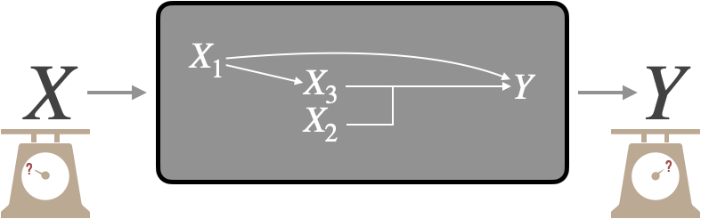
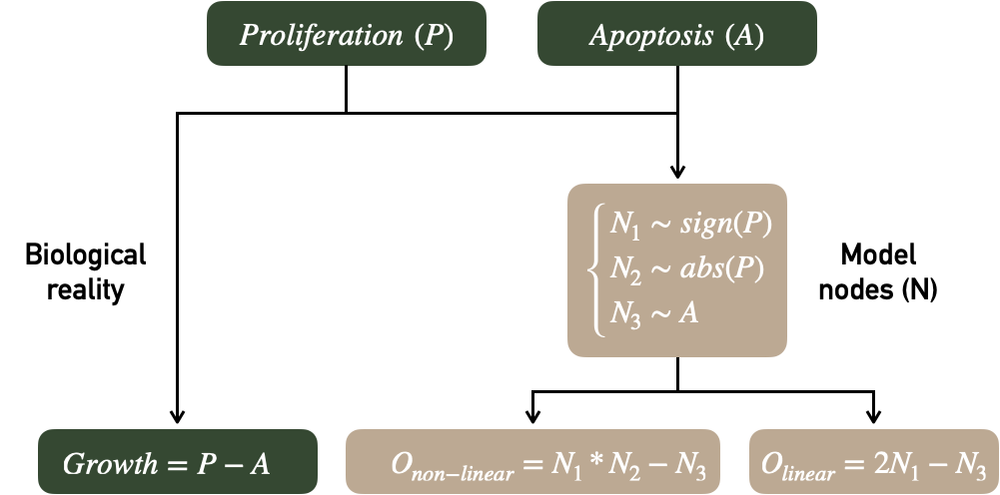
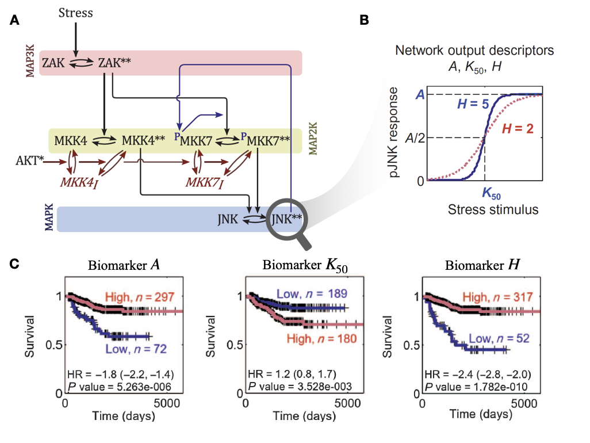

# (PART) Statistical quantification of the clinical impact of models {-}

# Information flows in mechanistic models of cancer

```{r, include=knitr::is_latex_output(), echo=FALSE}
knitr::asis_output('\\epigraph{"Et l\'effet qui s\'en va nous decouvre les causes."}{Alfred de Musset (Poésies nouvelles, 1843)}')
```

```{r, include=knitr::is_html_output(), echo=FALSE}
knitr::asis_output(
  '>*Et l\'effet qui s\'en va nous decouvre les causes.*<br/>
  >Alfred de Musset (Poésies nouvelles, 1843)')
```

```{r, include=knitr::is_latex_output(), echo=FALSE}
knitr::asis_output('\\initial{T}he mechanistic models of cancer presented in the previous section have allowed us to integrate the omics data, to "make them speak" in order to better understand the clinical characteristics of cell lines or patients. But beyond their undeniable intellectual and scientific interest, do they have a direct clinical utility? Given the abundance and complexity of patient data available to physicians, the use of computer tools and mathematical models is inevitable and increasingly frequent. Because of their explicit representation of phenomena, mechanistic models can provide a more easily understood alternative for physicians or patients. Is it therefore desirable and relevant to use these models in support of medical decision making? And how can their clinical validity and impact be rigorously measured?')
```

```{r, include=knitr::is_html_output(), echo=FALSE}
knitr::asis_output('The mechanistic models of cancer presented in the previous section have allowed us to integrate the omics data, to "make them speak" in order to better understand the clinical characteristics of cell lines or patients. But beyond their undeniable intellectual and scientific interest, do they have a direct clinical utility? Given the abundance and complexity of patient data available to physicians, the use of computer tools and mathematical models is inevitable and increasingly frequent. Because of their explicit representation of phenomena, mechanistic models can provide a more easily understood alternative for physicians or patients. Is it therefore desirable and relevant to use these models in support of medical decision making? And how can their clinical validity and impact be rigorously measured?')
```

```{r 7_packages, echo=FALSE, warning=FALSE, message=FALSE}
invisible(lapply(X =  c("knitr", "tidyverse", "magrittr",  "ggplot2", "ggpubr", "patchwork", "cowplot", "ggrepel"),
       FUN = require,
       character.only = TRUE))

knitr::opts_chunk$set(
  cache = TRUE, echo = FALSE, warning = FALSE, message = FALSE,
  out.width = "90%",
  #fig.pos = "ht",
  fig.align = "center"
  )
```
  
First of all, the purpose of this chapter is to outline some of the limitations of the previously presented evaluations of mechanistic models, together with some recommended statistical tools. These evaluations answered the question: do the models have any clinical utility? We will show that an additional question could be: **do mechanistic models have an incremental clinical utility**, in comparison to the direct use of the data used to construct or specify them? This chapter is intended as a statistical introduction for systems biologists to some of the problems encountered in model evaluation.

```{block2, type='summarybox', echo = TRUE}

#### Scientific content {-}

This chapter is relying on literature for the first section and unpublished content for the second. The exploratory analyses presented below have helped to clarify considerations expressed qualitatively in previous chapters and formed the starting point for subsequent chapters on the clinical impact of cancer models.

```

## Evaluation of models as biomarkers

### Evaluation framework and general principles

First of all, mechanistic models of cancer should be considered as biomarkers among others, and therefore evaluated as such. This means focusing on the clinical information provided by the model outputs. In the previous examples, these outputs would be for example the $H$/$K_{50}$/$A$ biomarkers from Fey's model (described in section \@ref(prognostic)) or the personalized *Proliferation* scores from the mechanistic models in the examples in sections \@ref(validation-METABRIC) or \@ref(diff-BRAF). The prognostic or predictive value of model outputs can then be evaluated according to the methods and recommendations present in the literature on prognostic or predictive biomarkers. Without going into too much detail, guidelines in this area are quite numerous and detailed, both for prognostic biomarkers [@mcshane2005reporting; @sauerbrei2018reporting] and predictive biomarkers [@janes2014approach]. Most of the points mentioned in these articles should apply identically for the particular type of biomarker that are the outputs of mechanistic models of cancer. The purpose of this thesis is not to exhaustively list these recommendations for the evaluation of biomarkers, so we will simply highlight the **most salient issues identified in the systems biology literature**.

### Some frequent problems and recommended statistical tools

Concerning continuous and prognostic model outputs/biomarkers, they are sometimes confronted with naturally binary data (*e.g.*, event or not). In this case, many methods exist, among which the **Area Under the receiver operating Curve (ROC), usually denoted as AUC** [@soreide2009receiver]. With a continuous biomarker $X$ and a binary outcome to predict $D$, the ROC curve plots sensitivity, $P(X > c | D = 1)$, against $(1 -~\text{specificity})= (1-P(X\leq c|D= 0))$, for all possible values $c$. the AUC is then simply computed as the area under this curve. The resulting AUC is computed as the area under this curve and measures the ability of the biomarker to discriminate between the two classes of interest and is a common tool for the evaluation of biomarkers. 


However, prognostic validation often requires time-to-envent data such as survival data. Very schematically, if we study patients suffering from cancer and we are interested in the *death* event from a time $t_0$, which we define to be common to all patients, different cases are possible. Some patients have died and we therefore know their status and the time of their death $t_1$. Others are still alive at the time $t_{max}$ when the study stops (administrative censorship) or have withdrawn from the study at time $t_2$ so that their fate is then unknown. These patients are said to be right-censored. These data are extremely frequent and require specific methods such as Cox's proportional risk model [@cox1972regression] or accelerated failure time models. The **reasoned use of these dedicated survival models, and the associated assumptions, should be preferred to the forced binarization of survival data**, sometimes encountered in an apparent concern for simplification. In general, the validation of prognostic biomarkers using survival data therefore requires specific metrics such as **time dependent AUC for censored survival data** [@heagerty2000time]. This measure, however, requires a more complex definition of sensitivity and specificity to accommodate censored data [@heagerty2005survival] and to be applicable to real biomarker validation data [@buyse2006validation]. Despite fairly frequent use [@ching2018cox], the use of another metric called c-index is not recommended for assessing a model's ability to predict risk over a given time horizon [@blanche2019c]. However, the clinical interpretation of AUC values is not straightforward and the complementarity of other approaches that focus on **the usefulness of risk models at the population level** rather than the ability to discriminate has been highlighted [@pepe2008integrating]. The costs and benefits of prognostic models with various AUC values have been studied in an applied context by @gail2018breast.


Another frequent issue, already encountered in the examples from previous chapters, is the discretization of continuous markers. This is often done in order to classify patients into high and low risk groups for example for prognostic biomarkers. In the first place, although discretization may be required clinically, it is not necessary to evaluate the clinical value of the biomarker beforehand. Secondly, the choice of thresholds is crucial. In particular, in the case of biomarkers derived from mechanistic models, the artificial nature of the markers often makes difficult a binarization based on an *a priori* interpretation of the values. Choosing the cut-off point in order to maximise the significance or separation of the survival curves, as proposed in @fey2015signaling and presented in Figure \@ref(fig:fey), is however not recommended [@altman1994dangers], among other things because it can be interpreted as uncorrected multiple testing. Such practices may thus contribute to the low clinical reproducibility of the contribution of certain biomarkers [@hilsenbeck1992so]. For this problem in particular, tools have been proposed in the literature on clinical biomarkers, such as the **predictivenesse curve** [@mboup2020evaluating]. Similarly but in a more general framework, @janes2014approach propose the use of **risk curves** to better evaluate predictive biomarkers beyond the crude computation of statistical interaction between the biomarker and the treatment in randomized clinical trial.


Another potential issue, particularly important in subsequent analyses (see section \@ref(information)), is the **incremental value of biomarkers**. For instance, in the context of prognostic biomarkers, it is of course necessary to present univariable analyses showing the relationship between the marker and the outcome, which is almost systematically done, but also to question the value of this biomarker compared to other prognostic factors already known: does it add information or is it redundant? It is theoretically possible to consider the potential increase in AUC resulting from the addition of the new biomarker to the model. The increase in AUC, however, requires the addition of very strong markers [@gail2018breast], which has prompted the emergence of popular alternative metrics (Net Reclassification Index NRI, integrated discrimination improvement IDI) to evaluate the added predictive ability of a new marker [@pencina2008evaluating]. However, these metrics have been criticized as being unsafe since they can improve with the addition of non-informative markers [@hilden2014note; @pepe2014net].

  
All in all, the first step in a good evaluation of mechanistic models would be that the **standards recommended for the evaluation of biomarkers can be applied in the same way to mechanistic models** that have certain applications or validation based on prognostic or predictive values. As these topics are well covered in the relevant literature, we will subsequently focus on a **specific vision of incremental value of biomarkers that is more specific to mechanistic models**.


## Processing of biological information

Mechanistic models, and their outputs in particular, have so far been considered and evaluated as biomarkers. A comprehensive appreciation requires that they be seen as **information processing tools** in relation to the biological data they use. In this section, we will focus on a toy example to introduce some concepts. We will thus speak in general terms of the clinical value of this model, understood in the sense of a prognostic or predictive value depending on the application. The next section (\@ref(reanalysis)) will extend the same analyses to published models. The purpose of these two sections is to question the way in which mechanistic models process information. These **qualitative questions have been written essentially for those who design mechanistic models**. For the sake of technical simplification, the statistical tools chosen for illustration are therefore simpler than those presented in the previous section.   

### Information in, information out {#information}

Indeed, the mechanistic models presented in this thesis (Figures \@ref(fig:fey), \@ref(fig:PROFILE-METABRIC-Survival) and \@ref(fig:BRAF-results)) can be schematically represented by Figure \@ref(fig:box-mech): inputs $X$ (often omics data) are processed through a mechanistic model (here the grey box) to result in an output $Y$. These models can thus be assimilated to a mathematical transformation, often non-linear, of $X$ in $Y$. Thus, when validating the biological or clinical relevance of $Y$, either by calculating a correlation with the ground truth or by using it to stratify survival curves, only the univariate value of $Y$ is checked. This is an important step and a prerequisite for a well-constructed model. On the other hand, it is not sufficient information to understand how the model works. Indeed, the inputs $X$ can themselves be prognostic biomarkers, and this from the outset and before being transformed into Y: *e.g.*, if the mechanistic model uses different inputs, each of which has a prognostic value, the fact that the output also has a prognostic value does not necessarily indicate the relevance of the model in its ability to make sense of the information. In short, **measuring only the output value of the model does not necessarily reveal the model's ability to make sense of the data it uses**. Put more figuratively, it is important to know whether the model turns lead into gold by giving a clinical interpretation ($Y$) based on information that was devoid of it ($X$), or whether it simply turns gold into gold by refactoring information that is already clinically relevant. In the latter case, the interest of the model may lie in the way it better summarizes or makes the information understandable, but its incremental clinical value is low.

```{r box-mech, echo=FALSE, out.width = "80%", fig.cap='(ref:box-mech-caption)', fig.scap='Evaluation of a mechanistic model', fig.align='center'}

```
(ref:box-mech-caption) **Evaluation of a mechanistic model.** Adapted from Figure \@ref(fig:boxes).

Therefore, the question of the incremental value of the model can be explained as follows: what does the output of the model represent in relation to the inputs? If we restrict ourselves to cases where the absolute biological/clinical value of $Y$ is positive, we can then identify two families of situations. First we can imagine a situation where the mechanistic model has "improved" the value of the inputs: the output would then have a higher value than the inputs (better biological validation, better pronostic value etc.), or in any case a complementary value, a value not present in the inputs. This would correspond to the **capture by the model of emerging or non-linear effects**. For the sake of simplification, we will here assimilate the two in the sense that a non-linear effect resulting from the interaction between certain variables was indeed not predictable from the components taken individually, and therefore emergent. Note, for example, that the identification and capture by statistical models of non-linear components of treatment response is important in the ability to generalize findings from preclinical models to human tumours [@mourragui2020precise]. In the second situation, the output does not capture emergent properties but summarizes, totally or partially, the information present in the inputs. This would correspond to a **knowledge-informed dimensionality-reduction**. Even in the latter case, the scientific value of the model as a tool for understanding is not necessarily questioned. The analyses presented below are simply intended to supplement the understanding of models and how they process information.

### Emergence of information in artificial examples

These questions can be illustrated using a very simple artificial model represented in Figure \@ref(fig:model-simulation). On the one hand there are two latent biological variables called *Proliferation (P)* and *Apoptosis (A)* resulting in our biological ground truth, *Growth*. On the other hand, the modeler has access to three different random variables $N_1$, $N_2$ and $N_3$ respectively associated with the sign of *P*, the absolute value of *P* and the value of *A*. Two mechanistic models are defined, one linear (with its output $O_{linear}$) and one non-linear (with its output $O_{non-linear}$). We note that the two outputs are sufficiently well defined to be correlated with *Growth* but only the non-linear model makes use of $N_2$ by multiplying it with $N_1$.

```{r model-simulation, echo=FALSE, out.width = "80%", fig.cap='(ref:box-mech-caption)', fig.scap='Definition of two distinct mechanistic models', fig.align='center'}

```
(ref:model-simulation-caption) **Definition of two distinct mechanistic models.** Green variables are the true latent phenomena. Brown variables are the values accessible to the modeler ($N_i$) and the outputs extracted from the models ($O$). Statistical analysis of this artificial model is provided in Figure \@ref(fig:R2-artificial).

The ability of models to use inputs to create or summarize information through outputs will be studied using the **explained variation metric $R^2$**. If a linear model is defined as $y_i=\beta_0+\beta_1x_i+e_i$, linear coefficients $\beta$ are estimated by minimizing the sum of squared differences between predicted and real values of $y$. The fitted model is written $\hat{y_i}=\hat{\beta_0}+\hat{\beta_1}x_i$ and $R^2$ also called coefficient of determination is defined as:

$$R^2=1-\dfrac{\sum_{i=1}^{n} (\hat{y_i}-\bar{y_i})^2}{\sum_{i=1}^{n}  (y_i-\bar{y})^2}$$

Therefore $R^2$ measures the proportion of variation in $y$ that is explained by the regressors. A different way of expressing this is to say that $R^2$ compares the null model without covariate (observations are compared to their mean) to the linear model with covariates. By extension, it has been proposed to use R2 to assess the effect of adding a new biomarker to a previously established model^[An unpublished note by Frank Harrell details and illustrates the possibilities and limitations of $R^2$ for this type of analysis ([link](https://www.fharrell.com/post/addvalue/))] [@schemper2003predictive]. In order to avoid overfitting, it is possible to calculate the adjusted $R^2$ that corrects with the number of regressors or to fit the model on training data and calculate the $R^2$ on validation data. The latter option was chosen using cross validation and averaging over the $R^2$ obtained in the different folds. Metrics with an interpretation similar to $R^2$ have been defined for logistic regressions or survival analysis [@choodari2012simulation]. In the case of regressions with several variables $x_i$, it is possible to **decompose $R^2$ into different components associated with each of the variables**. This decomposition is carried out here by  averaging over orderings according to the method proposed by @lindeman1980introduction and applied in R code by @gromping2006relative. The precise formulas are detailed in appendix \@ref(appendix-decomp).  
  

Here is an example of schematic reasoning that can be carried out with $R^2$ about the two models in Figure \@ref(fig:model-simulation). We will **denote $R^2_{X_1+X_2}$ the $R^2$ corresponding to the linear model $Growth=\beta_0+\beta_1 X_1+\beta_2 X_2$** (written more compactly $Y\sim X_1+X_2$, by analogy to its implementation in *R*). Using only the outputs of the models to predict *Growth*, explained variations are $R^2_{O_{non-linear}}=0.455$ and $R^2_{O_{linear}}=0.379$. The mechanistic models are thus correctly defined since the mechanistic output partly recover the biological read-out. However, the inputs of the model also have an important predictive value since $R^2_{N_1+N_2+N_3}=0.514$. How can we understand the relationship between these values? First, the model including the $N_i$ inputs and the output $O_{linear}$ as regressors show identical performances with 

$$R^2_{N_1+N_2+N_3+O_{linear}}=0.514=R^2_{N_1+N_2+N_3},$$

which means that $O_{linear}$ has no incremental value compared to a linear combination of the inputs. This is perfectly obvious from a statistical point of view since the two models are equivalent:
\begin{equation*}
\begin{aligned}
Growth &=\beta_0+\beta_1 N_1+\beta_2 N_2 + \beta_3 N_3+\beta_4 O_{linear}\\
       &=\beta_0+(\beta_1+2\beta_4) N_1+\beta_2 N_2 + (\beta_3 - \beta_4) N_3
\end{aligned}
\end{equation*}

The purpose of this example is to explicitly underline what is done implicitly in the study of certain mechanistic models. The complexity of the described mechanisms sometimes hides more or less linear combinations of inputs that may make it possible to obtain meaningful biomarkers but without incremental value by construction. On the other hand, $O_{non-linear}$ has allowed to extract an emergent information which improves the global prediction when combined linearly with the inputs:
$$R^2_{N_1+N_2+N_3+O_{non-linear}}=0.586>R^2_{N_1+N_2+N_3}.$$

We can go further in understanding by breaking down the $R^2$. In Figure \@ref(fig:R2-artificial)A and B (left columns), $R^2$ of the inputs' models ($Growth = \beta_0+\beta_1 N_1+\beta_2 N_2 + \beta_3 N_3$) are decomposed to show that $N_1$ and $N_3$ contribute most to the prediction in a linear model. By using the same strategies for decomposing the $R_2$ and calculating the incremental $R^2$, it is also possible to **decompose the $R^2$ of $O_{linear}$ and $O_{non-linear}$ according to its origin: its component $N_1$ ($0.22$ in Figure \@ref(fig:R2-artificial)A) is the proportion of $R^2$ that is also explained by $N_1$, so it can be interpreted as being the part of the value of $N_1$ captured by $O$**. In the non-linear case, we can see in the decomposition that $O_{non-linear}$ has an additional created component ($0.07$), it is the non-linear component that is not shared with any of the inputs.

```{r R2-artificial, echo=FALSE, out.width = "90%", fig.cap='(ref:R2-artificial-caption)', fig.scap='Decomposition of $R^2$ for inputs and output of example models', fig.align='center', fig.height=5, fig.width=8}

R2_artificial <- readRDS("data/evaluation/R2_artificial.rds")

plot_nl <- R2_artificial %>% select(Node, R2_inputs, R2_nl) %>%
  rename("Y~N1+N2+N3"=R2_inputs, "Y~O"=R2_nl) %>%
  pivot_longer(c("Y~N1+N2+N3", "Y~O"), names_to = "Type", values_to = "R2") %>%
  mutate(Node=factor(Node, levels=c( "O", "N3", "N2", "N1")),
         Alpha=if_else(Type=="Y~O" & Node!="O", 0, 1),
         Label=paste0("R2=", round(R2, digits=2)))
max_r2_nl <- sum(R2_artificial$R2_inputs,R2_artificial[R2_artificial$Node=="O", "R2_nl"], na.rm = T)
plot_A <- ggplot(plot_nl, aes(x=Type, y=R2, fill=Node, label=Label)) +
  geom_bar(aes(alpha=Alpha), stat="identity", width = 0.5, color="black") +
  geom_label(size = 3, position = position_stack(vjust = 0.5)) +
  geom_hline(aes(yintercept = max_r2_nl)) +
  scale_alpha_continuous(range = c(0.7, 1),  guide = "none") +
  scale_fill_manual(values = c("O"="#9D3D2DFF", "N1"="#6A6A54FF", "N2"="#727C73FF", "N3"="#C9AA82FF")) +
  #scale_colour_manual(values = c("black")) +
  labs(fill=expression(paste("R"^"2", " components:")),
       x="Model",
       y=expression(paste("R"^"2"))) +
  theme_pubclean()  +
  ylim(c(0, 0.6)) +
  guides(fill=guide_legend(nrow=1,byrow=TRUE,
                           override.aes = aes(label = ""))) +
  theme(legend.position = "bottom")

plot_l <- R2_artificial %>% select(Node, R2_inputs, R2_l) %>%
  rename("Y~N1+N2+N3"=R2_inputs, "Y~O"=R2_l) %>%
  pivot_longer(c("Y~N1+N2+N3", "Y~O"), names_to = "Type", values_to = "R2") %>%
  mutate(Node=factor(Node, levels=c( "O", "N3", "N2", "N1")),
         Alpha=if_else(Type=="Y~O" & Node!="O", 0, 1),
         Label=paste0("R2=", round(R2, digits=2)))
max_r2_l <- sum(R2_artificial$R2_inputs,R2_artificial[R2_artificial$Node=="O", "R2_l"], na.rm = T)
plot_B <- ggplot(plot_l, aes(x=Type, y=R2, fill=Node, label=Label)) +
  geom_bar(aes(alpha=Alpha), stat="identity", width = 0.5, color="black") +
  geom_label(size = 3, position = position_stack(vjust = 0.5)) +
  geom_hline(aes(yintercept = max_r2_l, color = "R2 with `Y~N1+N2+N3+O`")) +
  scale_alpha_continuous(range = c(0.7, 1),  guide = "none") +
  scale_fill_manual(values = c("O"="#9D3D2DFF", "N1"="#6A6A54FF", "N2"="#727C73FF", "N3"="#C9AA82FF")) +
  scale_colour_manual(values = c("black")) +
  labs(colour="Reference line:",
       x="Model",
       y=expression(paste("R"^"2"))) +
  theme_pubclean() +
  ylim(c(0, 0.6)) +
  guides(fill = FALSE) +
  theme(legend.position = "bottom")

plot_A + plot_B +
  plot_annotation(tag_levels = 'A')
```
(ref:R2-artificial-caption) **Decomposition of $R^2$ for inputs and output of example models.** (A) Results for the non-linear model inputs and output $O_{non-linear}$ as defined in Figure \@ref(fig:model-simulation): the left column represents the $R^2$ decomposition of model $Growth = \beta_0+\beta_1 N_1+\beta_2 N_2 + \beta_3 N_3$ and the right column the $R^2$ decomposition of $Growth = \beta_0+ \beta_4 O_{non-linear}$. (B) Same with the linear model and the corresponding $O_{linear}$. For both (A) and (B), colors represent the origin of $R^2$ contribution according to the decomposition. In particular, for right colums (model$Y\sim O$), the red share represent the proportion of the $R^2$ of the regressor $O$ that does not come linearly from the inputs, and therefore its emerging part. The horizontal reference line corresponds to the maximal $R^2$ obtained from the model $Growth = \beta_0+\beta_1 N_1+\beta_2 N_2 + \beta_3 N_3 + \beta_4O$
  

In conclusion, if these two models generate meaningful outputs that are correlated with the biological read-out *Growth*, the analysis of their information processing classifies them into two different categories outlined in the previous sub-section. The linear model summarizes some of the information present in the inputs, without creating any. It can be likened to a relevant dimensionality reduction. The output of the non-linear model also fails to avoid some information losses, but at the same time it extracts new non-linear information. Thus, in combination with the inputs, it provides incremental value measured by the increase in total $R^2$. Note that $R^2$ is used here as one tool among others to illustrate the reflection on personalized mechanistic models as information processing tools. The point to remember is not technical but rather methodological: these **mechanistic models using on omics data cannot be evaluated for themselves but must be evaluated in comparison with the data they use in order to better explain the way they process information**. Following this rationale of model selection, other tools such as the Akaike Information Criterion (AIC) have been proposed and could allow to quantify if the reduction of dimension carried out by the models (from many omics inputs to one mechanistic output) allows a more parsimonious description of biology than the direct use of inputs [@kirk2013model]. 

## Reanalysis of mechanistic models of cancer {#reanalysis}

Using the tools presented above, it is possible to deepen the analysis of some mechanistic models already presented in this thesis.

### ODE model of JNK pathway by @fey2015signaling

One of the first applications of personalized mechanistic models to cancer is the one proposed by @fey2015signaling regarding JNK pathways in patients with neuroblastomas. This work has been described in section \@ref(prognostic) and is recalled in Figure \@ref(fig:fey2). The evaluation of the mechanistic models in the original paper was performed by assessing the clinical value of the inputs (RNA levels of ZAK, MKK4, MKK7, JNK and AKT genes) and outputs ($H$, $A$ and $K_{50}$) separately by comparing them with survival data. The outputs were binarized to optimize the separation between the curves in a log-rank test. In this section we propose to **quantify the value of the output in relation to those of the inputs**, leaving the output continuous, using the tools described in the previous section. In the context of survival data, different measures called $R^2$ by analogy have been described in the literature. The one used thereafter was described by @royston2004new, its detailed definition is given in Appendix \@ref(appendix-r2surv) and its properties have been studied and validated in previous studies using simulated data [@choodari2012simulation]. $R^2$ is not the preferred tool for survival data and is only used here to allow a qualitative description in line with the previous ones without introducing new tools. A formal and rigorous analysis should favour the tools presented at the beginning of the chapter.

```{r fey2, echo=FALSE, out.width = "90%", fig.cap='(ref:fey2-caption)', fig.scap='Mechanistic modeling of JNK pathway and survival of neuroblastoma patients, as described by Fey \\emph{et al}.', fig.align='center'}

```
(ref:fey2-caption) **Mechanistic modeling of JNK pathway and survival of neuroblastoma patients, as described by @fey2015signaling.** (A) Schematic representation (as a process description [@le2015quantitative]) for the ODE model of JNK pathway. (B) Response curve (phosphorylated JNK) as a function of the input stimulus (Stress) and characterization of the corresponding sigmoidal function with maximum amplitude $A$, Hill exponent $H$ and activation threshold $K_{50}$. (C) Survival curves for neuroblastoma patients based on binarized $A$, $K_{50}$ and $H$; binarization thresholds having been defined based on optimization screening on calibration cohort.  
  

Thus, the $R^2$ of the output $H$ is $0.39$ while that of the combined inputs is $0.60$. We can see from the decompositions that $H$ derives most of its the value from ZAK, MKK4 and AKT (Figure \@ref(fig:R2-Fey)A, right column), which were already the largest contributors in the combined evaluation of the inputs (Figure \@ref(fig:R2-Fey)A, left column). However, $H$ also includes an emerging non-linear share ($R^2=0.08$) that was not explained by the linear combination of inputs. Thus, incorporating $H$ with the inputs in a survival prediction model does indeed allow to observe an added value with a global $R^2$ of $0.68$. In addition, the authors in the original study stressed the importance of positive feedback from JNK to MKK7 (Figure \@ref(fig:fey2)A). In its absence, we find that the value of $H$ is almost reduced to zero, since not only its non-linear part (Figure \@ref(fig:R2-Fey), red share), but also its parts derived from inputs, disappear. Analyzing the other outputs of the model ($A$ and $K_{50}$) reveals similar but less dramatic trends underlining the importance of this feedback which allows the model to capture a clinically relevant behaviour, assimilated by the authors to the capacity of cells to trigger apoptosis in case of stress. In the case of this model, the analyses provide a better understanding of how the model works with respect to survival prediction: **the outputs partly summarize clinical information already present in the inputs but also reveal relevant emerging information**.

```{r R2-Fey, echo=FALSE, out.width = "90%", fig.cap='(ref:R2-Fey-caption)', fig.scap='Decomposition of $R^2$ for inputs and output for ODE model in Fey \\emph{et al}.', fig.align='center', fig.height=5, fig.width=8}

R2_Fey <- readRDS("data/evaluation/R2_Fey_H.rds") %>%
  mutate(Node=if_else(Node=="ZAK_o_o", "ZAK",
                      if_else(Node=="pAKT", "AKT",
                              if_else(Node=="O", "H", Node))))

col_F <- c("ZAK"="#556246FF", "MKK4"="#928F6BFF",
           "MKK7"="#CCAF69FF", "JNK"="#C5AC8EFF",
           "AKT"="#8E7C56FF", "H"="#9D3D2DFF")

plot_nl <- R2_Fey %>% select(Node, R2_inputs, R2_nl) %>%
  rename("Y~AKT+ZAK+MKK4+MKK7+JNK"=R2_inputs, "Y~H\n(with feedback)"=R2_nl) %>%
  pivot_longer(c("Y~AKT+ZAK+MKK4+MKK7+JNK", "Y~H\n(with feedback)"), names_to = "Type", values_to = "R2") %>%
  mutate(Node=factor(Node, levels=c( "H", "ZAK", "MKK4", "MKK7", "JNK", "AKT")),
         Alpha=if_else(Type=="Y~H\n(with feedback)" & Node!="H", 0, 1),
         Label=paste0("R2=", round(R2, digits=2)))
max_r2_nl <- sum(R2_Fey$R2_inputs,R2_Fey[R2_Fey$Node=="H", "R2_nl"], na.rm = T)
plot_A <- ggplot(plot_nl, aes(x=Type, y=R2, fill=Node, label=Label)) +
  geom_bar(aes(alpha=Alpha), stat="identity", width = 0.5, color="black") +
  geom_label_repel(size = 3, position = position_stack(vjust = 0.5), direction="y", force = 0.001) +
  geom_hline(aes(yintercept = max_r2_nl)) +
  scale_alpha_continuous(range = c(0.7, 1),  guide = "none") +
  scale_fill_manual(values = col_F) +
  #scale_colour_manual(values = c("black")) +
  labs(fill=expression(paste("R"^"2", " components:")),
       x="Model",
       y=expression(paste("R"^"2"))) +
  theme_pubclean()  +
  ylim(c(0, 0.70)) +
  guides(fill=guide_legend(nrow=1,byrow=TRUE,
                           override.aes = aes(label = ""))) +
  theme(legend.position = "bottom")

plot_l <- R2_Fey %>% select(Node, R2_inputs, R2_l) %>%
  rename("Y~AKT+ZAK+MKK4+MKK7+JNK"=R2_inputs, "Y~H\n(no feedback)"=R2_l) %>%
  pivot_longer(c("Y~AKT+ZAK+MKK4+MKK7+JNK", "Y~H\n(no feedback)"), names_to = "Type", values_to = "R2") %>%
  mutate(Node=factor(Node, levels=c( "H", "ZAK", "MKK4", "MKK7", "JNK", "AKT")),
         Alpha=if_else(Type=="Y~H\n(no feedback)" & Node!="H", 0, 1),
         Label=paste0("R2=", round(R2, digits=2)))
max_r2_l <- sum(R2_Fey$R2_inputs,R2_Fey[R2_Fey$Node=="H", "R2_l"], na.rm = T)
plot_B <- ggplot(plot_l, aes(x=Type, y=R2, fill=Node, label=Label)) +
  geom_bar(aes(alpha=Alpha), stat="identity", width = 0.5, color="black") +
  geom_label_repel(size = 3, position = position_stack(vjust = 0.5), direction="y", force = 0.002) +
  geom_hline(aes(yintercept = max_r2_l, color = "R2 with `Y~Inputs+H`")) +
  scale_alpha_continuous(range = c(0.7, 1),  guide = "none") +
  scale_fill_manual(values = col_F) +
  scale_colour_manual(values = c("black")) +
  labs(colour="Reference line:",
       x="Model",
       y=expression(paste("R"^"2"))) +
  theme_pubclean() +
  ylim(c(0, 0.70)) +
  guides(fill = FALSE) +
  theme(legend.position = "bottom")

plot_A + plot_B +
  plot_annotation(tag_levels = 'A')
```
(ref:R2-Fey-caption) **Decomposition of $R^2$ for inputs and output for ODE model in @fey2015signaling.** (A) Results for the Fey model inputs and output $H$ as defined in Figure \@ref(fig:fey2)A and B. (B) Same using the model without positive feedback between JNK and MKK7. Colors represent the origine of $R^2$ contribution. In particular, for right colums (model$Y\sim H$), the red share represent the proportion of the $R^2$ of the output $H$ that does not come linearly from the inputs, and therefore its emerging part.  

### Personalized logical models: BRAF inhibition in melanoma and colorectal cancers

Similarly, it is appropriate to assess the relevance of the personalized logical models presented so far. Unlike the models of the previous sub-section, however, they integrate a much larger number of variables and the decomposition of $R^2$ is no longer accessible, because of its computational cost, which increases exponentially with the number of variables. If we focus on the example best suited to these models, that of BRAF inhibition sensistivity, we can however reformulate the question more simply. Given that the most important predictor of the answer is the status of the BRAF mutation itself, **do the personalized models allow us to do better or provide additional information?** In the case of CRISPR data, the $R^2$ of BRAF alone is $0.75$, the $R^2$ of the personalized scores from the models is $0.73$, while the combination of the two increases the $R^2$ to $0.83$. In the absence of a precise decomposition, this gain can come either from the contribution of the other variables used in the model (the RNA levels of CRAF for example) or from the emergence of non-linear effects. In both cases, these figures are another way of expressing the remarks in section \@ref(diff-BRAF): thanks to the integration of other data and their organization in a framework based on literature knowledge, the model provides a more precise and complete vision of the response mechanisms. As positive as it is, this increase in $R^2$ remains modest, illustrating that the **main interest of these models is not necessarily a pure gain in predictive performance. Rather, it lies in their explanatory capacity and in their ability to support the investigation of mechanisms** such as in section \@ref(diff-BRAF). In a complementary way, one could imagine extending these analyses to other nodes of the model and not only to its output in order to dissect even more precisely the information processing within the model.


```{block2, type='conclubox', echo = TRUE}

#### Summary {-}

The use of certain mechanistic models of cancer for clinical purposes reinforces the importance of a rigorous evaluation of their performance. One of the main recommendations is to consider the outputs of these models as classical biomarkers, ignoring initially the mechanistic architecture that generated them. Numerous methods and metrics then exist to quantify the clinical information they provide, whether prognostic or predictive. In a complementary way, it is then insightful to examine the particularities of this kind of biomarker which does not come out of nowhere but often results from the knowledge-based transformation of biological data, including possibly other biomarkers. The prognostic or predictive value of mechanistic models must then be interpreted against the value of the biological data used to build or customize the models.s

```
