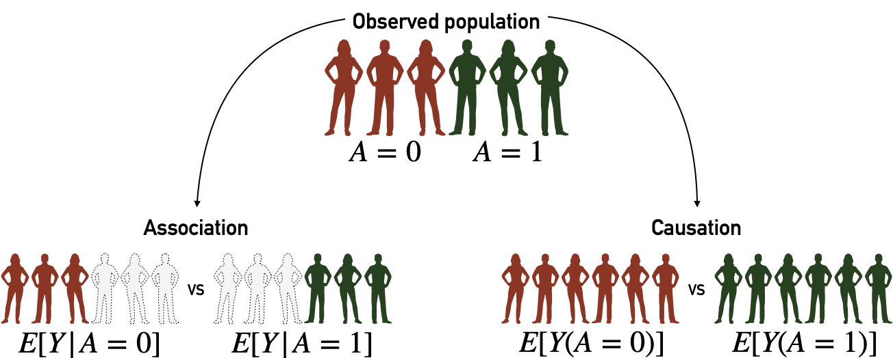

# Clinical evidence generation and causal inference

```{r, include=knitr::is_latex_output(), echo=FALSE}
knitr::asis_output('\\epigraph{"Maudit\n
soit le père de l\'épouse\n
du forgeron qui forgea le fer de la cognée\n
avec laquelle le bûcheron abattit le chêne\n
dans lequel on sculpta le lit\n
où fut engendré l\'arrière-grand-père\n
de l\'homme qui conduisit la voiture\n
dans laquelle ta mère\n
rencontra ton père!"}{Robert Desnos (La colombe de l\'arche, 1923)}')
```

```{r, include=knitr::is_html_output(), echo=FALSE}
knitr::asis_output(
  '>*Maudit  
  >soit le père de l\'épouse  
  >du forgeron qui forgea le fer de la cognée  
  >avec laquelle le bûcheron abattit le chêne  
  >dans lequel on sculpta le lit  
  >où fut engendré l\'arrière-grand-père  
  >de l\'homme qui conduisit la voiture  
  Wdans laquelle ta mère  
  >rencontra ton père!.*<br/>
  >Robert Desnos (La colombe de l\'arche, 1923)')
```

```{r, include=knitr::is_latex_output(), echo=FALSE}
knitr::asis_output('\\initial{T}he previous chapter proposed some tools to evaluate and quantify the value of mechanistic models, and in particular their outputs, with simple statistical tools. The latter, such as $R^2$, are by no means specific to medical applications. One of the particularities of mechanistic cancer models, on the other hand, is the possibility of simulating treatments that imitate therapeutic interventions. Before tackling more precise questions, this chapter will therefore introduce certain clinical or statistical methods used to evaluate the effect of different types of treatments, including drugs, on patoents. A more specific issue related to the evaluation of mechanistic models will be explored in the next chapter using these methods')
```

```{r, include=knitr::is_html_output(), echo=FALSE}
knitr::asis_output('The previous chapter proposed some tools to evaluate and quantify the value of mechanistic models, and in particular their outputs, with simple statistical tools. The latter, such as $R^2$, are by no means specific to medical applications. One of the particularities of mechanistic cancer models, on the other hand, is the possibility of simulating treatments that imitate therapeutic interventions. Before tackling more precise questions, this chapter will therefore introduce certain clinical or statistical methods used to evaluate the effect of different types of treatments, including drugs, on patoents. A more specific issue related to the evaluation of mechanistic models will be explored in the next chapter using these methods.')
```

```{r 8_packages, echo=FALSE, warning=FALSE, message=FALSE}
invisible(lapply(X =  c("knitr", "tidyverse", "magrittr",  "ggplot2", "ggpubr", "patchwork", "cowplot", "ggpmisc"),
       FUN = require,
       character.only = TRUE))

knitr::opts_chunk$set(
  cache = TRUE, echo = FALSE, warning = FALSE, message = FALSE,
  out.width = "90%",
  #fig.pos = "ht",
  fig.align = "center"
  )
```
  

```{block2, type='summarybox', echo = TRUE}

#### Scientific content {-}

This short chapter introduces the framework for causal inference based on the literature and the description of causal inference in @beal2020causal.

```

\newcommand{\indep}{\perp \!\!\! \perp}

## Clinical trials and beyond

### Randomized clinical trials as gold standards

When it comes to evaluating the effect of a therapeutic intervention, the reference method in most cases in modern medicine is the randomized clinical trial, which will be described now in its simplest version. Without loss of generality, the rationale for this approach can be detailed for one drug, which will be referred to as $A$ in the remainder of the chapter (Figure \@ref(fig:trials)). The patients who can benefit from this drug, and therefore those eligible for the clinical trial, are first of all defined (disease, characteristics etc.). Then they are randomly separated into two distinct groups, one receiving the new treatment to be evaluated ($A=1$) and the other generally receiving the treatment considered as standard of care, or a placebo if no validated treatment is available ($A=0$). A predefined treatment response criterion $Y$ (viral load, tumour size, etc.) is then compared for the two groups to quantify the average treatment effect (ATE):

$$ATE= E[Y|A=1]-E[Y|A=0]$$

Thus it will be possible to say, for example, that "compared to patients who received the standard treatment, those treated with the new drug have a 20% lower tumour volume". In this example, randomly choosing how the two groups of patients, treated and untreated, are constituted ensures *a priori* that the two groups are comparable. Indeed, it should be verified that the untreated patients were not on average suffering from more advanced cancers that are more likely to proliferate and grow. In this case, the difference in outcome between the groups could simply come from a difference in initial composition and not from a difference in therapeutic intervention. Random assignment of treatments therefore offers minimum guarantees concerning the characteristics of the two subgroups.

```{r trials, echo=FALSE, out.width = "90%", fig.cap='(ref:trials-caption)', fig.scap='Principles of randomized clinical', fig.align='center'}

```
(ref:trials-caption) **Principles of randomized clinical trials.**. This trial evaluates the impact of treatment $A$.  
  

### Observational data and confounding factors

The problem of comparability between the two groups is reinforced when the data used does not come from a clinical trial. In the remainder of this thesis these data will be called observational data. This means that in the available data, some patients were treated with the new drug ($A=1$) and others received the reference treatment ($A=0$). However, the assignment of treatment was not decided by the observer. This assignment was therefore made according to a protocol unknown to the observer which has no guarantee that the two groups are in fact comparable.  
  

The situation can be illustrated with a simple example involving a confounding variable $C$ in addition to the treatment variable $A$ and the outcome variable $Y$. If $Y$ represents tumour volume and $A$ the treatment to be evaluated, $C$ could be a biomarker of cancer agressiveness. Data have been simulated for all variables in two different settings represented in Figures \@ref(fig:causality-example) and \@ref(fig:causality-example2). In the first case (Figure \@ref(fig:causality-example)), the outcome $Y$ is positively correlated to $C$ (more agressive tumours have bigger volume) and decreased when $A=1$ (treatment decreases tumour volume). $C$ has no influence on $A$. The causal relationships between the variables and the associated coefficients used to simulate data are summarized in the directed acyclic graphs (DAG) in Figure \@ref(fig:causality-example)A. The observed relations between variables in siimulated data are shown in Figure \@ref(fig:causality-example)B, C and D. In particular, the theoretical influence of $A$ on $Y$ is apparent in the observed data.


```{r causality-example, echo=FALSE, out.width = "90%", fig.cap='(ref:causality-example-caption)', fig.scap='Analysis on observed data without confounder', fig.align='center', fig.height=5, fig.width=8}
# library(lava)
# m <- lvm()
# distribution(m, ~A) <- binomial.lvm(p=0.5)
# regression(m, Y~A) <- -5
# regression(m, Y~C) <- 3
# regression(m, A~C) <- 0
# covariance(m, ~Y) <- 10
# 
# set.seed(3)
# sim_data_noC <- sim(m, n = 1000) %>%
#   mutate(A=factor(A))
# saveRDS(sim_data_noC, "sim_data_noC.rds")

p_DAG <- ggdraw() + draw_image("fig/DAG-simple-noC.png")

sim_data_noC <- readRDS("data/causal/sim_data_noC.rds")
plot_CY <- ggplot(sim_data_noC, aes(x=C, y=Y, fill=A, color=A)) +
  geom_point(alpha=0.6, show.legend = FALSE) +
  theme_pubclean() +
  geom_smooth(method = 'lm', formula = 'y~x',
              color='black', show.legend = FALSE) +
  stat_poly_eq(formula = y~x, 
                aes(label = ..eq.label..), 
                parse = TRUE) +
  scale_fill_manual(values=c('0'= "#972D15FF", '1'="#02401BFF")) +
  scale_color_manual(values=c('0'= "#972D15FF", '1'="#02401BFF"))
  
plot_CA <- ggplot(sim_data_noC, aes(x=C,
                                y=as.numeric(as.character(A)),
                                color=A)) +
  geom_jitter(alpha=0.6,
              width = 0, height = 0.05, show.legend = FALSE) +
  geom_smooth(method = 'glm', 
              method.args=list(family="binomial"),
              formula = 'y~x',
              color='black') +
   theme_pubclean() +
  labs(y='P[A=1|C] and original data points') +
  scale_color_manual(values=c('0'= "#972D15FF", '1'="#02401BFF"))

diff_AY <-  round(mean(filter(sim_data_noC, A==1)$Y)-mean(filter(sim_data_noC, A==0)$Y),
               digits=2)
   
plot_AY <- ggplot(sim_data_noC, aes(x=A, y=Y, fill=A)) +
  geom_boxplot() +
   theme_pubclean() +
  annotate("text", x=1.5, y=12.5,
           label=paste0("E[Y|A=1]-E[Y|A=0]=", diff_AY)) +
  scale_fill_manual(values=c('0'= "#972D15FF", '1'="#02401BFF")) +
  labs(fill="A: ") +
  theme(legend.title = element_text(face="bold"))


      
p_DAG / (plot_CA + plot_CY + plot_AY) / guide_area() +
  plot_layout(heights = c(2, 4,1), guides = 'collect') +
  plot_annotation(tag_levels = 'A')

```
(ref:causality-example-caption) **Analysis on observed data without confounder.** (A) Directed acyclic graphs with causal relations between variables and parameters used to simulate data. (B) Influence of $C$ on $A$ in observed simulated data. (C) Same with $C$ and $Y$. (D) Same with $A$ and $Y$.  
  
In the second case (Figure \@ref(fig:causality-example2)), $C$ has an influence on $Y$: the more aggressive the tumor, the more likely the patient is to be treated with the new drug. In this case the simultaneous influence of $C$ on $A$ and $Y$ makes it a real confounder. The direct observation of the differences in outcomes between treated and untreated patients reveals only a small benefit of the new treatment which does not correspond to the underlying reality used in these simulations since the influence of $A$ on $Y$ remained the same as in the previous case.


```{r causality-example2, echo=FALSE, out.width = "90%", fig.cap='(ref:causality-example2-caption)', fig.scap='Analysis on observed data with confounder', fig.align='center', fig.height=5, fig.width=8}
# library(lava)
# m <- lvm()
# distribution(m, ~A) <- binomial.lvm(p=0.5)
# regression(m, Y~A) <- -5
# regression(m, Y~C) <- 3
# regression(m, A~C) <- 2
# covariance(m, ~Y) <- 10
# 
# set.seed(3)
# sim_data_C <- sim(m, n = 1000) %>%
#   mutate(A=factor(A))
# saveRDS(sim_data_C, "sim_data_C.rds")

p_DAG <- ggdraw() + draw_image("fig/DAG-simple-C.png")

sim_data_C <- readRDS("data/causal/sim_data_C.rds")
plot_CY <- ggplot(sim_data_C, aes(x=C, y=Y, fill=A, color=A)) +
  geom_point(alpha=0.6, show.legend = FALSE) +
  theme_pubclean() +
  geom_smooth(method = 'lm', formula = 'y~x',
              color='black', show.legend = FALSE) +
  stat_poly_eq(formula = y~x, 
                aes(label = ..eq.label..), 
                parse = TRUE) +
  scale_fill_manual(values=c('0'= "#972D15FF", '1'="#02401BFF")) +
  scale_color_manual(values=c('0'= "#972D15FF", '1'="#02401BFF"))
  
plot_CA <- ggplot(sim_data_C, aes(x=C,
                                y=as.numeric(as.character(A)),
                                color=A)) +
  geom_jitter(alpha=0.6,
              width = 0, height = 0.05, show.legend = FALSE) +
  geom_smooth(method = 'glm', 
              method.args=list(family="binomial"),
              formula = 'y~x',
              color='black') +
   theme_pubclean() +
  labs(y='P[A=1|C] and original data points') +
  scale_color_manual(values=c('0'= "#972D15FF", '1'="#02401BFF"))

diff_AY <-  round(mean(filter(sim_data_C, A==1)$Y)-mean(filter(sim_data_C, A==0)$Y),
               digits=2)
   
plot_AY <- ggplot(sim_data_C, aes(x=A, y=Y, fill=A)) +
  geom_boxplot() +
   theme_pubclean() +
  annotate("text", x=1.5, y=12.5,
           label=paste0("E[Y|A=1]-E[Y|A=0]=", diff_AY)) +
  scale_fill_manual(values=c('0'= "#972D15FF", '1'="#02401BFF")) +
  labs(fill="A: ") +
  theme(legend.title = element_text(face="bold"))


      
p_DAG / (plot_CA + plot_CY + plot_AY) / guide_area() +
  plot_layout(heights = c(2, 4,1), guides = 'collect') +
  plot_annotation(tag_levels = 'A')

```
(ref:causality-example2-caption) **Analysis on observed data with confounder.** (A) Directed acyclic graphs with causal relations between variables and parameters used to simulate data. (B) Influence of $C$ on $A$ in observed simulated data. (C) Same with $C$ and $Y$. (D) Same with $A$ and $Y$.

## Causal inference methods to leverage data

Despite these difficulties, some statistical methods have been developed to derive estimates with a causal interpretation from observational data, under certain assumptions. This work will focus the potential outcomes framework [@rubin1974estimating]. We will first describe briefly the fundamentals of this framework and different methods that are part of it.

### Notations in potential outcomes framework

First of all, the notations used in this and the next chapter are defined as follows. We will use $j=1,...,N$ to index the individuals in the population. $A_j$ and $Y_j$ correspond respectively to the actual treatment received by individual $j$ and the outcome. In the most simple case, treatment takes values in $\mathcal{A}=\{0, 1\}$, $1$ denoting the treated patients and $0$ the control ones. $Y_j$ corresponds to the patient's response to treatment. In the case of cancer it may be  a continuous value (e.g size of tumour), a binary value (e.g status or event indicator), or even a time-to-event (e.g time to relapse or death). Only the first two cases will be discussed later. Finally, it is necessary to take into account the possible presence of confounders influencing both $A$ and $Y$ and denoted $C_j$ for individual $j$.  
  

The potential outcomes framework is sometimes described as counterfactual because it defines variables like $Y_j(a)$ to denote the potential outcome of individual $j$ in case he has been treated by $A=a$ which may be different from what we observe if $A_j\neq a$. These counterfactual variables make it possible to write the causal estimands. For instance, in this context, we can easily compute the difference in outcome between treated patients and control patients (Figure \@ref(fig:causality), left part): 
$E[Y | A=1] - E[Y | A=0].$

However, this difference has no causal interpretation as it does not offer any guarantees as to the confounding factor, as an unbalanced distribution of $C$ can induce biases. Thus we define another estimate:
$E[Y(1)] - E[Y(0)].$

In this case, we compare between two ideal cohorts (Figure \@ref(fig:causality), right part), one in which all patients have been treated (possibly contrary to the fact) and one in which all patients have been left in the control arm (once again, possibly contrary to the fact).

```{r causality, echo=FALSE, out.width = "90%", fig.cap='(ref:causality-caption)', fig.scap='Association and causation', fig.align='center'}

```
(ref:causality-caption) **Association, causation and their associated cohorts.** Assocation analyses are based on observed cohorts and conditional probabilities. Causation analyses are based on counterfactual variables and cohorts.  
  

### Identification of causal effects

Different methods provide estimators to evaluate causal effect from observational data. 

Under certain assumptions of consistency, positivity and conditional exchangeability, the potential outcomes framework allows to estimate these counterfactual variables and therefore infer causal estimates from observational (non-randomized) data [@rubin1974estimating, @hernan2020causal]. 

*Consistency* means that values of treatment under comparison represent well-defined interventions which themselves correspond to the treatments in the data:
$\textrm{if} \: A_j=a,  \textrm{then} \: Y_j(a)=Y_j.$

*Exchangeability* means that treated and control patients are exchangeable, i.e if the treated patients had not been treated they would have had the same outcomes as the controls, and conversely. Since we usually observe some confounders we define conditional exchangeability to hold if cohorts are exchangeable for same values of confounding $C$. Therefore conditional exchangeability will hold if there are no unmeasured confounding:
$Y(a) \indep A | C.$

*Positivity* assumption states that the probability of being administered a certain version of treatment conditional on $C$ is greater than zero: $\textrm{if} \: P[C=c] \neq 0, P[A=a | C=c] >0.$ Intuitively, this positivity condition is required to ensure that the defined counterfactual variables make sense and do not represent something that cannot exist.

#### Standardization or parametric g-formula

Throughout the article, we will describe essentially one method called standardization or parametric g-formula. Details on other types of estimators are available in Supplementary Materials, sections B and C. In the simple example depicted in Figure \@ref(fig:causality-example2), the causal effect of treatment $A$ can be written with standardized means (formal proof in Supplementary Materials, section A):

\begin{equation*}
\begin{aligned}
  E[Y(a)] & = \sum_{c} E[Y(a)|c] \times P[c]&& \\
          & = \sum_{c} E[Y(a)|a,c] \times P[c,w]
          &&\text{ by conditional exchangeability } Y(a) \indep A | C \\
          & = \sum_{c} E[Y|a,c] \times P[c]
          &&\text{ by consistency for Y }
\end{aligned}
\end{equation*}

\begin{equation} 
\begin{split}
  E[Y(A=1)] - E[Y(A=0)] = \\ \sum_{c} \Big(E[Y | A=1, C=c]-E[Y | A=0, C=c]\Big) \times P[C=c]
  (\#eq:stdeq)
\end{split}
\end{equation} 

Computationally, non-parametric estimation of $E[Y | A=a, C=c]$ is usually out of reach. Thus, on real-world dataset, $E[Y | A=a, C=c]$ is estimated through modelling and explicit computation $P[C=c]$ is replaced by its empirical estimate.

#### Inverse probability weighting (IPW) and propensity scores


