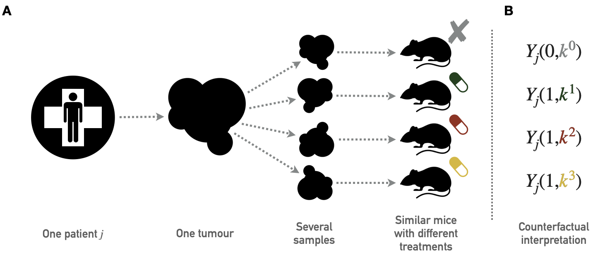
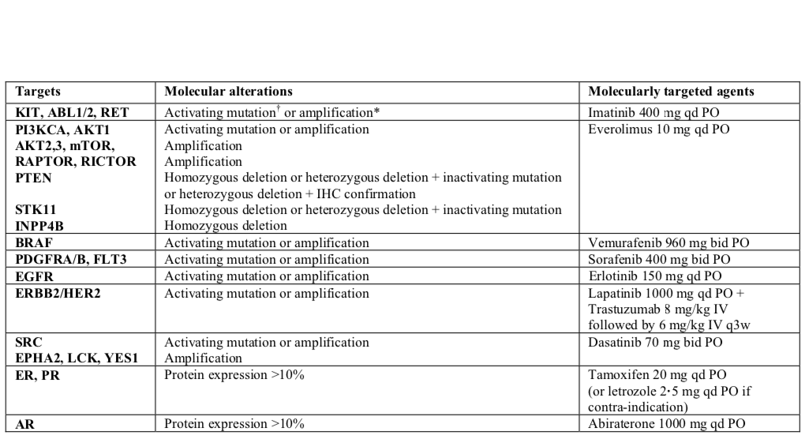
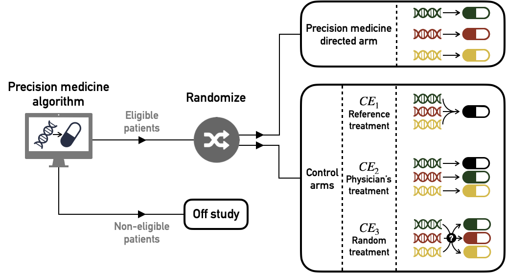
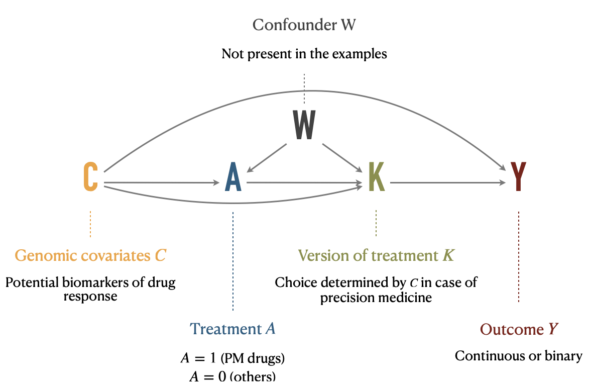
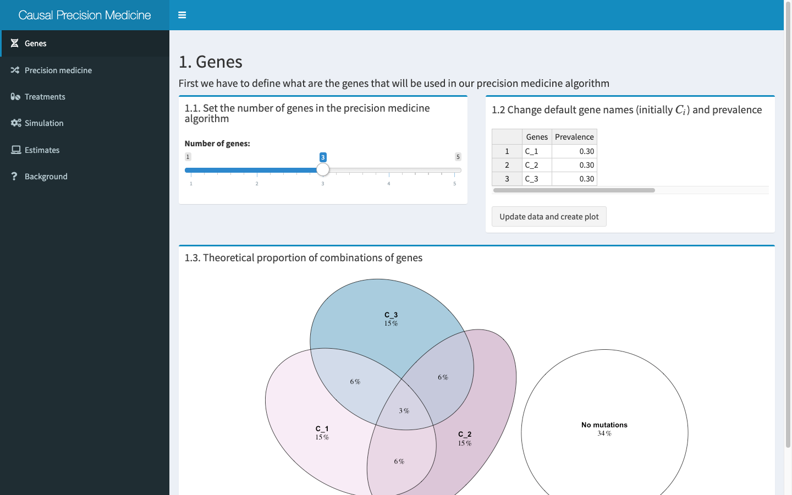

# Causal inference for precision medicine {#chapter-precision}

```{r, include=knitr::is_latex_output(), echo=FALSE}
knitr::asis_output('\\epigraph{"Felix qui potuit rerum cognoscere causas."}{Virgil (Georgics, 29 BC)}')
```

```{r, include=knitr::is_html_output(), echo=FALSE}
knitr::asis_output(
  '>*Felix qui potuit rerum cognoscere causas.*<br/>
  >Virgil (Georgics, 29 BC)')
```


```{r, include=knitr::is_latex_output(), echo=FALSE}
knitr::asis_output('\\initial{T}hroughout this manuscript, we first described the complexity of cancer mechanisms, through the diversity of genetic alterations or non-linear signaling pathways. This complexity naturally led to the choice of systemic modeling approaches and in particular mechanistic models whose explicit nature facilitates the study of the effects of new molecular perturbations such as treatments. The simple study of the response to BRAF inhibitors has thus required the consideration of many other genes and pathways.')
```

```{r, include=knitr::is_html_output(), echo=FALSE}
knitr::asis_output('Throughout this manuscript, we first described the complexity of cancer mechanisms, through the diversity of genetic alterations or non-linear signaling pathways. This complexity naturally led to the choice of systemic modeling approaches and in particular mechanistic models whose explicit nature facilitates the study of the effects of new molecular perturbations such as treatments. The simple study of the response to BRAF inhibitors has thus required the consideration of many other genes and pathways.')
```

```{r 9_packages, echo=FALSE, warning=FALSE, message=FALSE}
invisible(lapply(X =  c("knitr", "tidyverse", "magrittr",  "ggplot2", "ggpubr", "patchwork", "cowplot", "kableExtra", "ggstance", "ggalluvial", "DescTools", "latex2exp", "egg"),
       FUN = require,
       character.only = TRUE))

knitr::opts_chunk$set(
  cache = TRUE, echo = FALSE, warning = FALSE, message = FALSE,
  out.width = "90%",
  #fig.pos = "ht",
  fig.align = "center"
  )
```
  
This final chapter proposes to take the complexity a step further by considering different treatments. The diversity of patients' molecular profiles suggests that the best treatment is not necessarily the same for all patients: this is what is known as precision medicine. This is already a clinical reality in oncology that could be reinforced in the future by the emergence of new computational models of cancer, whether mechanistic or not. **How then can we assess the relevance of these models in their ability to guide patient treatment?**

```{block2, type='summarybox', echo = TRUE}

#### Scientific content {-}

This chapter presents an extension of the causal inference framework to quantify the value of precision medicine strategies. This work is currently under revision and is available as a preprint in @beal2020causal. All code is available in the dedicated [GitHub repository](https://github.com/JonasBeal/Causal_Precision_Medicine)

```


## Precision medicine in oncology

It is first important to understand what is meant by the concept of precision medicine in the treatment of cancer patients in order to place subsequent questions in a plausible clinical framework. 

### An illustration with patient-derived xenografts {#main-PDX}

Precision medicine is based on the diversity of treatment responses observed in different tumors. It has already been observed in previous chapters about BRAF inhibition that **different cell lines respond differently to a particular treatment**. A broader analysis of pre-clinical data shows that the same is true for the vast majority of treatments. It would be possible to illustrate this using the same data from cell lines extended to other drugs. However, because of the more directly clinical impact of the issues discussed in this chapter, the analyses presented below will focus on another type of data that is closer to patient data: patient-derived xenografts (PDX).  
  

A **PDX is a tumor tissue that has been removed from a patient and implanted into immunodeficient mice** [@hidalgo2014patient]. Unlike cell lines, which are *in vitro* models, PDXs are *in vivo* models that allow cancer cells to evolve in a more realistic microenvironment. In the same way as for cell lines, PDX can be used for drug screening. The data used in this chapter come from a study by @gao2015high which contains several hundred tumors and more than fifty drugs. Not all drugs having been tested for all tumors and details of the drugs and types of cancer tested are available in the appendix \@ref(appendix-PDX). This dataset was generated following the "one animal per model per treatment" approach ($1 \times 1 \times 1$), the principles of which are summarized in Figure \@ref(fig:PDX-principles)A. It should be noted that different drug response metrics are computed in the source data, two of which will be used in the analyses. The first one is continuous and called *Best Average Response* in the data, it is based on the variation of the tumor volume after treatment, the lower values (and especially negative) corresponding to better responses. The second one is originally categorical and based on a modified Response Evaluation Criteria In Solid Tumors (RECIST) criteria. It was binarized for this study so that the responders have a score of $1$ and non-responders $0$. The details of the definition and distribution of these metrics are given in appendix \@ref(appendix-PDX).


```{r PDX-principles, echo=FALSE, out.width = "90%", fig.cap='(ref:PDX-principles-caption)', fig.scap='Principles of PDX screening', fig.align='center'}

```
(ref:PDX-principles-caption) **Principles of PDX screening.** (A) Schematic pipeline for PDX screening with tumor biopsies from one patient divided in several pieces later implanted in similar immunodeficient mice. Each mouse is then treated with a different drug; the collection of mice that have received tumor samples from the same patient but have been treated with different drugs therefore gives access to several outcomes for the same tumor of origin. (B) Corresponding counterfactual variables.  
  

In order to illustrate the diversity of response to treatment, the database is momentarily restricted to the 4 most widely tested drugs and the 180 tumors (or PDX models) that were evaluated for all four drugs. The four chosen drugs target different pathways: binimetinib (MAPK inhibitor), BKM120 (PIK inhibitor), HDM201 (MDM2 inhibitor) and LEE011 (CDK inhibitor). In Figure \@ref(fig:PDX-dense)A the 4 treatments show a high variability of response, with a slight advantage for BKM120 and binimetinib on average over all tumors. However, **each of the treatments was found to be the most effective of the 4 for a significant proportion of tumors** (Figure \@ref(fig:PDX-dense)B), with binimetinib and BKM being the best treatment for one-third of tumors each and LEE011/HDM201 sharing the remaining one-third of tumors. It thus appears that in view of the molecular diversity of tumors and the increasing number of treatments available, it does not seem advisable, according to these preclinical data, to treat all tumors with the same gold-standard treatment. Furthermore, the tissue of origin of the tumors in this example does not appear to be the main determinant of tumor preference for certain treatments.

```{r PDX-dense, echo=FALSE, out.width = "90%", fig.cap='(ref:PDX-dense-caption)', fig.scap='Differences in drug response for 4 drugs and 180 tumors a call for precision medicine', fig.align='center', fig.height=5, fig.width=8}

PDX_dense <- readRDS("data/precision/PDX_clin_dense.rds")

colors_tissues <- c("GC"="#800000FF", "CRC"="#FFA319FF",
                    "PDAC"="#8A9045FF", "BRCA"="#155F83FF",
                    "NSCLC"="#C16622FF", "CM"="#58593FFF",
                    "Unknown"="#767676FF")

plot_data_best <- PDX_dense %>%
  group_by(PATIENT_ID, Tissue) %>%
  arrange(PATIENT_ID, Treatment) %>%
  summarise(Treatment=c('binimetinib', 'BKM120', 'HDM201', 'LEE011')[which.min(BestAvgResponse)])


plot_all <- ggplot(PDX_dense, aes(x=Treatment, y=BestAvgResponse)) +
  geom_boxplot() +
  theme_pubclean() +
  labs(y="Best Average Response")

# plot_best <- left_join(plot_data_best, PDX_dense,
#           by=c("PATIENT_ID", "Treatment")) %>%
#   ggplot(aes(x=Treatment, y=BestAvgResponse)) +
#   geom_boxplot() +
#   theme_pubclean()


plot_bar <- ggplot(plot_data_best, aes(x=Treatment, fill=Tissue)) +
  geom_bar() +
  labs(#title = "Best treatments per patient",
       y="Number of patients for whom\nthe treatment is the most effective",
       fill="Tissue:") +
  theme_pubclean() +
  scale_fill_manual(values = colors_tissues) +
  theme(legend.title = element_text(face="bold"))

(plot_all + plot_bar) / guide_area() +
  plot_layout(heights = c(6,1), guides = 'collect') +
  plot_annotation(tag_levels = 'A')

```
(ref:PDX-dense-caption) **Differences in drug response for 4 drugs and 180 tumors a call for precision medicine.** (A) Distribution of treatment response for the 4 different drugs, each with all 180 tumors. (B) Number of times each of the 4 drugs is the most effective for a given tumor, distribution by tissue of origin.

### Clinical trials and treatment algorithms

These remarks can be extended to patients. Thus, precision medicine (PM) consists in **assigning the most appropriate treatment to each patient according to his or her characteristics, usually genomic alterations for cancer patients** [@friedman2015precision; @de2015pragmatic]. At the individual level, targeted treatments have provided relevant solutions for patients with specific mutations [@abou2003overview]. Putting together these various treatments, some precision medicine strategies can be defined. Based on the genomic profile of the patient, the treatment most likely to be successful is chosen. If the information available is reliable, **precision medicine can thus be reduced to a treatment algorithm that takes as input the molecular characteristics of the patient's tumor and outputs a recommendation of treatment**. An example of such a treatment algorithm from the SHIVA clinical trial by @le2015molecularly is shown in Figure \@ref(fig:SHIVA) where different treatments are associated with different alterations. In this case, the treatment algorithm can be considered as an aggregation of the medical knowledge accumulated on the individual biomarkers. 

```{r SHIVA, echo=FALSE, out.width = "80%", fig.cap='(ref:SHIVA-caption)', fig.scap='An example of a precision medicine treatment algorithm: the SHIVA clinical trial', fig.align='center'}

```
(ref:SHIVA-caption) **An example of a precision medicine treatment algorithm: the SHIVA clinical trial.** Specific molecular alterations and their associated treatments, as proposed in the SHIVA clinical trial [@le2015molecularly].


### Computational models to assign cancer treatments

But the treatment algorithm example in Figure \@ref(fig:SHIVA) could be more complex. Indeed, previous chapters have stressed, for example, that being mutated for the BRAF gene is not the only predictor of response to an inhibitor of BRAF (here Vemurafenib). The same is true for most treatments that could benefit from more global and systemic analyses, taking into account more variables and their interactions. This complexity would require the use of computational methods.  
  

It is on this point that this chapter links to the previous ones. **Some of the cancer models studied throughout this thesis, or their future developments, could be interpreted as treatment algorithms**. Indeed, a model capable of predicting the response to a single treatment does not necessarily allow the inference of precision medicine strategies. On the other hand, a model capable of predicting a patient's response to different treatments is also capable of indicating which one is the best. Such models would then move from systems biology to systems therapeutics [@hansen2013computation], taking patients' geneomic features as inputs and outputting a treatment recommendation. In theory, mechanistic models seem to be suitable for this purpose since their explicit representation of genes and proteins makes it possible to simulate the effect of different therapeutic interventions. However, the feasibility of designing and calibrating such a model has yet to be demonstrated. Other types of models are being studied that could achieve these goals. For example, some recent approaches propose the use of deep learning to provide a computational tools for predicting the growth of cells [@ma2018using], or even the sensitivity of cell lines to different treatments [@manica2019toward].  
  
In short, if no computational model is sufficiently developed to date to replace the clinician, the emergence of this type of tool is likely in the medium term. This raises the question of **how to assess the clinical value of the precision medicine strategies (and corresponding treatment algorithms) derived from these models**. For the sake of generality, this question will be addressed more broadly in the following without reference to models as a possible source of the treatment algorithm: how to evaluate the clinical impact of a precision medicine strategy and the treatment algorithm? The methods presented will indeed be the same, whether the algorithm evaluated comes from a model or from the knowledge of clinicians as in Figure \@ref(fig:SHIVA). In the spirit of this thesis, the question nevertheless finds its origin in the first hypothesis related to models.


## Emulating clinical trials to evaluate precision medicine algorithms

### Objectives and applications

The question then arises of how to quantify the clinical benefit provided by these treatment algorithms. Some **precision medicine clinical trials** have been proposed, demonstrating both the feasibility of collecting information about mutations [@le2015molecularly] or RNA [@rodon2019genomic] in real-time and the clinical benefit that can be expected from these approaches for some patients [@coyne2017defining]. However, the increasing abundance of genomic data and biological knowledge make it progressively easier to establish new algorithms for precision medicine, either directly based on physician knowledge or provided by computational models [@hansen2013computation]. For practical reasons it is not possible to propose a real clinical trial for each new precision medicine algorithm or for any variants, comparing standard of care with new algorithm-based therapeutic strategies.  
  

Therefore, this work provides a method to assess the clinical impact of proposed PM treatment algorithm based on already generated data, **emulating precision medicine clinical trials and analyzing them in the causal inference framework** [@hernan2016using]. First we will define the causal estimates of the precision medicine effects (later referred to as causal estimates) we want to assess, and the corresponding ideal clinical trials one would like to perform. Next, we will define the notations and the causal framework we use to infer the causal effects from observational data with multiple versions of treatment, based on the previous work by @vanderweele2013causal. The main principles of the potential outcome framework having been introduced in the previous chapter, an extension to the case of precision medicine will be described, focusing on the multiplicity of treatment versions, *i.e.*, targeted drugs. Then we will apply these methods to simulated data in order to investigate the different biases of the candidate methods. An example scenario will be presented and a RShiny interactive application has been developed to further explore other user-defined settings. Finally, the analysis of data from patient-derived xenografts (PDX) makes it possible both to apply the methods to pre-clinical situation and to have data approximating the counterfactual responses, thus enabling further validation of the proposed estimation methods.


### Target trials for precision medicine: definition of causal estimates {#causal-estimates}

We first specify the precision medicine effects that are to be estimated. These effects will finally be estimated based on observational data through the causal framework and target trial emulation [@hernan2016using]. In this context the notion of **target trial refers to the real clinical trial whose estimates are sought to be reproduced through causal inference**. Thus, if we think in terms of clinical trials, we are not trying to prove or quantify the superiority of one treatment over another but rather to evaluate the clinical utility of a precision medicine strategy assigning treatments based on genomic features of patients. This is therefore closer to the well-studied biomarker-based designs for clinical trials [@freidlin2010randomized]. In a way, it is a matter of extending these unidimensional biomarker-based designs to multidimensional strategies that allow a choice between quite a number of different treatments. The potentially large number of treatments thus prompts us to draw more inspiration from scalable biomarker-strategy designs than biomarker-stratified designs [@freidlin2010randomized]. We can draw a methodological parallel with some trials like the Tumor Chemosensitivity Assay Ovarian Cancer study in which a biochemical assay guides the choice of preferred chemotherapy for patients in a panel of twelve different treatments [@cree2007prospective]. More recently, some clinical trials have been proposed that include precision medicine strategies, particularly in oncology [@le2015molecularly; @flaherty2020molecular]. 

On the basis of these clinical examples, we propose three different target trials and their corresponding causal estimates, the clinical relevance of which may vary according to medical contexts. Each target trial contains a **precision-medicine directed arm** in which patients are treated in accordance with the precision medicine algorithm recommendations but they are differentiated from each other by **alternative control arms** (Figure \@ref(fig:target-trials)). Causal effects will be estimated solely on patients eligible for the assignment of a personalized treatment, *i.e.*, those for whom the treatment algorithm is able to recommend a drug. 

```{r target-trials, echo=FALSE, out.width = "90%", fig.cap='(ref:target-trials-caption)', fig.scap='Target trials to estimate causal effect of precision medicine (PM) algorithm versus different controls', fig.align='center'}

```
(ref:target-trials-caption) **Target trials to estimate causal effect of precision medicine (PM) algorithm versus different controls.** Patients are first screened according to their eligibility for the algorithm: based on their genomic characteristics patients are recommended a specific treatment (eligible) or not (no eligible). Then eligible patients are randomized and assigned either to PM-directed arm or to one of the alternative control arms ($\text{CE}_1$, $\text{CE}_2$ or $\text{CE}_3$)

#### First causal effect ($\text{CE}_1$): comparison with a single standard

The first possible target trial is to compare the precision medicine arm with a control arm in which **all patients have been treated with the same single treatment**. This could classically be the current standard of care applied to all patients (e.g chemotherapy cancer treatment). 

#### Second causal effect ($\text{CE}_2$): comparison with physician's assignment of drugs

Then, in order to propose a more comprehensive clinical assessment, we propose a second causal effect, **comparing the PM arm with the current clinical practice**, i.e the assignment of the same targeted treatments by physicians in the absence of the algorithm. This implicitly means comparing two PM strategies: the one derived from the algorithm and the one that corresponds to current physician's knowledge. Unlike the former, the latter may not be perfectly deterministic depending on the heterogeneity of medical knowledge or practices. This way of defining $\text{CE}_2$ by focusing on the doctor's assignment of the same treatments stems from our question of interest: to quantify the relevance of the algorithm itself. Another possibility would have been to compare the precision medicine arm with the doctor's treatments, allowing him to use treatments other than those of the PM arm, such as the gold-standard one described in $\text{CE}_1$. But the differences between the arms could then be biased by the use of treatments with different overall efficacy, changing the focus of the question. We will therefore stick to the first definition, which is more focused on the relevance of the algorithm. 

#### Third causal effect ($\text{CE}_3$): comparison with random assignment of drugs

Finally, we define the $\text{CE}_3$ effect **comparing the PM arm with a control arm using exactly the same pool of treatments assigned randomly**. In this case, we measure the ability of the PM algorithm to assign treatments effectively based on genomic features of patients. This comparison has already been considered in the context of biomarker-based clinical trials [@sargent2005clinical]. Although this comparison with random assignment is methodologically relevant, it may not make sense from a clinical point of view if the common clinical practice already contains  strong indications (or contraindications) for some patient-treatment associations.


## Causal inference methods and precision medicine 

### A treatment with multiple versions

The statement of the potential outcomes framework implicitly implies the uniqueness of the versions of the treatment [@rubin1980randomization] or at least the treatment variation irrelevance [@vanderweele2009concerning]. **In the precision medicine case, the multiplicity of treatment versions is inherent**: a given treatment status may encompass several drugs since a patient may be associated with several molecular agents based on his or her genomic characteristics. $A$ can be seen as a compound treatment [@hernan2011compound] or a treatment with multiple versions [@vanderweele2013causal].  
  

Therefore, we define a variable $K_j$ denoting the version of treatment administered to individual $j$. If $A_j=a$ is the arm to which the patient is assigned, $K^a_j$ is the molecule received, the version of treatment $A=a$ (e.g a specific anti-cancer drug) and $K^a_j \in \mathcal{K}^a$, the set of versions of treatment $A=a$. In our precision medicine problem, $A=0$ will denote control patients and $A=1$ the patients treated with an anti-cancer drug of the precision medicine pool. $\mathcal{K}^1=\{k^1_1, ..., k^1_P\}$ is the set of $P$ possible targeted treatments for $A=1$ patients. For the sake of simplicity we will assume that there is only one treatment version for $A=0$ controls, $\mathcal{K}^0=\{k^0\}$. We also need to define other counterfactual variables like $K^a_j(a)$, the counterfactual version of treatment $A=a$ if the subject had been given the treatment level $a$. Thus, we finally write the counterfactual outcome as $Y_j(a,k^a)$ for individual $j$ when treatment $A$ has been set to $a$, using $k^a$ as the version of treatment $a$, with $k^a \in \mathcal{K}^a$. Causal relations between variables $C$, $A$, $K$ and $Y$ are depicted in the causal diagram in Figure \@ref(fig:DAG-multiple). It should be noted that $A$ has no direct influence on $Y$, its only effect is entirely mediated by $K$, which is the real treatment in the pharmacological sense.  

```{r DAG-multiple, echo=FALSE, out.width = "90%", fig.cap='(ref:DAG-multiple-caption)', fig.scap='Causal diagram illustrating relations between variables under multiple versions of treatment', fig.align='center'}

```
(ref:DAG-multiple-caption) **Causal diagram illustrating relations between variables under multiple versions of treatment.** Treatment $A$, version of treatment $K$, outcome $Y$, and confounding variables $C$ and $W$ are placed in a causal digram, along with their interpretation in the precision medicine application. 
  
In this context, we can also define the assignment of a version of treatment for patients eligible for precision medicine algorithm. It is important to note that not all patients are necessarily eligible for the precision medicine strategy. Indeed, the treatment assignment algorithm relies on targetable alterations to establish its recommendations. In the absence of these, no recommendation can be offered to the patient. We denote $\mathcal{C}^{PM}$ the set of eligible patient profiles and consequently define the **drug assignment algorithm as the function $r$ which associates to each $C$ a precision medicine treatment version $K$** such as:

$$\forall j \in [[ 1, N ]], \: \textrm{if} \: C_j \in \mathcal{C}^{PM}, r(C_j) \in \mathcal{K}^{1}$$

### Causal inference with multiple versions

Consequently, the multiplicity of versions prevents direct application of the framework as described in section \@ref(causal-identification-simple). The **theoretical framework has however been extended to causal inference under multiple versions of treatment** and some identifiability conditions and properties have been studied, especially in the seminal article by @vanderweele2013causal. One of the first required adaptation to identify some causal effects is to distinguish between confounders $C$ and $W$ (Figure \@ref(fig:DAG-multiple)). $W$ indicates a collection of covariates that may be causes of treatment $A$ or version of treatment $K$ but are not direct causes of $Y$. These covariates are of special interest for causal effects identification under multiple versions of treatment. $C$ indicates all other covariates. In our precision medicine settings, the genomic features of patients may define the eligibility to precision medicine and therefore affect $A$. They may also be used to define the version of treatment $K$. And finally they can influence the response to treatment $Y$. Thus, the genomic features of patients are a typical example of type $C$ confounders. All causal relationships are summarized in Figure \@ref(fig:DAG-multiple). Please note that no $W$ variable is present in the applications provided later because all the covariates considered in this situation were likely to influence $A$, $K$ and $Y$ and therefore belonged rather to the covariates of type $C$. However all subsequent formulas and definitions have been derived taking into account $W$.

We summarize here some general observations from @vanderweele2013causal regarding the extension of the framework to multiple versions before discussing specific estimates of interest of our precision medicine settings in the next section. These two sections will be based exclusively on the method called **standardization or parametric g-formula** described in section \@ref(std-classic). The adaptation of other methods to precision medicine will be discussed more briefly in section \@ref(PM-others). First of all, the identifiability conditions have to be adapted. The *consistency* assumption for instance is extended to $K$:

$$\textrm{if} \: A_j=a,  \textrm{then} \: K_j^a(a)=K_j^a$$.

Then, the *conditional exchangeability* or no-unmeasured confounding assumptions, may be stated in two different ways, either without or with versions of treatment: 

\begin{equation}
Y(a) \perp \!\!\! \perp A | (C,W)
(\#eq:exchan-noK)
\end{equation}

\begin{equation}
Y(a, k^a) \perp \!\!\! \perp \{A, K\} | C
(\#eq:exchan-K)
\end{equation}

If equation \@ref(eq:exchan-noK) holds, we can derive a new version of the standardised estimator with multiple versions of treatment [@vanderweele2013causal]:

\begin{equation}
E[Y(a)] = E[Y(a, K^a(a))] = \sum_{c,w} E[Y | A=a, C=c, W=w] \times P[c,w]
(\#eq:overall-treatment-effect)
\end{equation}

Specifically, it should be noted that we need to add $W$ in the set of covariates that must be taken into account in standardization, and we need *positivity* to hold for $C$ and $W$, *i.e.*, $0<P[A=a|C=c,W=w]<1$. Detailed proof of equation \@ref(eq:overall-treatment-effect) is provided in appendix \@ref(appendix-overall-treatment-effect). Equation \@ref(eq:overall-treatment-effect) paves the way to overall treatment effect assessment since $E[Y(1, K^1(1))]-E[Y(0, K^0(0))]$ would estimate the effect of treatment $A=1$ compared to $A=0$ with current versions of treatment.

Conversely, estimating a treatment effect for a given unique version of treatment $E[Y(a,k^a)]$ would require to check the exchangeability with regard to versions $K$ and therefore to hold equation \@ref(eq:exchan-K) true [@vanderweele2013causal]:

\begin{equation}
E[Y(a, k^a)] = \sum_{c} E[Y | A=a,K^a=k^a, C=c] \times P[c]
(\#eq:version-treatment-effect)
\end{equation}

Similarly, we can define $G^a$ a random variable for versions of treatment with conditional distribution $P[G^a=k^a| C=c]=g^{k^a,c}$ and assuming the equation \@ref(eq:exchan-K) to be true we can derive the following formula and its formal proof in appendix \@ref(appendix-distrib-treatment-effect):

\begin{equation}
E[Y(a, G^a)] = \sum_{c,k^a} E[Y | A=a,K^a=k^a, C=c] \times g^{k^a,c} \times P[c]
(\#eq:distrib-treatment-effect)
\end{equation}

In this case, to allow estimation of the right-hand side of the equation, positivity will be defined as $0<P[A=a, K^a=k^a|C]<1$. 

### Application to precision medicine {#identification_causal_PM}

In the context of the potential outcomes framework extended to treatments with multiple versions, it is therefore possible to apply equations \@ref(eq:overall-treatment-effect) and \@ref(eq:distrib-treatment-effect) in order to define and estimate the precision medicine causal effects previously described in section \@ref(causal-estimates).

$A=0$ corresponds to control patients with $\mathcal{K}^0=\{k^0\}$ and $A=1$ to patients treated with a targeted treatments. It is important to notice that from this point on we systematically restrict ourselves to patients eligible for the precision medicine algorithm, *i.e.*, to individuals $j$ such as $C_j \in \mathcal{C}^{PM}$. 

#### $\text{CE}_1$ estimation

$\text{CE}_1$ is a comparison between the precision medicine arm and a single version control arm:

\begin{equation}
\text{CE}_1 = E[Y(1, r(C)] - E[Y(0, k^0)]
(\#eq:CE1)
\end{equation}

In details, $E[Y(1, r(C)]$ can be derived from equation \@ref(eq:distrib-treatment-effect) in the case where $g^{k^a,~c}=1$ if $k^a=r(c)$ and $g^{k^a,~c}=0$ otherwise:

$$E[Y(1, r(C)] = \sum_{c} E[Y | A=1,K^1=r(c), C=c] \times P[c]$$


Then, $E[Y(0, k^0)]$ and $E[Y(1, k^1_{ref})]$ can be derived from equation \@ref(eq:version-treatment-effect):

$$ E[Y(0, k^0)] = \sum_{c} E[Y | A=0, C=c] \times P[c] $$

Alternatively, if one wants to use as control only one of the treatments used in the PM arm  the previous estimate could be replaced by the following one:
$$E[Y(1, k^1_{ref})] = \sum_{c} E[Y | A=1,K^1=k^1_{ref}, C=c] \times P[c]$$

It should be noted that $\text{CE}_1$, like $\text{CE}_2$ and $\text{CE}_3$ presented later, depends on the PM algorithm of interest $r$. $\text{CE}_i$ could therefore also be written $\text{CE}_1(r)$. 

#### $\text{CE}_2$ estimation

Then, $\text{CE}_2$ is written using $K^1(1)$ the PM targeted treatment that would have been assigned to the patient by the physician if the patient had been allocated in arm $A=1$ with PM targeted treatments:

\begin{equation}
\text{CE}_2 = E[Y(1, r(C)] - E[Y(1, K^1(1))]
(\#eq:CE2)
\end{equation}

$E[Y(1, K^1(1))]$ is derived from equation \@ref(eq:overall-treatment-effect):

$$E[Y(1, K^1(1))] = \sum_{c,w} E[Y | A=1, C=c, W=w] \times P[c,w]$$

#### $\text{CE}_3$ estimation

Defining $G^1$ as the random distribution of versions of treatment $k^1 \in \mathcal{K}^{1}$, $\text{CE}_3$ expresses as:

\begin{equation}
\text{CE}_3 = E[Y(1, r(C)] - E[Y(1, G^1)] \text{ with } P[G^1=k^1_i]=\dfrac{1}{|\mathcal{K}^1_{PM}|},
(\#eq:CE3)
\end{equation}

$|.|$ denoting the cardinality of the set. In this formula, $E[Y(1, G^1)]$ can be derived from equation \@ref{distrib-treatment-effect}:

$$E[Y(1, G^1)] = \dfrac{1}{|\mathcal{K}^1_{PM}|} \times \sum_{c,k^1_i} E[Y | A=1, K^1=k^1_i, C=c] \times P[c]$$

### Alternative estimation methods {#PM-others}

For the sake of simplicity and brevity, we only detailed the standardization in previous sections. However, other popular candidate methods can be used. Estimators based on the **inverse probability weighting (IPW)** and **targeted maximum likelihood estimation (TMLE)** will also be computed in the following sections. IPW has the particularity of not trying to model the outcome but rather the process of assigning treatments. Its theoretical bases have been described in section \@ref(IPW-classic) and the details of its adaptation to multiple versions of treatment is provided in appendix \@ref(appendix-IPW).
  

The TMLE methods are of a different nature [@van2011targeted]. They combine an outcome model and a treatment model in order to obtain a doubly robust estimate, *i.e.*, an estimate that is robust to a possible misspecification of either model. Moreover, the estimation is done in several steps in order to optimize the equilibrium bias-variance, not for the overall distribution of the data but specifically for the causal effect of interest. These methods also have the particularity of being very often used with machine learning algorithms to fit the outcome or treatment models, instead of the parametric models classically used in standardization and IPW methods. A more detailed description of TMLE properties and the choices that have been made to adapt it to the problem of precision medicine are available in appendix \@ref(appendix-TMLE).

### Code

The methods detailed above have been implemented in R and applied to simulate data and PDX data. The code is provided in the form of R notebooks (simulated data and PDX data) as well as in the form of an RShiny interactive application (simulated data only). All of these files are available in the dedicated [GitHub repository](https://github.com/JonasBeal/Causal_Precision_Medicine).

## Application to simulated data

The proposed methods are first tested on simulated data in order to check the performance of the estimators in finite sample sizes.

### General settings

```{r simparam, echo=FALSE, out.width = "90%",fig.align='center'}

dt <- data.frame(`Response variable`=c('$Y(0,k^0)$', '$Y(1,k^1_1)$', '$Y(1,k^1_2)$'),
                 Intercept=c(0, -25, 0),
                 `Lin. coeff. $Y \\sim C_1$`=c(0, -15, 0),
                 `Lin. coeff. $Y \\sim C_2$`=c(15, 10, -20),
                 check.names = FALSE, stringsAsFactors = FALSE)

knitr::kable(dt, caption = '(ref:simparam-caption)',
                  escape = F) %>%
  kable_styling(bootstrap_options = "striped", full_width = F)

```
(ref:simparam-caption) **Intercepts and linear coefficients in the linear models specified to simulate data**

Using the R package *lava* based on latent variable models, we simulate a super-population of 10000 patients  with variables $C$, $A$, $K$ and $Y$ as in Figure \@ref{fig:DAG-multiple}. We first define two independent binary variables $C_1$ and $C_2$, representing mutational status of genomic covariates, with a mutation prevalence of 40\%. By analogy with the PDX data, $Y$ represents the evolution of tumor volume and a low value (*a fortiori* negative) corresponds to a better response. *Y* is therefore defined as a continuous gaussian variable. For each counterfactual variable of response $Y(a, k^a)$, we specify the intercept and the linear regression coefficients regarding influence of $C_i$ as described in Table \@ref(tab:simparam). Lower intercepts correspond to better responses/more efficient drugs. Similarly, a negative regression coefficient between $Y(a, k^a_i)$ and $C_j$ means that the gene $C_j$ improves the response to $k^a_i$. So all in all, $k^1_1$ has the best basal response (lowest intercept). $C_1$ (resp. $C_2$) improves the response to $k^1_1$ (resp. $k^1_2$). The treatment algorithm of precision medicine is in line with these settings since patients mutated in $C_1$ (regardless their $C_2$ status) are recommended to take $k^1_1$ and patients mutated for $C_2$ only are recommended to take $k^1_2$. Patients without mutations are not eligible for precision medicine and not taken into account in the computations. Since $k^1_1$ has the bast basal response we assume it is assigned with greater probability by the physician and implement the following distribution of observed treatments:

$$P[K=k^1_1]=0.5 \text{ and } P[K=k^1_2]=P[K=k^0]=0.25$$

A super-population of 10000 patients is then generated. 1000 cohorts of 200 patients are sampled without replacement within this super-population which, with the prevalences defined for the mutations, corresponds to an effective sample size of about 130 patients eligible for the PM algortithm. the causal effects $\text{CE}_1$, $\text{CE}_2$ and $\text{CE}_3$ are computed based on different methods on the sub-cohort eligible for precision medicine:

* **True effects**, using all simulated counterfactuals for all patients
* **Naive effects**, using observed outcomes only for both PM and control arms
* **Corrected effects**: using observed outcome and standardized estimators (Std), inverse probability weighting (IPW) and targeted maximum likelihood estimators (TMLE).


### Simulation results

First, the distribution of data in the super-population of 10,000 patients can be observed in Figure \@ref{simulation-results}A, illustrating the different relations and differences described above. In particular, $Y(1, k^1_1)$ (resp. $Y(1, k^1_2)$) is lower for $C_1$-mutated (resp. $C_2$-mutated) patients. It can also be seen that the response to precision medicine ($Y(1, r(C))$) differs according to the groups: patients mutated for $C_1$ only have the best response, followed by patients mutated for both $C_1$ and $C_2$ and patients mutated for $C_2$ only. There is therefore a heterogeneity of responses to PM which encourages to take into account the groups of patients and their PM versions. The right side of Figure \@ref(fig:simulation-results)A shows the deterministic assignment of the recommended PM treatment ($r(C)$) to each patient profile and the unbalanced distribution of observed treatments ($K$) with a predominance of $k^1_1$.  
  
  
```{r simulation-results, echo=FALSE, out.width = "90%", fig.cap='(ref:simulation-results-caption)', fig.scap='Causal effects of precision medicine strategy with simulated data', fig.align='center', fig.height=10, fig.width=8}

sim_data2 <- readRDS("data/precision/sim_data2.rds")
sim_data2_random <- readRDS("data/precision/sim_data2_random.rds")
true_effects2 <- readRDS("data/precision/true_effects2.rds")

colors_genes <- c("C_1"="#972D15", "C_2"="#02401B","C_3"="#D8B70A")
colors_drugs_NE <- c("k_1"="#972D15", "k_2"="#02401B","k_3"="#D8B70A", "Not eligible"="grey30", "None"="grey30")
colors_drugs <- c("k_1"="#972D15", "k_2"="#02401B","k_3"="#D8B70A", "k_0"="grey50")
colors_drugs_sankey <- c("K_PM=k1"="#972D15", "K_PM=k2"="#02401B","K_PM=k3"="#D8B70A", "K_PM=None"="grey70")
colors_methods <- c("True"= "#376597FF", "Std"="#928F6BFF", "IPW"="#CCAF69FF",
                    "TMLE"="#556246FF",
                    "Naive"="#8F5144FF")

simulated_data_plot <- function(df){
  #Prepare data
  sim_data <- df %>% rename_all(funs(str_replace(., "C_", "C")))
  sim_data$set = apply(sim_data %>% select(C1, C2), 1,function(x) {
    paste(sort(names(x)[which(x == 1)]), collapse="-")
  })
  
  # Add a "None" genre
  sim_data$None=ifelse(sim_data$set=="", 1, 0)
  sim_data$set[sim_data$set==""] = "None"
  
  # Get order of genre groupings 
  set_order = sim_data %>% group_by(set) %>% 
    summarise(n = n()) %>%
    mutate(Drug_PM=case_when(
      set=="C1" ~ "k_1",
      set=="C2" ~ "k_2",
      set=="C1-C2" ~ "k_1",
      set=="None" ~ "None"
    )) %>%
    arrange(Drug_PM) %>%
    mutate(set = factor(set, levels=set),
           prop=round(n/sum(n), digits=3),
           pos=NA)
  
  set_order$pos[1] <- set_order$prop[1]/2
  for(i in 2:nrow(set_order)){
    set_order$pos[i] <- sum(set_order$prop[1:(i-1)])+set_order$prop[i]/2
  }
  
  # Set order of genre groupings
  sim_data = sim_data %>% 
    mutate(set = factor(set, levels=set_order$set))

  tile_categories = sim_data %>% 
    gather(key, value, C1, C2) %>% 
    group_by(set, key, value) %>% 
    slice(1) %>% 
    ungroup %>% 
    mutate(key = factor(key)) %>% 
    left_join(set_order, by="set") %>%
    ggplot(aes(x=key, y=pos, height=prop)) +
    geom_tile(aes(fill=Drug_PM, alpha=as.factor(value)), color="white")  +
    geom_text(aes(label=ifelse(value==1, substr(key,1,2), "")), colour="white", size=3,fontface = "bold") +
    theme_classic() + 
    theme(axis.title.x=element_blank(), plot.title = element_text(hjust = 0.5)) +
    scale_fill_manual(values=colors_drugs_NE) +
    scale_alpha_manual(values = c(0.2,1)) +
    scale_y_continuous(breaks = c(0, 0.2, 0.4, 0.6, 0.8, 1), label = c("0", "2k", "4k", "6k", "8k", "10k")) +
    labs(x= "Genes",
         y = "Number of patients and\ncombinations of mutations",
         tag="A") +
    guides(fill=FALSE, alpha=FALSE)
  
  #Boxplots
  plot_BP_Y0 <- left_join(sim_data, select(set_order, set, pos, n), by="set") %>%
    ggplot(aes(x=Y_0, y=pos, group=pos)) +
    geom_boxploth(aes(weight=sqrt(n)), fill="grey50", alpha=0.2,
                  show.legend = F, varwidth = T, width=0.15) +
    ylim(c(0,1)) +
    theme_classic() + 
    theme(axis.title.y=element_blank(),
          axis.text.y=element_blank(),
          axis.line.y=element_blank(),
          axis.ticks.y=element_blank(),
          plot.margin=margin(r=-2),
          plot.title = element_text(hjust = 0.5)) +
    labs(x=TeX("$Y(0, k^0)$"))
  
  plot_BP_Y1 <- left_join(sim_data, select(set_order, set, pos, n), by="set") %>%
    ggplot(aes(x=Y_1, y=pos, group=pos)) +
    geom_boxploth(fill="grey50", aes(alpha=as.factor(C1), weight=sqrt(n)),
                  show.legend = F, varwidth = T, width=0.15) +
    scale_alpha_manual(values = c("0"=0.2,"1"=1)) +
    ylim(c(0,1)) +
    theme_classic() + 
    theme(axis.title.y=element_blank(),
          axis.text.y=element_blank(),
          axis.line.y=element_blank(),
          axis.ticks.y=element_blank(),
          plot.margin=margin(r=-2),
          plot.title = element_text(hjust = 0.5)) +
    labs(x=TeX("$Y(1, k^1_1)$"))
  
  plot_BP_Y2 <- left_join(sim_data, select(set_order, set, pos, n), by="set") %>%
    ggplot(aes(x=Y_2, y=pos, group=pos)) +
    geom_boxploth(fill="grey50", aes(alpha=as.factor(C2), weight=sqrt(n)),
                  show.legend = F, varwidth = T, width=0.15) +
    scale_alpha_manual(values = c("0"=0.2,"1"=1)) +
    ylim(c(0,1)) +
    theme_classic() + 
    theme(axis.title.y=element_blank(),
          axis.text.y=element_blank(),
          axis.line.y=element_blank(),
          axis.ticks.y=element_blank(),
          plot.margin=margin(r=-2),
          plot.title = element_text(hjust = 0.5)) +
    labs(x=TeX("$Y(1, k^1_2)$"))
  
  plot_BP_YPM <- left_join(sim_data, select(set_order, set, pos, n), by="set") %>%
    ggplot(aes(x=Y_PM, y=pos, group=pos)) +
    geom_boxploth(aes(fill=as.factor(K_PM), weight=sqrt(n)),
                  show.legend = F, varwidth = T, width=0.1) +
    scale_fill_manual(values = colors_drugs) +
    ylim(c(0,1)) +
    theme_classic() + 
    theme(axis.title.y=element_blank(),
          axis.text.y=element_blank(),
          axis.line.y=element_blank(),
          axis.ticks.y=element_blank(),
          plot.margin=margin(r=-2),
          plot.title = element_text(hjust = 0.5)) +
    labs(x=TeX("$Y(1, r(C))$"))
  
  plot_sankey <- mutate(sim_data,
                        K=if_else(set=="None", factor("None", levels = c("k_1", "k_2", "k_0", "None")), K),
                        set=factor(set, levels = set_order$set) %>% fct_rev,
                        K_PM=fct_recode(K_PM, `K_PM=k1`="k_1",
                                        `K_PM=k2`="k_2",
                                        `K_PM=None`="None") %>%
                          factor(levels=c("K_PM=None",
                                          "K_PM=k2", "K_PM=k1")),
                        K=fct_recode(K, `K=k1`="k_1",
                                     `K=k2`="k_2",
                                     `K=k0`="k_0") %>%
                          factor(levels=c("None", "K=k0",
                                          "K=k2", "K=k1"))) %>%
    rename(`r(C)`=K_PM) %>%
    group_by(set, `r(C)`, K) %>%
    summarise(Freq=n()) %>%
    ggplot(aes(y = Freq, axis1 = set, axis2 = `r(C)`, axis3= K)) +
    geom_alluvium(aes(fill = `r(C)`), width = 1/3) +
    geom_stratum() +
    geom_text(stat = "stratum", label = c(paste0(set_order$prop*100,"%"),
                                          TeX("$k^1_1$"),
                                          TeX("$k^1_2$"), "None",
                                          TeX("$k^1_1$"),TeX("$k^1_2$"), TeX("$k^0$"), "None"),
              size=3) +
    scale_x_discrete(limits = c("% patients", "r(C)", "K"), expand = c(.01, .01)) +
    #scale_fill_discrete(name = "r(C)", labels = c("NoneA", "k11B", "k12C")) +
    scale_fill_manual(values = colors_drugs_sankey,
                      guide = guide_legend(direction = "horizontal"),
                      name = "r(C):", labels = parse(text=c("k^0", "k[2]^{1}", "k[1]^{1}"))) +
    theme(legend.position = "right",
          legend.title = element_text(face="bold", size=10),
          legend.text = element_text(size=8),
          axis.title.y=element_blank(),
          axis.text.y=element_blank(),
          axis.line.y=element_blank(),
          axis.ticks.y=element_blank(),
          panel.grid = element_blank(),
          panel.grid.major.y = element_blank(),
          panel.background = element_blank())
  
  p <- ( guide_area() / ((tile_categories | plot_BP_Y0 | plot_BP_Y1 | plot_BP_Y2 | plot_BP_YPM | plot_sankey) + plot_layout(widths = c(2,3,3,3,3,8)))) +
    plot_layout(heights = c(1, 8), guides = 'collect')
  return(p)
}

plot_CE_summary <- function(input_data, te){
  
  plot_CEx <- function(CEi){
  val <- gsub("CE", "", CEi)
  plot_data_CEi <- select(input_data, Cohort, starts_with(CEi)) %>%
      rename_all(funs(str_replace(., paste0(CEi,"_"), ""))) %>%
      mutate(TE=te[CEi] %>% unlist %>% unname)
  
  if (CEi=="CE3"){
  p_distrib <-  pivot_longer(plot_data_CEi, any_of(c("True", "Naive", "Std", "IPW", "TMLE")),
                               names_to = "Method", values_to = "Estimate") %>%
      mutate(Method=factor(Method,
                           levels=c("True", "TMLE", "Std", "IPW", "Naive"))) %>%
      ggplot(aes(x=Method, y=Estimate, fill=Method)) +
      geom_boxplot(alpha=1, show.legend = FALSE, varwidth = FALSE, width=0.4) +
      scale_fill_manual(values=colors_methods) +
      geom_hline(aes(linetype="True effect\n in super-\npopulation",
                     yintercept = TE)) +
      scale_linetype_manual(name="Reference",
                            values=c("True effect\n in super-\npopulation"="dashed"),
                            guide = guide_legend(direction = "vertical")) +
      labs(title=bquote(CE[.(val)] ~ " distributions"),
           tag="D") +
      theme_pubclean() +
      theme(plot.title = element_text(size = 10, face = 'bold'),
            legend.position = "bottom",
            legend.text = element_text(size=8),
            legend.title = element_text(face="bold", size=10),
            legend.justification = "center",
            axis.title.x = element_blank(),
            axis.title.y = element_text(size=10),
            legend.key = element_rect(fill = NA, colour = NA))
  } else {
    p_distrib <-  pivot_longer(plot_data_CEi, any_of(c("True", "Naive", "Std", "IPW", "TMLE")),
                               names_to = "Method", values_to = "Estimate") %>%
      mutate(Method=factor(Method,
                           levels=c("True", "TMLE", "Std", "IPW", "Naive"))) %>%
      ggplot(aes(x=Method, y=Estimate, fill=Method)) +
      geom_boxplot(alpha=1, show.legend = FALSE, varwidth = FALSE, width=0.4) +
      scale_fill_manual(values=colors_methods) +
      geom_hline(aes(linetype="True effect in super-population",
                     yintercept = TE), show.legend = FALSE) +
      scale_linetype_manual(name="Reference",
                            values=c("True effect in super-population"="dashed")) +
      labs(title=bquote(CE[.(val)] ~ " distributions")) +
      theme_pubclean() +
      theme(plot.title = element_text(size = 10, face = 'bold'),
            axis.title.x = element_blank(),
            axis.title.y = element_text(size=10))
  }
  
  if (CEi=="CE1"){
    p_distrib <- p_distrib + labs(tag="B")
  } else if (CEi=="CE2"){
    p_distrib <- p_distrib + labs(tag="C")
  } else {
    p_distrib <- p_distrib + labs(tag="D")
  }
  
  
  #Deviations
  p_diff <-pivot_longer(plot_data_CEi, any_of(c("Naive", "Std", "IPW", "TMLE")),
                        names_to = "Method", values_to = "Estimate") %>%
    mutate(Method=factor(Method, levels=c("TMLE", "Std", "IPW", "Naive")),
           Diff=Estimate-True) %>%
    ggplot(aes(x=Method, y=Diff, fill=Method)) +
    geom_boxplot(alpha=1, show.legend = FALSE, varwidth = FALSE, width=0.4) +
    scale_fill_manual(values=colors_methods) +
    labs(title=bquote(CE[.(val)] ~ " deviations"),
         y="Deviation value") +
    theme_pubclean() +
    theme(plot.title = element_text(size = 10, face = 'bold'),
      legend.position = "bottom",
      legend.title = element_text(face="bold"),
      axis.title.x = element_blank(),
       axis.title.y = element_text(size=10)
    )
  
  #Performances
    p_perf_plot <-pivot_longer(plot_data_CEi, any_of(c("Naive", "Std", "IPW", "TMLE")),
                          names_to = "Method", values_to = "Estimate") %>%
      mutate(Method=factor(Method, levels=c("TMLE", "Std", "IPW", "Naive"))) %>%
      group_by(Method) %>%
      summarise(RMSE=RMSE(True, Estimate, na.rm=TRUE), MAE=MAE(True, Estimate, na.rm=TRUE))
    
      p_perf <- mutate(p_perf_plot, Label=as.character(round(MAE, digits=2))) %>%
        ggplot(aes(x=Method, y=MAE, fill=Method)) +
        geom_bar(stat = "identity", width=0.8,
                 show.legend = if_else(CEi=="CE3", TRUE, FALSE)) +
        geom_text(aes(label=Label, y=0.5*min(MAE)), color="white",
                  fontface="bold") +
        scale_fill_manual(values=colors_methods,
                          guide = guide_legend(direction = "vertical")) +
        labs(title=bquote(CE[.(val)] ~ " deviations scores")) +
        theme_pubclean() +
        theme(plot.title = element_text(size = 10, face = 'bold'),
              #legend.justification = "center",
              legend.text = element_text(size=8),
              legend.title = element_text(face="bold", size=10),
              axis.title.x = element_blank(),
              axis.title.y = element_text(size=10))
      
      p <- (p_distrib | p_diff | p_perf) +
        plot_layout(widths = c(5,4,5))
      
      return(p)
  }
  
  p_CE1 <- plot_CEx("CE1")
  p_CE2 <- plot_CEx("CE2")
  p_CE3 <- plot_CEx("CE3")
  
  ((p_CE1 / p_CE2 / p_CE3) | guide_area()) +
    plot_layout(widths = c(6,1), guides = 'collect')
}


plot_A <- simulated_data_plot(sim_data2)
plot_B <- plot_CE_summary(sim_data2_random, true_effects2)
  
wrap_plots(plot_A, plot_B, nrow = 2, heights = c(1,2))

```
(ref:simulation-results-caption) **Causal effects of precision medicine strategy with simulated data.** (A) Main variables and relations in the simulated super-population. From left to right: categories of patient based on their mutations; responses to $k^0$, $k^1_1$, $k^1_2$ and precision medicine $K=r(C)$; repartition of patients regarding their precision medicine drug and their assigned treatment in observed data. (B) Distribution and deviation of $\text{CE}_1$ estimates based on different methods, deviation scores being computed based on mean absolute error (MAE). (C) Same for $\text{CE}_2$. (D) Same for $\text{CE}_3$.  
  

In the first target trial, true $\text{CE}_1$ estimates in the sampled cohorts are distributed around -40 (Figure \@ref(fig:simulation-results)B), confirming the **superiority of the PM arm over the control arm** as defined in the simulation parameters. Not all methods of estimating the causal effect perform equally well. The so-called naive estimate and the one based on IPW show a net bias. The over-representation of the most advantaged patients by PM tends to cause these methods to overestimate the benefit of PM, as can also be seen in the deviation plots. The same trends are observed for $\text{CE}_2$ and $\text{CE}_3$ (Figure \@ref(fig:simulation-results)C and D) where the differences are even more drastic. The **mean absolute error of the naive method is thus divided by more than 2 when using standardized estimates or the TMLE**.  
  

In order to further dissect the influence of simulation parameters on estimation performances, a slightly different simulation scenario with equal probabilities of observed treatments has been studied: $$P[K=k^0]=P[K=k^1_1]=P[K=k^1_2]=\dfrac{1}{3}$$
In this case, the random and balanced assignment of the observed treatments logically removes the systematic biases of the naive method by providing them with more randomized data. However, the corrections made by the proposed methods of causal inference, and in particular standardization and TMLE, still **reduce the variances in the estimates** due to the heterogeneity of the effects of precision medicine as a function of molecular profiles. Randomly, some sampled cohorts are indeed found with an association between $C$ and observed  $K$, thus generating a confounding effect that the causal methods partially correct.  
  

The simulated data allow us to imagine an almost infinite number of scenarios depending on the number of biomarkers taken into account in the algorithm, the number of different treatments, the dependencies of their responses or the distribution of treatments observed. In order to allow easy exploration of these scenarios without having to master the underlying R code, an **interactive RShiny application has been developped**. It can be accessed by locally running the [R source file](https://github.com/JonasBeal/Causal_Precision_Medicine/blob/master/Application_Causal_PM.R) or by using the online version embedded in Figure \@ref(fig:Shiny). Readers with the ability to run the application locally are encouraged to favor this option because the hosting of the online application is limited to a maximum amount of time per month. The application allows certain additional analyses not presented in this manuscript, in particular the linking of biases observed in the sampled cohorts according to their composition (prevalence of mutations, treatments, etc.). It is thus possible to trace the origin of the biases.

```{r Shiny, echo=FALSE, out.width = "90%", fig.cap='(ref:Shiny-caption)', fig.scap='RShiny interactive application to investigate various simulation scenarios of precision medicine evaluation', fig.align='center'}

if (is_html_output()){
  knitr::include_app('http://jonasbeal.shinyapps.io/application_causal_pm/', height = '600px')
} else {
  
}


```
(ref:Shiny-caption) **RShiny interactive application to investigate various simulation scenarios of precision medicine evaluation.** It is possible to run the application locally with the [source R file](https://github.com/JonasBeal/Causal_Precision_Medicine/blob/master/Application_Causal_PM.R) or online with the version hosted on the [shinyapps.io server](https://jonasbeal.shinyapps.io/application_causal_pm/)

## Application to PDX

The method is then applied to public data from patient-derived xenografts [@gao2015high], described in section \@ref(main-PDX) and appendix \@ref(appendix-PDX). One of the major interests of this type of data in the context of this chapter is to provide access to treatment response values otherwise considered as hypothetical (or counterfactual). It is indeed possible to have the response of the same tumor (or more precisely of distinct samples from the same tumor) to different treatments, thus representing **proxies for counterfactual variables**, as described in Figure \@ref(fig:PDX-principles). Availability of these data provides a unique ground truth to assess the validity of proposed causal estimates in a pre-clinical context.  
  
  
Based on the analysis accompanying the published data [@gao2015high], some biomarkers of treatment response have been selected and resulted in **an example of treatment algorithm**: binimetinib (MEK inhibitor) is recommended to KRAS/BRAF mutated tumors, and BYL719 (alpha-specific PI3K inhibitor, also known as Alpelisib) to PIK3CA mutated tumors. PTEN is also included as a covariate because of its detrimental impact on the response to these two treatments. LEE011 drug (a cell cycle inhibitor also known as Ribociclib) is chosen as the reference drug treatment ($k^0$). Among the sequenced tumors, 88 are eligible for this precision medicine algorithm (*i.e.*, mutated for BRAF, KRAS or PIK3CA) and have been tested for all 3 drugs of interest, thus ensuring the availability of all corresponding responses. The following analyses will focus exclusively on this sub-cohort for which a descriptive analysis is provided in Figure \@ref(fig:PDX-subcohort)A. As expected BRAF/KRAS-mutated tumors have a better response to binimetinib and PIK3CA-mutated tumors have a better response to BYL719 (Figure \@ref(fig:PDX-subcohort)B). In addition, it can be noted that these biomarkers have deleterious cross-effects.

```{r PDX-subcohort, echo=FALSE, out.width = "90%", fig.cap='(ref:PDX-subcohort-caption)', fig.scap='Description of the 88 PDX models cohort', fig.align='center', fig.height=5, fig.width=8}

data_PM <- readRDS("data/precision/data_PM.rds")

PM_genes <- c("PIK3CA","KRAS", "PTEN", "BRAF")
PM_drugs <- c("BYL719", "binimetinib")
list_tissues <- c("GC", "CRC", "PDAC", "BRCA", "NSCLC", "CM")

p_hist <- ggplot(data_PM, aes(x=Tissue, fill=Tissue)) +
  geom_histogram(stat="count") +
  scale_fill_manual(values=colors_tissues) +
  theme_pubclean() +
  guides(fill=FALSE) +
  labs(x="Tissues",
       y="Number of\nPDX models") +
  coord_flip()

prop_mut_tissue <- function(gene, input_data=data_PM, leg=FALSE){
  p <- input_data %>% rename(Gene=!!gene) %>%
  group_by(Tissue) %>%
  summarise(P_1=mean(Gene) %>% round(digits=2),
            P_0=1-P_1,
            Label_1=paste0(sum(Gene),"/", n()),
            Label_0=paste0((n()-sum(Gene)),"/", n())) %>%
  pivot_longer(cols = starts_with("P_"), values_to="Prop", names_to="Status") %>%
  mutate(Status=substr(Status, 3,3) %>% factor(levels=c("1", "0"))) %>%
  arrange(Tissue, Status) %>%
  mutate(ymin=if_else(Status=="1", 0, 1-Prop),
         ymax=if_else(Status=="1", Prop, 1),
         Label=if_else(Status=="1", Label_1, Label_0),
         LabelAll=paste0(100*Prop, "%\n(", Label, ")"),
         labelPosition=(ymin+ymax)/2,
         Tissue=factor(Tissue, levels=rev(list_tissues))) %>%
    mutate(Status=if_else(Status=="1", "Mutated",
                          "Not mutated")) %>%
  ggplot(aes(ymax=ymax, ymin=ymin, xmax=4, xmin=3, alpha=Status, fill=Tissue)) +
  geom_rect() +
  coord_polar(theta="y") +
  geom_text( x=3.5, aes(y=labelPosition, label=LabelAll), size=3) +
  facet_grid(Tissue~.) +
  scale_fill_manual(values=colors_tissues) +
  scale_alpha_manual(values=c("Mutated"=1,
                              "Not mutated"=0.5)) +
  xlim(c(2, 4)) + ylim(c(0,1)) +
  theme_void() +
  theme(strip.text = element_blank(),
        title = element_text(hjust = 0.5),
        legend.position = "bottom",
        #legend.title = element_text(face="bold"),
        legend.title = element_blank()) +
  guides(fill=FALSE,
         alpha=guide_legend(override.aes = aes(label = ""),
                            direction = "horizontal")) +
  labs(title=paste0(gene, ""),
       alpha="Status:")
  
  if (leg){
    p
  } else {
    p + guides(alpha=FALSE)
  }
}

p_prop1 <- prop_mut_tissue("PIK3CA", data_PM)
#p_prop2 <- prop_mut_tissue("KRAS", data_PM, leg = T)
p_prop2 <- prop_mut_tissue("KRAS/BRAF",
                           mutate(data_PM, `KRAS/BRAF`=if_else(BRAF==0 & KRAS==0,0, 1)),
                           leg = T)

PDX_clin_red <- readRDS("data/precision/PDX_clin_red.rds")
  
plot_data <- left_join(PDX_clin_red,
                       mutate(data_PM,
                              `BRAF/KRAS`=if_else(BRAF==0 & KRAS==0, 0, 1)) %>%
                         select(PATIENT_ID, `BRAF/KRAS`, PIK3CA),
                       by="PATIENT_ID") %>%
  pivot_longer(cols=c('BRAF/KRAS', 'PIK3CA'),
               names_to = "Gene", values_to="Status") %>%
  filter(Treatment %in% PM_drugs) %>%
  mutate(Status=if_else(Status==1, "Mutated", "Not mutated"))

p_cont <- filter(plot_data, !is.na(Treatment), !is.na(Status)) %>%
  ggplot(aes(x=Status, y=BestAvgResponse)) +
  geom_boxplot() +
  facet_grid(Gene~Treatment, scales = "free") +
  stat_compare_means(paired = FALSE,
                     label.y.npc = 0.7,label.sep = "\n",label.x.npc = 0.35) +
  theme_pubclean() +
  labs(#title = "BestAvgResponse metric and biomarkers",
       x="Mutational status",
       y="Best Average Response")

p_empty <- ggplot() +theme_pubclean()

egg::ggarrange(p_hist, p_prop1, p_prop2, p_empty, p_cont, nrow = 1, widths = c(1, 1, 1, 0.3, 3.2),
               labels = c('A', '', '', '', 'B')) 


```
(ref:PDX-subcohort-caption) **Description of the 88 PDX models cohort.** (A) Tissue of origin and prevalences of the drug biomarkers. (B) Drug response to precision medicine targetd treatments in the 88 PDX models cohort depending on the mutational status of biomarkers

The analysis settings are similar to the ones used for simulated data. 1000 different cohorts of 70 tumors (out of 88) are sampled without replacement assuming each time that only the response to one of the treatments is known for each tumor, reproducing the classical clinical situation. The **distribution of the observed treatments was defined randomly**: $$P[K=k^0]=P[K=k^1_1]=P[K=k^1_2]=\dfrac{1}{3}$$
It should be noted that, contrary to analyses based on simulated data, all the statistical models used for standardization (outcome model), for the IPW (treatment model) and for the TMLE are no longer generalized linear models (GLM) but **random forests (RF)**. Indeed, it was observed that the performance of GLM-based methods was lower than that of the naive method, supporting the importance of relevant model specification consistent with real data. The RF algorithms then allow to limit misspecification due to the largely non-linear nature of the data. Random forests were chosen for their speed and versatility, especially in view of their ability to handle multinomial classification as well.  
  

The results of estimations are then presented in Figure \@ref(fig:PDX-results). In the presence of randomly assigned and balanced observed treatments, none of the methods (including the naive one) has significant systematic bias. On the other hand, **more sophisticated methods, and in particular TMLE, allow to reduce the gap between estimates and true values**, as visible on the mean absolute errors in Figure \@ref(fig:PDX-results) right column. A similar analysis using the binary version of outcome $Y$ is presented in @beal2020causal with similar trends and conclusions, thus supporting the extension of the method to binary outcomes. In the same way as before with the simulated data, it would be possible to study the impact of non-random assignment of the observed treatments, which could systematically bias the results of the naïve methods.

```{r PDX-results, echo=FALSE, fig.align='center', fig.cap='(ref:PDX-results-caption)', fig.height=7, fig.scap='Causal estimates with PDX data', fig.width=8, out.width="90%"}

res_PM <- readRDS("data/precision/res_PM.rds")

plot_CE_summary_PDX <- function(input_data){
  
  plot_CEx <- function(CEi){
  val <- gsub("CE", "", CEi)
  plot_data_CEi <- select(input_data, Cohort, starts_with(CEi)) %>%
      rename_all(funs(str_replace(., paste0(CEi,"_"), "")))
  
  if (CEi=="CE3"){
  p_distrib <-  pivot_longer(plot_data_CEi, any_of(c("True", "Naive", "Std", "IPW", "TMLE")),
                               names_to = "Method", values_to = "Estimate") %>%
      mutate(Method=factor(Method,
                           levels=c("True", "TMLE", "Std", "IPW", "Naive"))) %>%
      ggplot(aes(x=Method, y=Estimate, fill=Method)) +
      geom_boxplot(alpha=1, show.legend = FALSE, varwidth = FALSE, width=0.4) +
      scale_fill_manual(values=colors_methods) +
      labs(title=bquote(CE[.(val)] ~ " distributions"),
           tag="C") +
      theme_pubclean() +
      theme(plot.title = element_text(size = 10, face = 'bold'),
            legend.position = "bottom",
            legend.text = element_text(size=8),
            legend.title = element_text(face="bold", size=10),
            legend.justification = "center",
            axis.title.x = element_blank(),
            axis.title.y = element_text(size=10))
  } else {
    p_distrib <-  pivot_longer(plot_data_CEi, any_of(c("True", "Naive", "Std", "IPW", "TMLE")),
                               names_to = "Method", values_to = "Estimate") %>%
      mutate(Method=factor(Method,
                           levels=c("True", "TMLE", "Std", "IPW", "Naive"))) %>%
      ggplot(aes(x=Method, y=Estimate, fill=Method)) +
      geom_boxplot(alpha=1, show.legend = FALSE, varwidth = FALSE, width=0.4) +
      scale_fill_manual(values=colors_methods) +
      labs(title=bquote(CE[.(val)] ~ " distributions")) +
      theme_pubclean() +
      theme(plot.title = element_text(size = 10, face = 'bold'),
            axis.title.x = element_blank(),
            axis.title.y = element_text(size=10))
    
    if (CEi=="CE1"){
      p_distrib <- p_distrib + labs(tag="A")
    } else {
      p_distrib <- p_distrib + labs(tag="B")
    }
  }
  
  #Deviations
  p_diff <-pivot_longer(plot_data_CEi, any_of(c("Naive", "Std", "IPW", "TMLE")),
                        names_to = "Method", values_to = "Estimate") %>%
    mutate(Method=factor(Method, levels=c("TMLE", "Std", "IPW", "Naive")),
           Diff=Estimate-True) %>%
    ggplot(aes(x=Method, y=Diff, fill=Method)) +
    geom_boxplot(alpha=1, show.legend = FALSE, varwidth = FALSE, width=0.4) +
    scale_fill_manual(values=colors_methods) +
    labs(title=bquote(CE[.(val)] ~ " deviations"),
         y="Deviation value") +
    theme_pubclean() +
    theme(plot.title = element_text(size = 10, face = 'bold'),
      legend.position = "bottom",
      legend.title = element_text(face="bold"),
      axis.title.x = element_blank(),
       axis.title.y = element_text(size=10)
    )
  
  #Performances
    p_perf_plot <-pivot_longer(plot_data_CEi, any_of(c("Naive", "Std", "IPW", "TMLE")),
                          names_to = "Method", values_to = "Estimate") %>%
      mutate(Method=factor(Method, levels=c("TMLE", "Std", "IPW", "Naive"))) %>%
      group_by(Method) %>%
      summarise(RMSE=RMSE(True, Estimate, na.rm=TRUE), MAE=MAE(True, Estimate, na.rm=TRUE))
    
      p_perf <- mutate(p_perf_plot, Label=as.character(round(MAE, digits=2))) %>%
        ggplot(aes(x=Method, y=MAE, fill=Method)) +
        geom_bar(stat = "identity", width=0.8,
                 show.legend = if_else(CEi=="CE3", TRUE, FALSE)) +
        geom_text(aes(label=Label, y=0.5*min(MAE)), color="white",
                  fontface="bold") +
        scale_fill_manual(values=colors_methods,guide = guide_legend(direction = "vertical")) +
        labs(title=bquote(CE[.(val)] ~ " deviations scores")) +
        theme_pubclean() +
        theme(plot.title = element_text(size = 10, face = 'bold'),
              legend.justification = "center",
              legend.text = element_text(size=8),
              legend.title = element_text(face="bold", size=10),
              axis.title.x = element_blank(),
              axis.title.y = element_text(size=10))
      
      p <- (p_distrib | p_diff | p_perf) +
        plot_layout(widths = c(5,4,5))
      
      return(p)
  }
  
  p_CE1 <- plot_CEx("CE1")
  p_CE2 <- plot_CEx("CE2")
  p_CE3 <- plot_CEx("CE3")
  
  ((p_CE1 / p_CE2 / p_CE3) | guide_area()) +
    plot_layout(widths = c(6,1), guides = 'collect')
}

plot_CE_summary_PDX(res_PM)

```
(ref:PDX-results-caption) **Causal estimates with PDX data.** Distribution and deviation of $\text{CE}_1$ (A), $\text{CE}_2$ (B) and $\text{CE}_3$ (C) estimates based on different methods as in Figure \@ref(fig:simulation-results)B.

## Limitations and perspective

In synthesis, this work proposes a conceptual framework for evaluating a precision medicine algorithm, taking advantage of data already generated using adapted causal inference tools. However, in a clinical context, these data were not generated in a purely observational manner. Patients were cared for and treated by physicians who probably took into account some of their characteristics. However, the reasoning, formalized or not, behind the physicians' decisions does not correspond to that which a new investigator might want to test. In the eyes of this new investigator, the data can therefore be considered as observational in that they do not correspond to the randomization he would have liked to have carried out. The possibility for this new investigator to estimate the impact of his PM algorithm using the proposed estimators depends, however, on the consistency, exchangeability and positivity hypotheses.  
  

The hypothesis of consistency has been made more plausible by taking into account the treatment versions, which makes it possible to explicit the heterogeneity of the molecules administered. Exchangeability remains questionable. The simulations and calculations described above underline the importance of taking into account at least the genomic covariates used in the processing algorithm. The inclusion of additional covariates is likely to be necessary in many real-world applications. **Positivity, on the other hand, can be violated in a much more obvious way in certain situations**. Thus, equation \@ref(eq:distrib-treatment-effect) requires positivity to be extended to versions of treatment: $0<P[A=a, K^a=k^a|C]<1$. If the assignment of the observed treatments was done on a deterministic basis with respect to the variables used by the treatment algorithm, each patient's molecular profile will have been treated with a single drug, thus preventing any subsequent causal inference within the defined framework. The eventual use, by the boards of physicians in charge of assigning the observed treatments, of variables different from those used by the algorithm could then make it possible to verify the positive condition. But these variables would represent unmeasured confounding factors. It is therefore **essential to have an in-depth knowledge of the rationales at work in the assignment of the observed treatments**.  
  

We developed a user-friendly application that extends  the scope of the simulations and makes possible to study and quantify the impact of different situations, including possible (quasi-)violations of positivity or unmeasured confounding. It is thus a **tool for empirically framing cases where this causal inference is reasonable or not**. The analysis of the PDX data provides an illustration and proof of feasibility for these methods on pre-clinical data, closer to the human clinical data generally of interest. Beyond feasibility, this implementation leads to some remarks. Firstly, the improvement of causal inference methods compared to naive estimation of PM effects is conditioned in this case to the use of flexible and non-linear learning algorithms. This underlines the **importance of a proper specification of the outcome and treatment models** whose imperfection, especially when trained on small samples, could explain the modesty of the results compared to the simulated data. The particular nature of the PDX data design used should also be kept in mind: each tumor is tested only once for each drug, which may lead to greater variability of results due to tumor heterogeneity [@gao2015high]. Some studies, with smaller numbers of tumors and treatments, propose to form groups of several mice for each treatment-drug combination [@hidalgo2014patient]. The use of these mean effects could contribute to more accurate data. In spite of these limitations, which may diminish their ability to provide values with counterfactual interpretation, **PDX data are thus a dataset of interest for studying and validating methods of causal inferences about treatment response**. It can also be noted that the very nature of these data, due to the multiplicity of drugs tested for each tumor, can provide a framework in which the constraints of positivity are singularly alleviated. Even if all drugs were not tested on all patients, considering each tumor-drug combination as a different unit increases the coverage of the data. It is then necessary to take into account the clustered nature of the data, each tumor being present several times.  
  

Finally, beyond the pre-clinical data presented here, the theoretical framework developed in this article should be more directly applicable to data from clinical trials if these data do not violate the requirements of positivity. If it is necessary to consider several trials, the heterogeneity of practices must be taken into account. The use of different drug lists from one trial to another or from one medical centre to another could also provide an example of confounding factor $W$, included in the theoretical framework presented here but not used in applications.

# Conclusion {-}

The aim of this thesis was to trace **a path to link the biological knowledge of cancer to the clinical impact through mechanistics models**. Among the many possible orientations, it was chosen to take the opposite side of the data-intensive machine learning methods. The main approach proposed uses a qualitative logical formalism and **integrates the data by interpreting them** rather than by optimizing the parameters with respect to a particular objective. As a result, the resulting personalized mechanical models have proven to be **more of an interpretive than a predictive tool**. Their versatility and low data requirements nevertheless allow them to be applied to a wide range of questions, particularly concerning the response to treatments that their mechanistic nature facilitates. This seemingly limitless versatility can, however, prove to be a trap because, while all kinds of applications are theoretically possible, the need to rely on detailed biological knowledge and appropriate data limits its scope.  
  
  
In the case of mechanistic molecular signalling models, this interpretative nature of the models is confirmed by statistical analyses. The main value of these models is to provide an understandable framework for extracting relevant biological information in the context of current biological knowledge. The **ability of these models to detect emerging non-linear information is also proven, but is rarer and of relatively smaller magnitude**. Given the influx of biological knowledge and data, computational models of cancer, with various formalisms, are nevertheless multiplying, particularly with medical aims. In the context of cancer, their use to recommend personalised treatment for each patient is a possible horizon. The evaluation of these models could then become increasingly acute. This thesis proposes the **adaptation of causal inference methods in order to simulate their evaluation in clinical trials** and to come as close as possible to medical evaluation standards.  
  
In a word, cancer models still have a bright future ahead of them. Mechanistic models will continue to be attractive because of their ability not only to predict but, more importantly, to explain. However, the transparency of their mechanisms should not prevent them from being rigorously evaluated statistically. It is not enough for them to explain, they must also be well understood.


