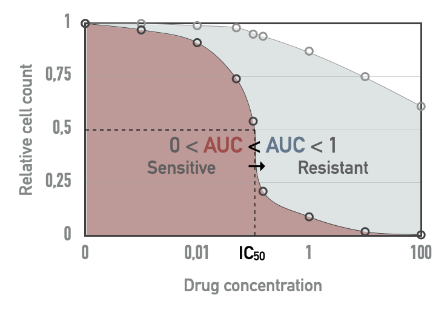
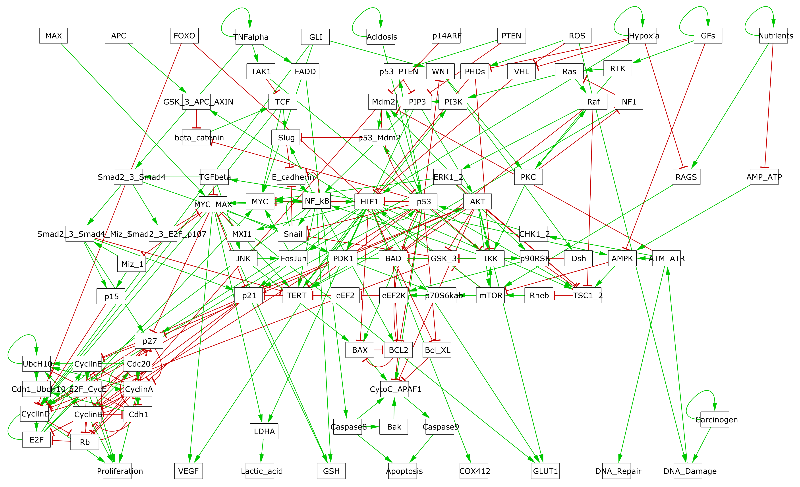
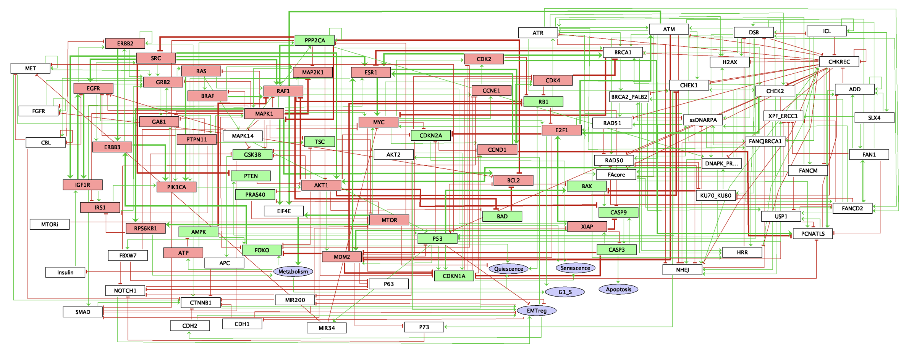
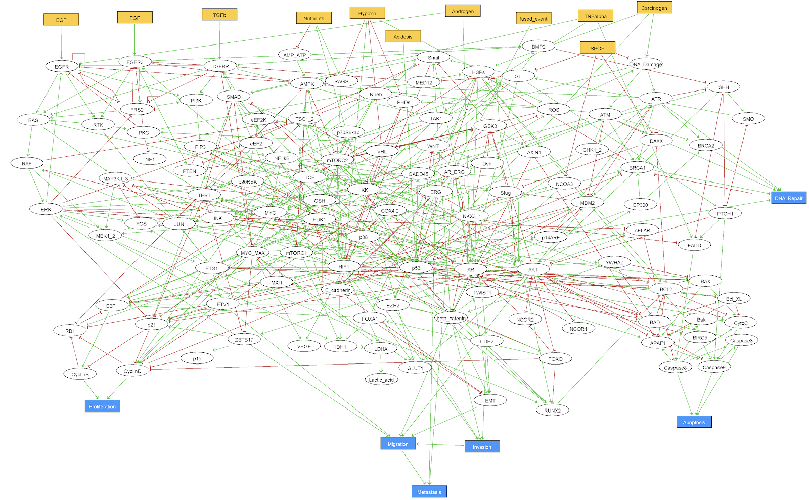

# (APPENDIX) Appendix {-}

```{r 10_packages, echo=FALSE, warning=FALSE, message=FALSE}
invisible(lapply(X =  c("knitr", "tidyverse", "magrittr",  "ggplot2", "ggpubr", "patchwork", "cowplot", "kableExtra", "UpSetR", "eulerr", "survival", "survminer", "paletteer", "ggstance"),
       FUN = require,
       character.only = TRUE))

knitr::opts_chunk$set(
  cache = TRUE, echo = FALSE, warning = FALSE, message = FALSE,
  out.width = "90%",
  #fig.pos = "ht",
  fig.align = "center"
  )
```

# About datasets {#appendix-datasets}

## Cell lines {#appendix-cl}

Several analyses in previous chapters are based on data derived from cell lines. Among the different databases, the ones used in the thesis are briefly described below. Please refer to corresponding references for additional details.

### Omics profiles

The omics profiles of cancer cell lines have been downloaded from Cell Model Passports [@van2019cell] containing genotypic and phenotypic information about more than 1000 cell lines. Among the available data used in this thesis are the exome sequencing, copy number variations and RNA-sequencing.

### Drug screenings {#appendix-GDSC}

Information about response to treatments is retrieved from Genomics of Drug Sensitivity in Cancer Database (GDSC, @yang2012genomics). In order to allow detailed analyses at the level of cancer types, we will restrict ourselves here to tissues represented by at least 20 cell lines and highlighted in dark grey in Figure \@ref(fig:GDSC)A. Most of the 663 cell lines in this subcohort have a complete profile with all omics data (mutations, CNA and expression) and drug responses. However, not all cell lines have necessarily been tested for all drugs.

```{r GDSC, echo=FALSE, out.width = "90%", fig.cap='(ref:GDSC-caption)', fig.scap='Distribution of cancer types and data types in GDSC-associated dataset', fig.align='center', fig.height=7, fig.width=8}
CL_clin <- readRDS("data/appendix/GDSC_CL_clin.rds") %>%
  mutate(TCGA_label=if_else(is.na(TCGA_label) | TCGA_label=="UNABLE TO CLASSIFY",
                        "Other", TCGA_label)) %>%
  mutate(TCGA_label=if_else(TCGA_label=="COAD/READ", "COREAD", TCGA_label))
big_labels <- table(CL_clin$TCGA_label) %>% is_greater_than(20) %>%
  which %>% names %>% setdiff("Other")

plot_A <- group_by(CL_clin, TCGA_label) %>%
  summarise(N=n()) %>%
  mutate(Select=if_else(TCGA_label=="Other" | N<20,
                        "No", "Yes")) %>%
  ggplot(aes(x=reorder(TCGA_label, -N), y=N, fill=Select)) +
  geom_bar(stat="identity", show.legend = FALSE) +
  theme_pubclean() +
  labs(x="Cancer types according to TCGA denomination)",
       y="Number of\nsamples") +
  scale_fill_manual(values = c("Yes"="grey20", "No"="grey80")) +
  theme(axis.text.x = element_text(angle = 90, size = 10))

plot_B <- filter(CL_clin, TCGA_label %in% big_labels) %>%
  select(PATIENT_ID, WES, CNA, Expression, Drug_response) %>%
  rename(Mutations=WES) %>%
  mutate(Mutations=if_else(Mutations=="Y", 1, 0),
         CNA=if_else(CNA=="Y", 1, 0),
         Expression=if_else(Expression=="Y", 1, 0),
         Drug_response=if_else(Drug_response=="Y", 1, 0)) %>%
  select(-PATIENT_ID) %>%
  as.data.frame() %>%
  upset(order.by="freq",text.scale = 1.5)

plot_Bis <- cowplot::plot_grid(NULL, plot_B$Main_bar, plot_B$Sizes, plot_B$Matrix,
                               nrow=2, align='hv', rel_heights = c(1,1),
                               rel_widths = c(1,3))

plot_grid(plot_A, plot_Bis, nrow = 2, rel_heights = c(3, 4), labels = "AUTO")

```
(ref:GDSC-caption) **Distribution of cancer types and data types in GDSC-associated dataset.** (A) Distribution of cell lines per cancer types, highlighting the ones selected in this thesis with more than 20 cell lines. (B) Availibility of data for the 663 selected cell lines in 17 different cancer types.  
  

The cell lines are treated with increasing concentration of drugs and the viability of the cell line relative to untreated control is measured. The dose-response relative viability curve is fitted and then used to compute the half maximal inhibitory concentration ($IC_{50}$) and the area under the dose-response curve (AUC) [@vis2016multilevel], both being represented in Figure. Since the $IC_{50}$ values are often extrapolated outside the concentration range actually tested, we will focus on the AUC metric for all validation with drug screening data. AUC is a value between 0 and 1: values close to 1 mean that the relative viability has not been decreased, and lower values correspond to increased sensitivity to inhibitions. In cases where the ranges of concentrations tested for different drugs vary, comparison of their AUC values does not have a simple and straightforward interpretation.

```{r AUC, echo=FALSE, out.width = "50%", fig.cap='(ref:AUC-caption)', fig.scap='Drug screening metrics in cell lines', fig.align='center'}

```
(ref:AUC-caption) **Drug screening metrics in cell lines.** Based on a tested drug concentration range, $IC_{50}$ and area under the dose-response curve (AUC) can be computed. For a given drug, red AUC corresponds to a more sensitive cell line than blue AUC.

### CRISPR-Cas9 screening {#appendix-CRISPR}

On top the previous drug response characterization, some CRISPR-Cas9 screenings have  been performed on cancer cell lines. Very basically, this involves using single-guide RNAs (sgRNAs) to direct the targeted inhibition of certain genes. Conceptually, screening is not very different from drug screening since it allows the sensitivity of cell lines to the inhibition of certain targets to be studied. However, this technology makes it possible to target many more different genes since it is based on RNA guide synthesis and not on the existence of drugs with an affinity for the target of interest. Schematically, sreening is therefore broader (thousands of genes), less biased (any gene can be targeted a priori) and more precise (much lower off-target effect).  
  

Among the various databases available, the ones used in this thesis have been downloaded from Cell Model Passports and come from Sanger Institute [@behan2019prioritization] and Broad Institute [@meyers2017computational]. Both databases present CRISPR inhibition results for thousands of genes for a few hundred cell lines among those presented in the previous section. The Sanger dataset for instance includes 324 cell lines, and 238 in common with the subcohort previously described in the previous section and in Figure \@ref(fig:GDSC).  
  

Among the different metrics, the examples presented in this thesis will focus on scaled Bayesian factors to assess the effect of CRISPR targeting of genes. These scores are computed based on the fold change distribution of sgRNA [@hart2016bagel]. The highest values indicate that the targeted gene is essential to the cell fitness.

## Patient-derived xenografts {#appendix-PDX}

Another type of data exists, halfway between cell lines and patients, and that is patient-derived xenografts (PDX). Each patient tumour is divided into pieces later implanted in several immunodeficient cloned mice treated with different drugs, thus providing access to sensitivities to several different drugs for each tumour. 

### PDX data from @gao2015high

The PDX dataset used in this thesis is the one published by @gao2015high. The original dataset contains 281 different tumours of origin (sometimes called PDX models, in the sense of a biological model) and 63 tested drugs, not all drugs having been tested for all tumours and some drugs have been tested with tissue-specific patterns (Figure \@ref(fig:PDX-appendix)). 192 of these tumours have also been characterized for their mutations, copy-number alterations and mRNA. 

```{r PDX-appendix, echo=FALSE, out.width = "95%", fig.cap='(ref:PDX-appendix-caption)', fig.scap='Comprehensive overview of tumours and drugs screened in PDX dataset from @gao2015high', fig.align='center', fig.height=7, fig.width=8}

colors_tissues <- c("GC"="#800000FF", "CRC"="#FFA319FF",
                    "PDAC"="#8A9045FF", "BRCA"="#155F83FF",
                    "NSCLC"="#C16622FF", "CM"="#58593FFF",
                    "Unknown"="#767676FF")

plot_data <- readRDS("data/appendix/plot_data_PDX_sparsity.rds") %>%
  filter(Tissue!="Unknown")

p_tile <- ggplot(plot_data) +
  geom_tile(aes(x=PATIENT_ID, y=Treatment, fill=Tissue, alpha=Screened),
            color="white") +
  labs(#x="PDX models",
       fill="Cancer tissues:") +
  scale_fill_manual(values=colors_tissues) +
  guides(alpha=FALSE) +
  theme_pubclean() +
  theme(axis.text.x = element_blank(),
        axis.title.x = element_blank(),
        axis.text.y = element_text(size=8),
        legend.position = "bottom",
        legend.title = element_text(face="bold"))

p_bar <- plot_data %>%
  group_by(Treatment) %>% summarise(S=sum(Screened)) %>%
  ggplot() +
  geom_barh(aes(y=Treatment, x=S),
           stat="identity") +
  labs(x="Number of screened PDX") +
  theme_pubclean() +
  theme(#axis.text.x = element_blank(),
        axis.text.y = element_blank(),
        axis.title.y = element_blank(),
        legend.position = "right",
        legend.title = element_text(face="bold"),
        panel.grid.major.y = element_blank())
  
egg::ggarrange(p_tile, p_bar, nrow = 1,
               widths = c(2,1)#,
               #top = "PDX drug screening"
               )

```
(ref:PDX-appendix-caption) **Comprehensive overview of tumours and drugs screened in PDX dataset from @gao2015high.**

### PDX data and drug response metrics

#### A continuous outcome

The first drug response metric used in this article is called *Best Average Response*. For each combination tumour/drug, the response is determined by comparing tumor volume change at time $t$, $V_t$ to tumor volume at time $t_0$, $V_{t_0}$. Several scores are computed:

$$\text{Tumour Volume Change (\%)} = \Delta Vol_t = 100\% \times \dfrac{V_t-V_{t_0}}{V_t}$$

$$\text{Best Response} = min(\Delta Vol_t), t>10d$$

$$\text{Average Response}_t = mean(\Delta Vol_i, 0 \leq i\leq t)$$

$$\text{Best Average Response} = min(\text{Average Response}_t), t>10d$$

We will mainly focus on *Best Average Response*. This metric "captures a combination of speed, strength and durability of response into a single value" *gao2015high*. Qualitatively, lower values correspond to more efficient drugs.

#### A binary outcome

Thresholds of *Best Response* and *Best Average Response* are also defined, inspired by RECIST criteria [@therasse2000new], in order to classify response to treatment into 4 categories: Complete Response (CR), Partial Response (PR, Stable Disease (SD) and Progressive Disease (PD). We designed a binary response status by combining the response categories (CR, PR and SD) into a single 'responder' category (1), opposed to the 'non-responders' progressive diseases (0).

## Patients {#appendix-datasets-patients}

### METABRIC

METABRIC dataset is large breast cancer dataset with more than 2000 patients [@pereira2016somatic]. Mutations, CNA, expression (transcriptomics micro-array) and clinical data are available for a majority of patients (Figure \@ref(fig:METABRIC)A), with 1904 patients for whom all the data is available. One of the  particular features of these data is to propose a very long clinical follow-up, over more than 10 years (Figure \@ref(fig:METABRIC)B).

```{r METABRIC, echo=FALSE, out.width = "90%", fig.cap='(ref:METABRIC-caption)', fig.scap='Available omics and survival in METABRIC Breast Cancer dataset', fig.align='center', fig.height=5, fig.width=8}
#data types
METABRIC_list <- readRDS("data/appendix/METABRIC_list.rds")
plot_A <- eulerr::venn(METABRIC_list) %>% plot

#Clin data
time_limit <- 180
META_clin <- readRDS("data/appendix/META_clin.rds") %>%
  mutate(Status=if_else(OS_MONTHS<time_limit & Status==1,1,0),
         OS_MONTHS=if_else(OS_MONTHS>time_limit,time_limit,OS_MONTHS)) %>%
  filter(PAM50!="NC")
KM <- survfit(Surv(OS_MONTHS,Status)~PAM50,
                  data=META_clin)
plot_B <- ggsurvplot(KM,
           palette=paletteer_d("ggsci::light_uchicago")[c(1, 3:6, 9)],
           risk.table = TRUE,
           conf.int = TRUE,
           risk.table.y.text.col = T,
           #risk.table.col = "strata",
           risk.table.y.text = FALSE,
           tables.height=0.25,
           ylim=c(0.25,1),
           xlab="Time (in months)",
           ylab="Survival probability",
           break.time.by=30,
           fontsize=4,
           ggtheme=theme_pubclean())

plot_grid(plot_A, plot_grid(plot_B$plot,
                            plot_B$table, nrow = 2, rel_heights = c(3,2)),
          ncol = 2, rel_widths = c(2,3.5), scale = 0.9,
          labels = "AUTO")
```
(ref:METABRIC-caption) **Available omics and survival in METABRIC Breast Cancer dataset**. (A) Number of patients for each omics type and their combinations, depicted as a Venn diagram. (B) Overall survival probability for all patients with clinical follow-up, stratified per breast cancer PAM50 subtype; administrative censoring at 180 months.

### TCGA: Breast cancer

Another reference database for breast cancer is the one from the TCGA consortium [@cancer2012comprehensive]. The cohort is smaller than METABRIC and its clinical follow-up is more limited. In contrast, the omics data are more comprehensive and include RNA sequencing and relative quantification ofsproteins with RPPA technology (Figure \@ref(fig:TCGA-bp)A). 

```{r TCGA-bp, echo=FALSE, out.width = "70%", fig.cap='(ref:TCGA-bp-caption)', fig.scap='Available omics and survival in METABRIC Breast Cancer dataset', fig.align='center', fig.height=5, fig.width=8}

#data types breast
TCGA_BRCA_list <- readRDS("data/appendix/TCGA_b_list.rds")
plot_A <- eulerr::venn(TCGA_BRCA_list) %>% plot

#data types breast
TCGA_PRAD_list <- readRDS("data/appendix/TCGA_p_list.rds")
plot_B <- eulerr::venn(TCGA_PRAD_list) %>% plot

plot_grid(plot_A, plot_B, ncol = 2,
          labels = "AUTO")

```
(ref:TCGA-bp-caption) **Available omics for TCGA Breast and Prostate cancer**. (A) Number of patients for each omics type and their combinations, depicted as a Venn diagram, in TCGA BRCA (Breast Invasive Carcinoma) study. (B) Same for the TCGA PRAD (Prostate Adenocarcinoma) study.

### TCGA: Prostate cancer {#appendix-prostate}

Similarly, for prostate cancer, reference can be made to data from the TCGA study [@abeshouse2015molecular], which has the same type of data but for a smaller number of patients than the breast cancer (Figure \@ref(fig:TCGA-bp)B).

# About logical models

Several logical models of cancer are used in this thesis and some additional descriptive elements about them are given below.

## Generic logical model of cancer pathways {#appendix-fumia}

For this thesis, a published Boolean model from [@fumia2013boolean] has first been used to illustrate our PROFILE methodology. This regulatory network summarizes several key players and pathways involved in cancer mechanisms such as RTKs, PI3K/AKT, WNT/$\beta$-catenin, TGF-$\beta$/Smads, Rb, HIF-1, p53 and ATM/ATR. An input node *Acidosis* has been added, along with an output node *Proliferation* used as a readout for the activity of any of the cyclins (*CyclinA*, *CyclinB*, *CyclinD* and *CyclinE*). This slightly extended model contains 98 nodes and 254 edges and its inputs are *Acidosis*, *Nutrients*, *Growth Factors* (GFs), *Hypoxia*, *TNFalpha*, *ROS*, *PTEN*, *p14ARF*, *GLI*, *FOXO*, *APC* and *MAX*. Its outputs are *Proliferation*, *Apoptosis*, *DNA_repair*, *DNA_damage*, *VEGF*, *Lactic_acid*, *GSH*, *GLUT1* and *COX412*.

```{r Fumia, echo=FALSE, out.width = "90%", fig.cap='(ref:Fumia-caption)', fig.scap='Graphical abstract of PROFILE method to personalize logical models with omics data', fig.align='center'}

```
(ref:Fumia-caption) **GINSIM representation of the logical model described in @fumia2013boolean.**

## Extended logical model of cancer pathways {#appendix-verlingue}

Another logical model of similar size and scope was also used, primarily for the study of treatment responses. This model was built by Loïc Verlingue, a medical oncologist and member of the laboratory and preliminary versions of the model are described in @verlingue2016comprehensive and @verlingue2016silico. One of the interests of this model is that it has been designed with a more clinical perspective, notably centred on the response to MTOR inhibitors. In addition, it presents more biological read-outs used for interpretation, and we will use mainly *Proliferation* (also called *G1_S* in the moel files to designate the associated stage of the cell cycle), *Apoptosis* and *Quiescence* in particular. In addition, being able to discuss and collaborate directly with the model autor has helped to avoid potential errors in use.

```{r Verlingue, echo=FALSE, out.width = "90%", fig.cap='(ref:Verlingue-caption)', fig.scap='Graphical abstract of PROFILE method to personalize logical models with omics data', fig.align='center'}

```
(ref:Verlingue-caption) **GINSIM representation of the 'Verlingue' logical model described in @verlingue2016silico.**

## Logical model of BRAF pathways in melanoma and colorectal cancer {#appendix-pantolini}

Here are some details about the regulations represented in Figure \@ref(fig:BRAF-model). The MAPK pathway encompasses three families of protein kinases: RAF, MEK, ERK. If RAF is separated into two isoforms, CRAF and BRAF, the other two families MEK and ERK are represented by a single node. When BRAF is inhibited, ERK can still be activated through CRAF, and BRAF binds to and phosphorylates MEK1 and MEK2 more efficiently than CRAF [@wellbrock2004raf], especially in his V600E/K mutated form. When PI3K/AKT pathway is activated, through the presence of the HGF (Hepatocyte Growth Factors), EGF (Epidermal Growth Factors) and FGF (Fibroblast Growth Factors) ligands, it leads to a proliferative phenotype. The activation of this pathway results in the activation of PDPK1 and mTOR, both able to phosphorylate p70 (RPS6KB1) which then promotes cell proliferation and growth [@uniprot2019uniprot]. There has been some evidence of negative regulations of these two pathways carried out by ERK itself [@lake2016negative]: phosphorylated ERK is able to prevent the SOS-GRB2 complex formation through the activation of SPRY [@edwin2009intermolecular], inhibit the EGF-dependent GAB1/PI3K association [@lehr2004identification] and down-regulate EGFR signal through phosphorylation [@lake2016negative]. The model also accounts for a negative regulation of proliferation through a pathway involving p53 activation in response to DNA damage (represented by ATM); p53 hinders proliferation through the activation of both PTEN, a PI3K inhibitor, and p21 (CDKN1A) responsible for cell cycle arrest.  
  

We hypothesize that a single network is able to discriminate between melanoma and CRC cells. These differences may come from different sources. One of them is linked to the negative feedback loop from ERK to EGFR. As mentioned previously, this feedback leads to one important difference in response to treatment between melanoma and CRC: $BRAF^{(V600E)}$ inhibition causes a rapid feedback activation of EGFR, which supports continued proliferation. This feedback is observed only in colorectal since melanoma cells express low levels of EGFR and are therefore not subject to this reactivation [@prahallad2012unresponsiveness]. Moreover, phosphorylation of SOX10 by ERK inhibits its transcription activity towards multiple target genes by interfering with the sumoylation of SOX10 at K55, which is essential for its transcriptional activity [@han2018erk]. The absence of ERK releases the activity of SOX10, which is necessary and sufficient for FOXD3 induction. FOXD3 is then able to directly activate the expression of ERBB3 at the transcriptional level, enhancing the responsiveness of melanoma cells to NRG1 (the ligand for ERBB3), and thus leading to the reactivation of both MAPK and PI3K/AKT pathways [@han2018erk]. Furthermore, it has been shown that in colorectal cells, FOXD3 inhibits EGFR signal *in vitro* [@li2017foxd3]. Interestingly, SOX10 is highly expressed in melanoma cell lines when compared to other cancer cells. In the model, we define SOX10 as an input because of the lack of information about the regulatory mechanisms controlling its activity. The different expression levels of SOX10 have been reported to play an important role in melanoma (high expression) and colorectal (low expression) cell lines. 
  
Besides a list of formalized biological assertions, retrieved from literature, has been used during the model building to ensure the consitency of the model with some qualitative behaviours. These assertions, listed below, are all verified when the logical model is simulated (details are available on the corresponding [GitHub repository](https://github.com/sysbio-curie/MaBoSS_test)):

* BRAF inhibition causes a feedback activation of EGFR in colorectal cancer and not in melanoma [@prahallad2012unresponsiveness]
* MEK inhibition stops ERK signal but activates the PI3K/Akt pathway and increases the activity of ERBB3 [@gopal2010basal; @lake2016negative]
* HGF signal leads to the reactivation of the MAPK and PI3K/AKT pathways, and resistance to BRAF inhibition [@wroblewski2013bh3]
* BRAF inhibition in melanoma activates the SOX10/FOXD3/ERBB3 axis, which mediates resistance through the activation of the PI3K/AKT pathway [@han2018erk]
* Overexpression/mutation of CRAF results in constitutive activation of ERK and MEK also in the presence of a BRAF inhibitor [@manzano2016resistant; johannessen2010cot]
* Early resistance to BRAF inhibition may be observed in case of PTEN loss, or mutations in PI3K or AKT [@manzano2016resistant]
* Experiments in melanoma cell lines support combined treatment with BRAF/MEK + PI3K/AKT inhibitors to overcome resistance [@manzano2016resistant]
* BRAF inhibition (Vemurafenib) leads to the induction of PI3K/AKT pathway and inhibition of EGFR did not block this induction [@corcoran2012egfr]
* Induction of PI3K/AKT pathway signaling has been associated with decreased sensitivity to MAPK inhibition [@corcoran2012egfr]


## Logical model of prostate cancer {#appendix-montagud}

In the context of the European project [PRECISE](https://precise-project.eu/) (Personalized Engine for Cancer Integrative Study and Evaluation), focused on the integrative study of prostate cancer, an adapted logical model has been built. This prostate cancer model is initially based on the generic structure of the Fumia model presented in section \@ref(appendix-fumia), which has been considerably enriched and extended with genes and mechanisms specific to prostate cancer such as ERG, SPOP or AR. The model contains 133 nodes and 449 edges (Figure \@ref(fig:Montagud)) and includes pathways like androgen receptor and growth factor signalling, several signaling pathways (Wnt, NFkB, PI3K/AKT, MAPK, mTOR, SHH), cell cycle, epithelial-mesenchymal transition (EMT), Apoptosis, DNA damage, etc. The model has 9 inputs (EGF, FGF, TGF beta, Nutrients, Hypoxia, Acidosis, Androgen, TNF alpha and Carcinogen presence) and 6 outputs (*Proliferation*, *Apoptosis*, *Invasion*, *Migration*, (bone) *Metastasis* and *DNA repair*).


```{r Montagud, echo=FALSE, out.width = "90%", fig.cap='(ref:Montagud-caption)', fig.scap='Graphical abstract of PROFILE method to personalize logical models with omics data', fig.align='center'}

```
(ref:Montagud-caption) **GINSIM representation of the 'Montagud' logical model of prostate cancer.**

# About statistics

## Decomposition of $R^2$ {#appendix-decomp}

The decomposition of $R^2$ according to the method of @lindeman1980introduction is detailed below. The presentation is taken directly from @gromping2006relative.  
  
A linear model is written $y_i=\beta_0+\beta_1x_{i1}+...+\beta_px_{ip}+e_i$ and the corresponding $R^2$ is:

$$R^2=\dfrac{\sum_{i=1}^{n} (\hat{y_i}-\bar{y_i})^2}{\sum_{i=1}^{n}  (y_i-\bar{y_i})^2}$$
Additionally, we define $R^2(S)$ for a model with regressors in set S. The additional $R^2$ when adding the regressors in set $M$ to a model with the regressors in set $S$ is given as:

$$seqR^2(M|S)=R^2(M\cup S)-R^2(S)$$

The order of the regressors in any model is a permutation of the available regressors $x_1, ..., x_p$ and is denoted by the tuple of indices $r = (r_1, ..., r_p)$. Let $S_k(r)$ denote the set of regressors entered into the model before regressor $x_k$ in the order $r$. Then the portion of $R^2$ allocated
to regressor $x_k$ in the order $r$ can be written as

$$seqR^2(\{x_k\}|S_k(r))=R^2(\{x_k\}\cup S_k(r))-R^2(S_k(r))$$

All in all, the $R^2$ allocated to $x_k$ after decomposition is:

$$R^2_{decomp}(x_k)=\dfrac{1}{p!}\sum_{r\text{ permutations}}seqR^2(\{x_k\}|r)$$