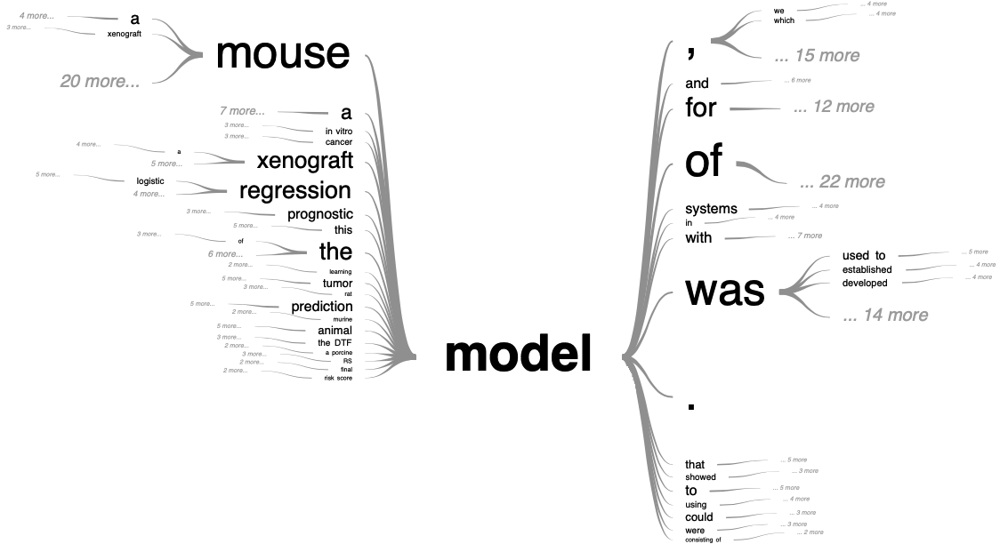

# (PART) Cells and their models {-}

# Scientific modeling: abstract the complexity

>*Ce qui est simple est toujours faux. Ce qui ne l'est pas est inutilisable.* 
  >Paul Valéry (Mauvaises pensées et autres, 1942)

The notion of modeling is embedded in science, to the point that it has sometimes been used to define the very nature of scientific research. What is called a model can, however, correspond to very different realities which need to be defined before addressing the object of this thesis which will consist, if one wants to be mischievous, in analyzing models with other models. This semantic elucidation is all the more necessary as this thesis is interdisciplinary, suspended between systems biology and biostatistics. In order to convince the reader of the need for such a preamble, he is invited to ask a statistician and a biologist how they would define what a model is.

(\#fig:orrery)(ref:orrery-caption)

(ref:orrery-caption) **A scientist and his model.** Joseph Wright of Derby, *A Philosopher Giving a Lecture at the Orrery (in which a lamp is put in place of the sun)*, c. 1763-65, oil on canvas, Derby Museums and Art Gallery

## What is a model?

<!-- Generic intro -->
### In your own words

A model is first of all an ambiguous object and a polysemous word. It therefore seems necessary to start with a semantic study. Among the many meanings and synonymous proposed by the dictionary (Figure \@ref(fig:visual-thesaurus)), while some definitions are more related to art, several find echoes in scientific practice. It is sometimes a question of the physical representation of an object, often on a reduced scale as in Figure \@ref(fig:orrery), and sometimes of a theoretical description intended to facilitate the understanding of the way in which a system works [@dictionnarymodel]. It is even sometimes an ideal to be reached and therefore an ambitious prospect for an introduction.

(\#fig:visual-thesaurus)(ref:visual-thesaurus-caption)

(ref:visual-thesaurus-caption) **Network visualization of *model* thesaurus entries.** Generated with the ['Visual Thesaurus'](https://www.visualthesaurus.com) ressource

<!-- For scientists -->

The narrower perspective of the scientist does not reduce the completeness of the dictionary's description to an unambiguous object [@bailer2002scientists]. In an attempt to approach these mult-faceted objects that are the models, Daniela Bailer-Jones interviewed different scientists and asked them the same question: what is a model? Across the different profiles and fields of study, the answers vary but some patterns begin to emerge (Figure \@ref(fig:interviews)). A model must capture the essence of the phenomenon being studied. Because it eludes, voluntarily or not, many details or complexity, it is by nature a simplification of the phenomenon. These limitations may restrict its validity to certain cases or suspend it to the fulfilment of some hypotheses. They are not necessarily predictive, but they must be able to generate new hypotheses, be tested and possibly questioned. Finally, and fundamentally, they must provide insights about the object of study and contribute to its understanding. 

(\#fig:interviews)(ref:interviews-caption)

(ref:interviews-caption) **Scientists talk about their models: words cloud.** Cloud of words summarizing the lexical fields used by scientists to talk about their models in dedicated interviews [@bailer2002scientists].

These definitions circumscribe the *model* object, its use and its objectives, but they do not in any way describe its nature. And for good reason, because even if we agree on the described contours, the biodiversity of the models remains overwhelming for taxonomists:

>*Probing models, phenomenological models, computational models, developmental models, explanatory models, impoverished models, testing models, idealized models, theoretical models, scale models, heuristic models, caricature models, exploratory models, didactic models, fantasy models, minimal models, toy models, imaginary models, mathematical models, mechanistic models, substitute models, iconic models, formal models, analogue models, and instrumental models are but some of the notions that are used to categorize models.* 
>[@frigg2020models]

### Material or formal

Without claiming to be exhaustive, we can make a first simple dichotomy between physical/material and formal/intellectual models [@rosenblueth1945role]. The former consist in replacing the object of study by another object, just as physical but nevertheless simpler or better known. These may be models involving a change of scale such as the simple miniature replica placed in a wind tunnel, or the metal double helix model used by Watson and Crick to visualize DNA. In all these cases the model allows to visualize the object of study to manipulate it and play with it to better understand or explain, just like the scientist with his orrery (Figure \@ref(fig:orrery)). In the case of biology, we will think mainly of model organisms such as drosophila, zebrafish or mice, for example. We then benefit from the relative simplicity of their genomes, a shorter time scale or ethical differences, usually to elucidate mechanisms of interest in humans. Correspondence between the target system and its model can sometimes be more conceptual, such as that ones relying on mechanical–electrical analogies: a mechanical system (e.g. a spring-mass system) can sometimes be represented by an electric network (e.g. a RLC circuit).

The model is then no longer simply a mimetic replica but is based on an intellectual equivalence: we are gradually moving into the realm of formal models. these are of a more symbolic nature and they represent the orgiginal system with a set of logical or mathematical terms, describing the main driving forces with similar structural properties. Historically these models have often been expressed by sets of mathematical equations or relationships. Increasingly, these have been implemented by computer. Despite their sometimes less analytical and more numerical nature, many so-called computational models could also belong to this category of formal models.

play also

### Back to cancer

As we get closer and closer to the subject of our study, and in order to illustrate these definitions more concretely, we can take an interest in the meaning of the word *model* in the context of cancer research. For this, we restrict our corpus to articles responding to the "cancer model" search in the Pubmed article database. Among these, we look at the occurrences of the word *model* and the sentences in which it is included. This cancer-related context of model is represented as a tree in Figure \@ref(fig:pubmed-tree).

(\#fig:pubmed-tree)(ref:pubmed-tree-caption)

(ref:pubmed-tree-caption) **Tree visualization of *model* semantic context in cancer-related literature** Generated with the ['PubTrees'](https://esperr.github.io/pub-trees/) tool by Ed Sperr, and based on most relevant PubMed entries for "cancer model" search.

In vivo, in vitro, in silico

## An ideal world

Before illustrating these definitions with a few examples, it is important to highlight one of the most important points already introduced in a concise manner by Valéry at the beginning of this chapter. Models are simplified representations of reality and by extension they are always wrong to a certain extent.

>*No substantial part of the universe is so simple that it can be grasped and controlled without abstraction. Abstraction consists in replacing the part of the universe under consideration by a model of similar but simpler structure. Models, formal and intellectual on the one hand, or material on the other, are thus a central necessity of scientific procedure.* 
>[@rosenblueth1945role]

https://www.nemenmanlab.org/~ilya/images/9/99/Rosenblueth-wiener-1945.pdf

Philosophy [@frigg2020models]

Galilean idealization with reality distortion
But even toy models for salient features

Then mathematics as a language 

Statistical models with a priori knowledge

Mechanistic to explain observation --> epicycle Ptolémée

## Statistical or mechanistic modeling

Within formal models -> 2 kinds

[@baker2018mechanistic]

https://gosilico.com/technology/mechanistic-vs-statistical-models/

Mechanistic already answer the "how" --> causality inside
Breiman --> Inside the box

https://theartofmodelling.wordpress.com/2012/02/19/mechanistic-models-what-is-the-value-of-understanding/

Example with data, stat and mech for Lotka-Volterra 
https://mc-stan.org/users/documentation/case-studies/lotka-volterra-predator-prey.html
http://www2.nau.edu/lrm22/lessons/predator_prey/predator_prey.html

